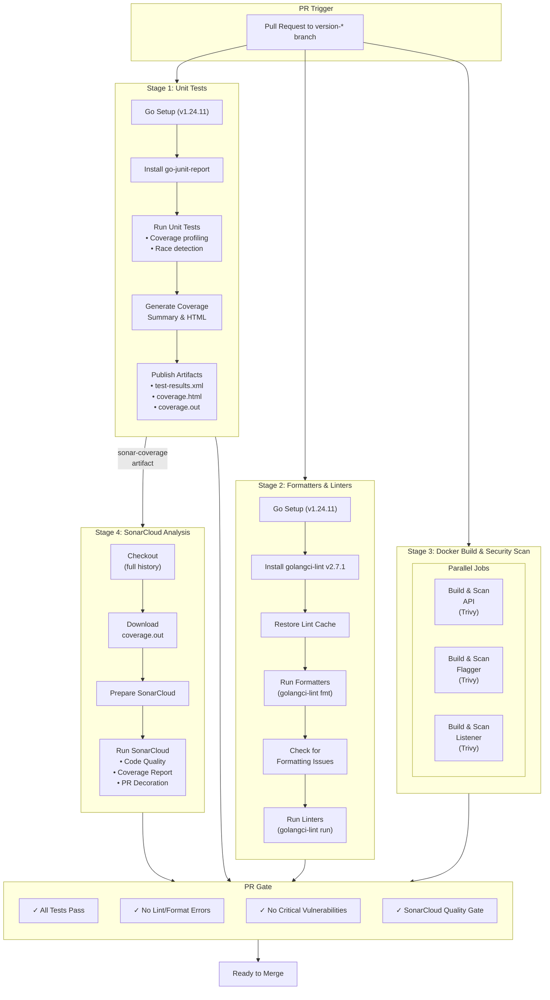
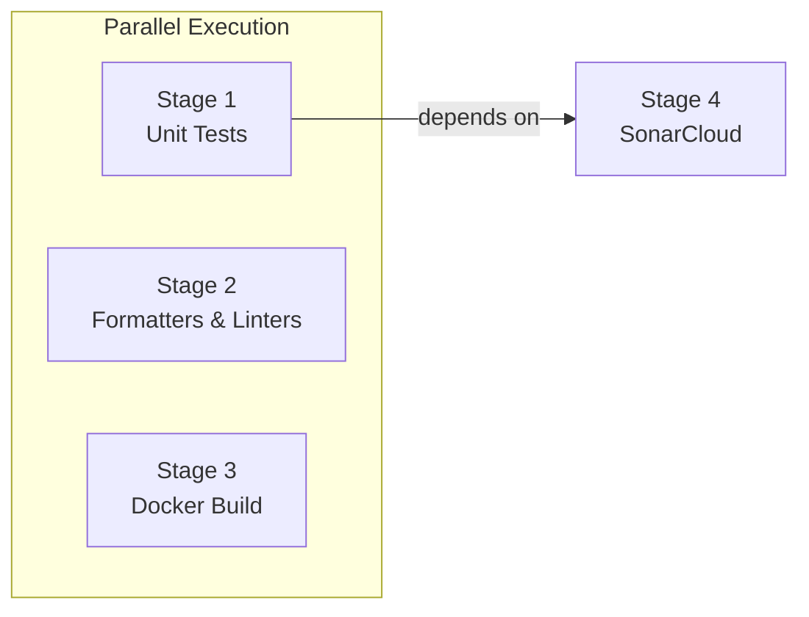

# Governance API - CI/CD Pipeline (Go PR Standard)

This document describes the CI/CD pipeline for the rayls-sovereign-pnh-governance repository, which serves as the standard for Go pull requests in the Rayls ecosystem.

## Pipeline Flow Diagram



## Stage Dependencies



## Stage Details

### Stage 1: Unit Tests
**Runs in parallel with Stages 2 & 3**

| Step | Description |
|------|-------------|
| Go Setup | Installs Go 1.24.11 with module caching |
| Install Tools | go-junit-report v2.1.0 |
| Run Tests | `go test -v -race -coverprofile=coverage.out -covermode=atomic` |
| Coverage Report | Generates summary and HTML report |
| Publish | JUnit results, HTML report, coverage.out for SonarCloud |

**Packages Tested:**

- `./cmd/listener/core/...`
- `./cmd/flagger/core/...`

**Artifacts Produced:**

| Artifact | Format | Purpose |
|----------|--------|---------|
| `test-results.xml` | JUnit | Azure DevOps test reporting |
| `coverage.html` | HTML | Human-readable coverage report |
| `coverage.out` | Go Cover | SonarCloud analysis input |

### Stage 2: Formatters & Linters
**Runs in parallel with Stages 1 & 3**

| Step | Description |
|------|-------------|
| Go Setup | Installs Go 1.24.11 with module caching |
| Install Lint | golangci-lint v2.7.1 |
| Cache | Restores lint cache for faster analysis |
| Formatters | `golangci-lint fmt ./...` |
| Check Changes | Fails if formatting changes detected |
| Linters | `golangci-lint run ./...` |

### Stage 3: Docker Build & Security Scan
**Runs in parallel with Stages 1 & 2**

Three parallel jobs build and scan Docker images:

| Job | Dockerfile | Security Scanner |
|-----|------------|------------------|
| API | `Dockerfile.api` | Trivy v0.68.2 |
| Flagger | `Dockerfile.flagger` | Trivy v0.68.2 |
| Listener | `Dockerfile.listener` | Trivy v0.68.2 |

### Stage 4: SonarCloud Analysis
**Depends on Stage 1 (Unit Tests)**

| Step | Description |
|------|-------------|
| Checkout | Full git history (`fetchDepth: 0`) for blame info |
| Download Artifact | Gets `coverage.out` from Stage 1 |
| Prepare | Configures SonarCloud scanner |
| Analyze | Runs Go-specific SonarCloud analysis |

**SonarCloud Features:**

- Code quality analysis (bugs, vulnerabilities, code smells)
- Code coverage visualization
- PR decoration with inline comments
- Quality gate enforcement

## Tool Versions

```yaml
GO_VERSION: '1.24.11'
GO_JUNIT_REPORT_VERSION: 'v2.1.0'
GOLANGCI_LINT_VERSION: 'v2.7.1'
TRIVY_VERSION: '0.68.2'
VM_IMAGE: 'ubuntu-22.04'
```

## Pipeline Triggers

| Trigger Type | Configuration |
|--------------|---------------|
| PR Trigger | `version-*` branches |
| CI Trigger | Disabled |
