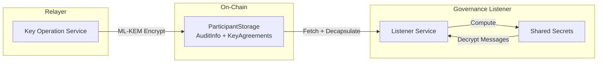
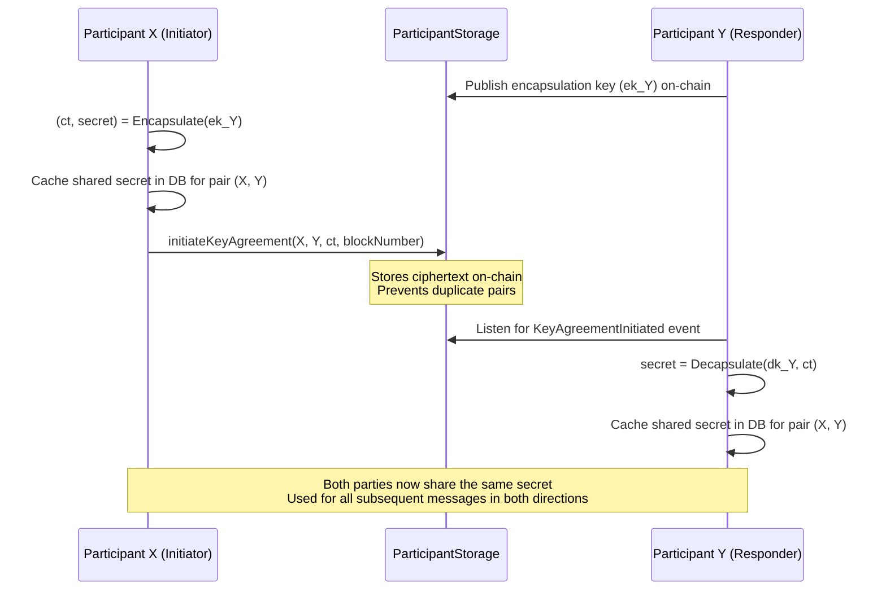
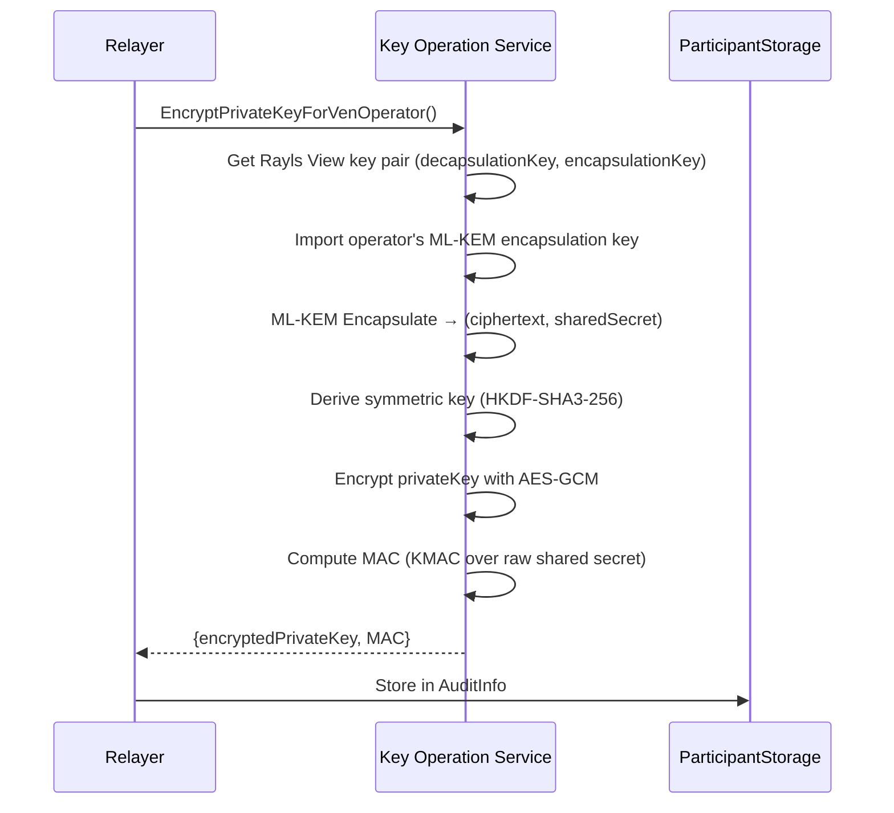
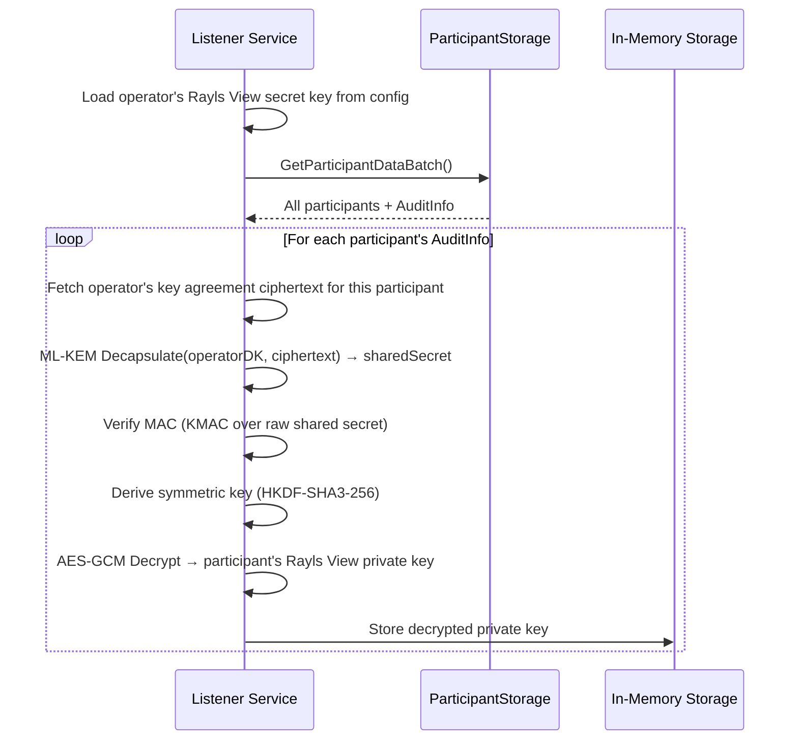
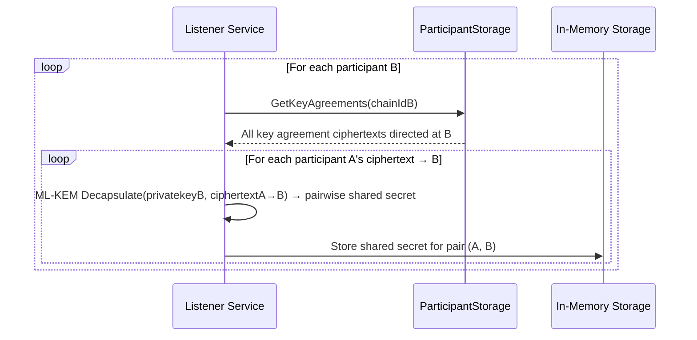
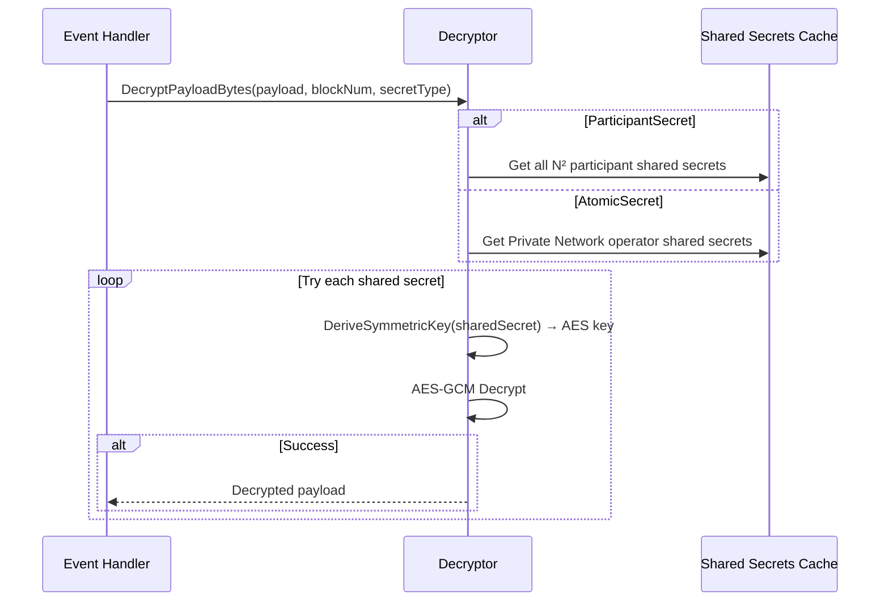

# Decryption

The Governance Listener decrypts encrypted events payloads to enable audit capabilities. This requires access to participants' Rayls View private keys, which are shared through a secure, post-quantum key agreement protocol using ML-KEM.

---

## Overview

The decryption system works through a two-phase key agreement architecture:

1. **Relayers** encrypt their Rayls View private keys using the operator's ML-KEM public key and store the ciphertext on-chain
2. **Governance Listener** at startup decapsulates the operator's key agreements to recover each participant's private key
3. **Pairwise shared secrets** are computed by decapsulating each participant pair's key agreements
4. **Events** are decrypted using the appropriate shared secret



---

## Cryptographic Primitives

| Algorithm         | Purpose                                                                        |
| ----------------- | ------------------------------------------------------------------------------ |
| **ML-KEM-768**    | Post-quantum key encapsulation (Module-Lattice-based KEM)                      |
| **AES-256-GCM**   | Symmetric authenticated encryption                                             |
| **HKDF-SHA3-256** | Symmetric key derivation from shared secrets (context: `"Rayls"`)              |
| **KMAC**          | Keyed message authentication code (SHA3-256 based)                             |
| **Poseidon**      | Hash function used by relayers for message tags (not used by Listener)         |

---

## ML-KEM Key Agreement Architecture

### The Ciphertext Overhead Problem

ML-KEM's `Encapsulate()` operation generates a **new random ciphertext and shared secret** every time it is called. If a fresh encapsulation were performed for every message, each message would need to carry an ML-KEM ciphertext (~1088 bytes) alongside the encrypted data. This creates significant overhead in transaction size and gas costs.

### Solution: One-Time Key Agreement

Instead of encapsulating a new shared secret for each message, the system performs encapsulation **once per participant pair** during setup. Both parties then reuse the same shared secret for all subsequent communication.

```text
Without one-time key agreement:
  Every message = encrypted_data (~variable) + ciphertext (~1088 bytes)
  Overhead: +1KB per message

With one-time key agreement:
  Setup (once): Store ciphertext on-chain (~1088 bytes)
  Every message = encrypted_data (~variable) + message tag (~32 bytes)
  Overhead: +32 bytes per message (97% reduction)
```

### Key Agreement Setup (Once Per Participant Pair)

For any two participants (X and Y), only **one** needs to initiate key agreement. The initiator encapsulates a shared secret using the responder's public encapsulation key, stores the ciphertext on-chain, and the responder completes the agreement by decapsulating.



Key properties:

- Each pair has exactly **one** ciphertext on-chain
- Both parties derive the **same** shared secret
- The agreement is **unidirectional** — only the initiator stores the ciphertext
- The smart contract prevents duplicate key agreements for the same pair

For the relayer-to-relayer message flow (message tag-based sender identification, per-message encryption), see [KMM Encryption](../components/kos/encryption.md).

---

## On-Chain Data Structures

### AuditInfo (Per Participant)

The encrypted package stored on-chain for governance decryption:

| Field                          | Description                                            |
| ------------------------------ | ------------------------------------------------------ |
| `RaylsViewPublicKey`           | Participant's ML-KEM encapsulation key (public)        |
| `EncryptedRaylsViewPrivateKey` | AES-GCM encrypted Rayls View decapsulation key         |
| `MAC`                          | Message authentication code for integrity verification |

### KeyAgreementData (Per Participant Pair)

```solidity
struct KeyAgreementData {
    bytes ciphertext;        // ML-KEM ciphertext (~1088 bytes)
    uint256 blockNumber;     // Block when agreement initiated
}
```

Stored in `ParticipantStorageV1`:

```solidity
// Key agreement data per unique pair (fromChainId, toChainId)
mapping(uint256 fromChainId => mapping(uint256 toChainId => KeyAgreementData[])) keyAgreementData;
```

| Field         | Description                                                    |
| ------------- | -------------------------------------------------------------- |
| `ChainId`     | Initiator's chain ID                                           |
| `Ciphertext`  | ML-KEM encapsulated key (~1088 bytes, for the responder)       |
| `Digest`      | Hash of the shared secret (used by relayers for sender lookup) |
| `BlockNumber` | Block number when key agreement was initiated                  |

### Key Agreement Contract Interface

```solidity
// Error thrown when attempting to create duplicate key agreement
error KeyAgreementAlreadyExists(uint256 chainId0, uint256 chainId1, uint256 blockNumber);

// Event emitted when key agreement is initiated
// Notifies responder to complete the key agreement via decapsulation
event KeyAgreementInitiated(uint256 fromChainId, uint256 toChainId, bytes ciphertext, uint256 blockNumber);

// Function to initiate key agreement between two participants
// Reverts if key agreement already exists (prevents duplicate setup)
function initiateKeyAgreement(
    uint256 fromChainId,
    uint256 toChainId,
    bytes memory ciphertext,
    uint256 blockNumber
) external;
```

---

## Step 1: Relayer Encrypts Rayls View Private Key

Each relayer encrypts its Rayls View private key for the Private Network Operator using the operator's ML-KEM encapsulation key:



---

## Step 2: Governance Listener Gathers Keys at Startup

When the Listener service starts, it performs two phases of key recovery:

### Phase 1: Recover Participant Private Keys



### Phase 2: Compute Pairwise Shared Secrets



### Key Recovery Process

Input:

  - Operator's Rayls View secret key (from config: `COMMITCHAIN_RAYLS_VIEW_SECRET_KEY`)
  - AuditInfo for each participant (from on-chain)
  - KeyAgreement ciphertexts (from on-chain)

Process:

  1. Import operator's ML-KEM decapsulation key
  2. For each participant: decapsulate operator's key agreement → shared secret
  3. Verify MAC: KMAC(sharedSecret, encryptedPrivateKey) == MAC
  4. Derive symmetric key: HKDF-SHA3-256(sharedSecret, "Rayls") → symmetricKey
  5. Decrypt: AES-GCM-Decrypt(symmetricKey, encryptedPrivateKey) → participant's Rayls View private key
  6. For all participant pairs: decapsulate key agreements → pairwise shared secrets

Output:

  - Decrypted ML-KEM decapsulation keys for all participants
  - Pairwise shared secrets (32 bytes each) for all participant pairs


---

## Step 3: Message Decryption

When an encrypted message arrives, the Listener uses pre-computed shared secrets to decrypt:



### Secret Types

| Type                  | Description                                  | Use Case                  |
| --------------------- | -------------------------------------------- | ------------------------- |
| **ParticipantSecret** | Shared secrets between all participant pairs | Inter-participant messages|
| **AtomicSecret**      | Private Network operator shared secrets      | Atomic Teleport messages  |

---

## Message Format

Encrypted messages follow this structure:

| Component           | Size                    | Description                            |
| ------------------- | ----------------------- | -------------------------------------- |
| **Associated Data** | 16 bytes                | Poseidon message tag (sender routing)  |
| **Nonce**           | 12 bytes                | Random initialization vector           |
| **Ciphertext**      | Variable + 16 bytes tag | AES-GCM encrypted payload              |

The message tag (associated data) is `PoseidonHash(shared_secret, blockNumber)`. Relayers use it to identify the sender and look up the correct shared secret. The Governance Listener does **not** use the message tag — it has all N² shared secrets pre-computed and tries each one until decryption succeeds (see [Brute-Force Decryption Strategy](#brute-force-decryption-strategy)).

---

## Configuration

The Listener requires the operator's Rayls View secret key configured via environment variable:

| Variable                            | Description                                         |
| ----------------------------------- | --------------------------------------------------- |
| `COMMITCHAIN_RAYLS_VIEW_SECRET_KEY` | Operator's ML-KEM decapsulation key (hex-encoded)   |

This key is used to decapsulate the key agreement ciphertexts stored on-chain by each participant's relayer.

---

## Security Properties

### Post-Quantum Resistance

ML-KEM-768 (Module-Lattice-based Key Encapsulation Mechanism) provides security against both:

- Classical computers (current threat model)
- Quantum computers (future threat model)

ML-KEM is NIST standardized (FIPS 203) and provides ~192-bit symmetric security (equivalent to AES-192).

### One-Time Key Agreement Benefits

| Aspect            | Per-Message Encapsulation   | One-Time Key Agreement              |
| ----------------- | --------------------------- | ----------------------------------- |
| **Overhead**      | ~1088 bytes per message     | ~32 bytes per message (message tag) |
| **On-chain cost** | Ciphertext with every tx    | Ciphertext stored once per pair     |
| **Security**      | Fresh secret per message    | Same secret, same guarantees        |
| **Performance**   | Encapsulate per message     | Encapsulate once, reuse             |

### Authenticated Encryption

- **AES-256-GCM** provides both confidentiality and integrity
- **KMAC** verification prevents tampering with encrypted private keys
- Invalid or tampered data is rejected before decryption

### Brute-Force Decryption Strategy

The Listener doesn't know which shared secret corresponds to a given message, so it tries all N² combinations. This is acceptable because:

- N (number of participants) is typically small
- Shared secrets are pre-computed at startup
- AES-GCM decryption is fast (<1ms per attempt)

---

## Performance Considerations

| Operation                             | Typical Latency |
| ------------------------------------- | --------------- |
| ML-KEM decapsulation                  | <1ms            |
| AES-GCM decryption                    | <1ms            |
| HKDF key derivation                   | <1ms            |
| Startup key recovery (per participant)| ~5ms            |

At startup, recovering N participant keys and computing N² pairwise shared secrets is fast due to ML-KEM's efficient decapsulation. Message decryption remains fast with pre-computed secrets.

---

**Navigate:**

- [Back to Governance Services Overview](governance-services.md)
- [Listener Service](listener-service.md) - Event monitoring
- [Flagger Service](flagger-service.md) - Compliance validation
