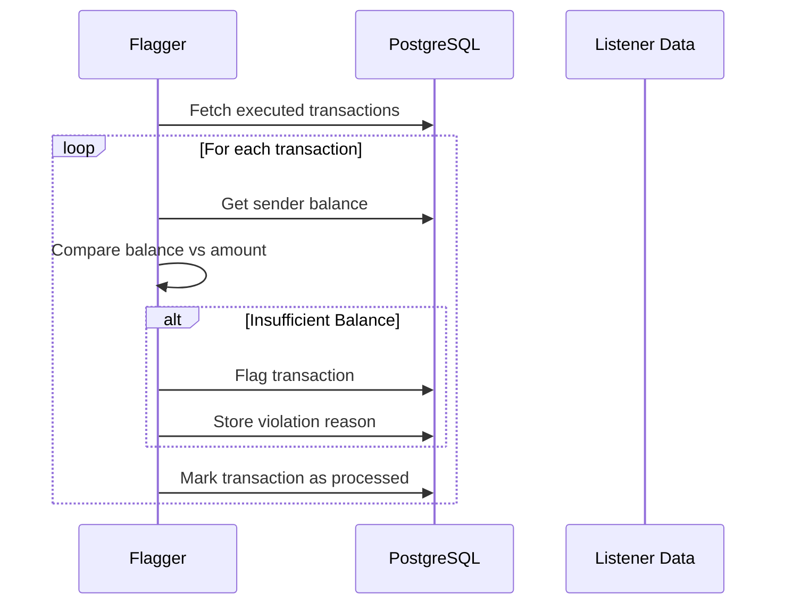
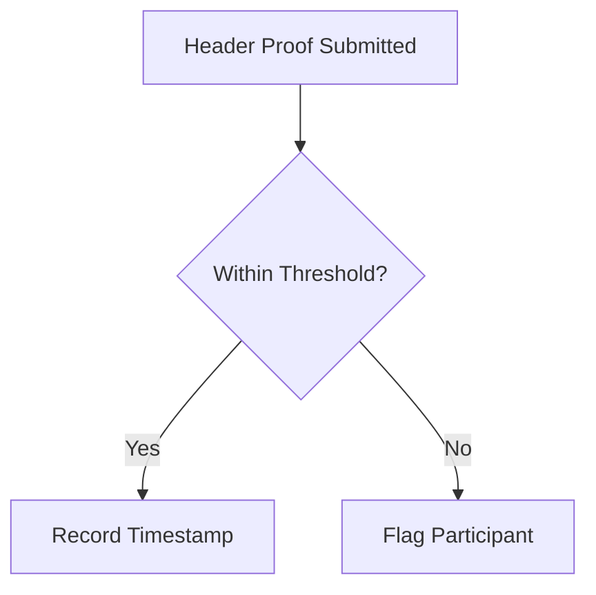
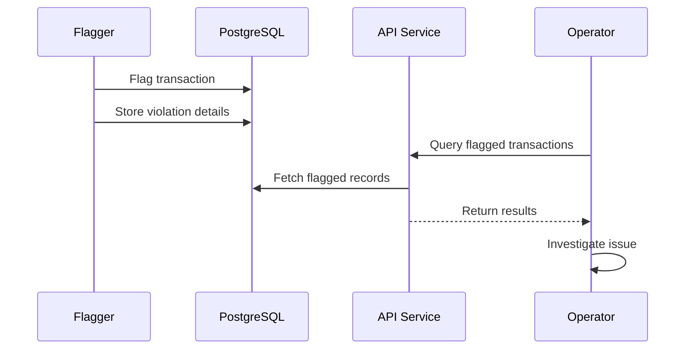
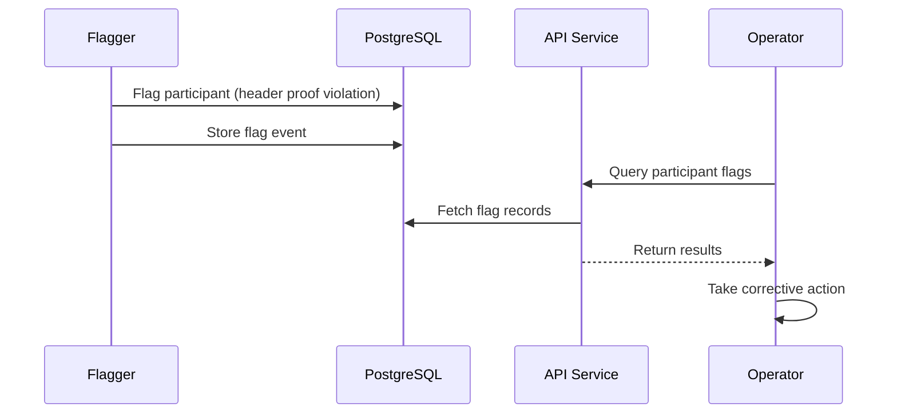

# Flagger Service

The Flagger Service monitors transaction balances and participant liveliness, automatically flagging any violation.

---

## Purpose

The Flagger Service provides automated compliance enforcement:

- **Transaction Validation**: Verifies sender balances match transaction amounts
- **Liveliness Monitoring**: Tracks header proof submission timing
- **Automatic Flagging**: Marks non-compliant transactions for review
- **Continuous Processing**: Runs validation checks on executed transactions

---

## Transaction Validation

The Flagger validates each transaction against sender balances:

### Balance Check Logic

1. **Load Transaction**: Get executed transaction from database
2. **Fetch Balance**: Query sender's balance at transaction time
3. **Compare**: Verify balance >= transaction amount
4. **Result**: Flag if insufficient

---

## Liveliness Monitoring

The Flagger tracks participant activity through header proof submissions (stored previously in PostgreSQL by the Listener):

### Liveliness Rules

| Rule               | Threshold    | Action               |
| ------------------ | ------------ | -------------------- |
| Header proof delay | 5 minutes    | Flag participant     |
| Missing proofs     | Configurable | Escalate to operator |

Liveliness tracking ensures participants are actively maintaining their state commitments on the Private Network Hub.

---

## Data Storage

The Flagger maintains its own tables for compliance tracking:

### Balances Table

The Flagger calculates and maintains token balances for each Privacy Node:

| Column        | Description                         |
| ------------- | ----------------------------------- |
| `id`          | Primary key (UUID)                  |
| `resource_id` | Token resource ID                   |
| `chain_id`    | Privacy Node ID                     |
| `amount`      | Calculated balance amount           |
| `erc_id`      | Token ID (for ERC-721 and ERC-1155) |
| `created_at`  | Creation timestamp                  |
| `updated_at`  | Last update timestamp               |

The Flagger computes balances by processing all transactions (stored previously in PostgreSQL by the Listener) for each token on each chain. These calculated balances are used to validate that senders have sufficient funds before executing transfers.

### Flagged Transactions Table

When a transaction violates compliance rules, it is recorded in this table:

| Column           | Description                       |
| ---------------- | --------------------------------- |
| `id`             | Primary key (UUID)                |
| `transaction_id` | Foreign key to transactions table |
| `created_at`     | Flagging timestamp                |
| `updated_at`     | Last update timestamp             |

Flagged transactions are exposed via the API Service for auditor investigation and resolution.

### Header Flag Events Table

When a participant violates liveliness rules, the event is recorded:

| Column         | Description                           |
| -------------- | ------------------------------------- |
| `id`           | Primary key (UUID)                    |
| `chain_id`     | Privacy Node ID                       |
| `block_number` | Block number where violation occurred |
| `reason`       | Reason code for the flag              |
| `initiator`    | Who initiated the flag                |
| `created_at`   | Flagging timestamp                    |

This table tracks participant compliance violations, enabling operators to monitor and address liveliness issues.

---

## Compliance Workflow

### Transaction Compliance

**Investigation Steps:**

1. **Detection**: Flagger automatically flags transaction violation
2. **Notification**: Operators query flagged transactions via API
3. **Investigation**: Auditor reviews transaction details and decrypted payload

### Participant Compliance

**Investigation Steps:**

1. **Detection**: Flagger detects missing or delayed header proofs
2. **Notification**: Operators query participant flags via API
3. **Investigation**: Review participant liveliness and proof submission history
4. **Action**: Contact participant or escalate issue

---

**Navigate:**

- [Back to Governance Services Overview](governance-services.md)
- [Listener Service](listener-service.md) - Event monitoring
- [Decryption](decryption.md) - Cryptographic details
