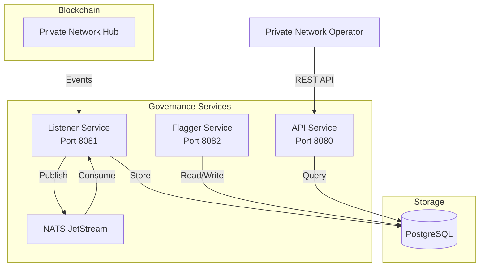
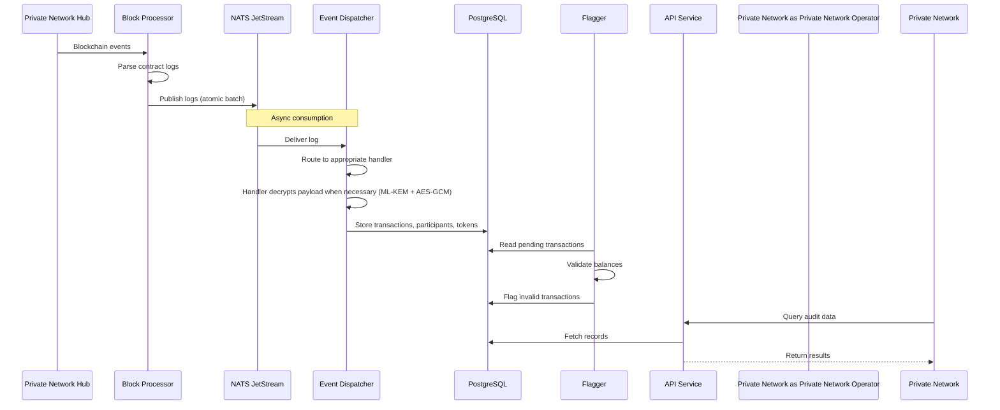
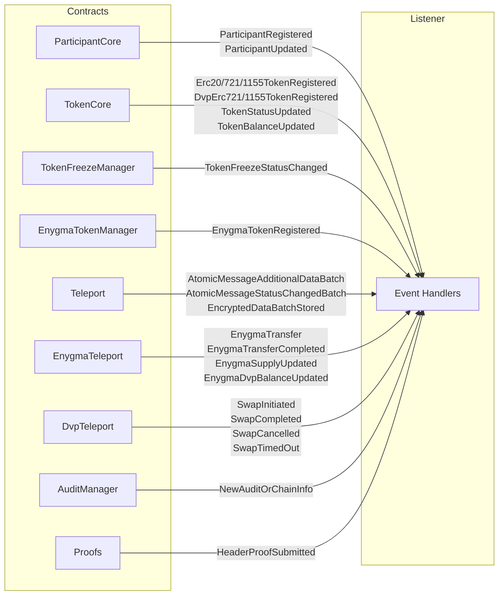
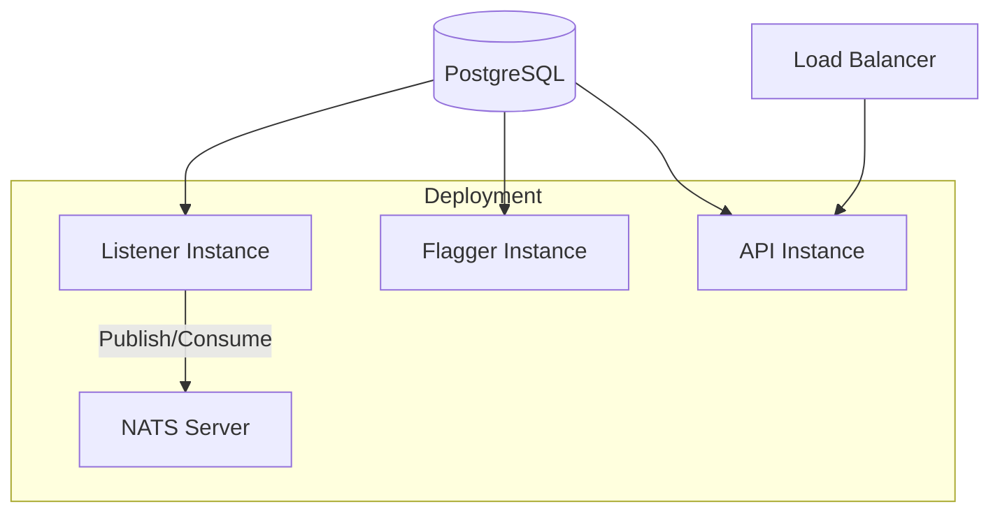

# Governance Services

The Governance Services is an off-chain service that provides auditing and compliance capabilities for the Rayls network. It monitors blockchain events, decrypts transaction payloads, and validates transactions against compliance rules.

---

## Purpose

The Governance Services enables Private Network (Validator/Operator) oversight of the network:

- **Transaction Monitoring**: Tracks all cross-chain transactions
- **Payload Decryption**: Decrypts encrypted data using post-quantum cryptography
- **Balance Validation**: Verifies sender balances match transaction amounts
- **Compliance Flagging**: Automatically flags non-compliant transactions
- **Liveliness Tracking**: Monitors participant activity and header proof submissions

---

## Architecture

The Governance Services consists of three independent services that work together:

### Service Responsibilities

| Service      | Port | Responsibility                                                                                        |
| ------------ | ---- | ----------------------------------------------------------------------------------------------------- |
| **Listener** | 8081 | Processes blockchain events (encrypted or not) and stores the resulting data                          |
| **Flagger**  | 8082 | Validate transactions, monitor participant activity and header proof submissions, and flag violations |
| **API**      | 8080 | Exposes REST endpoints for audit data                                                                 |

---

## Data Flow

---

## Database Schema

The Governance API stores data in PostgreSQL:

| Table                      | Description                                      |
| -------------------------- | ------------------------------------------------ |
| `participants`             | Registered network participants                  |
| `tokens`                   | Registered tokens                                |
| `transactions`             | Cross-chain transaction records                  |
| `enygma_transactions`      | Enygma-specific transaction metadata             |
| `flagged_transactions`     | Transactions that failed validation              |
| `header_proof_events`      | Submitted header proofs                          |
| `header_flag_events`       | Participant liveliness violations                |
| `balances`                 | Token balance snapshots                          |
| `token_freeze_states`      | Current freeze state per token-chain pair        |
| `token_freeze_audits`      | Historical log of freeze/unfreeze operations     |
| `last_processed_block`     | Block cursor for listener resume                 |
| `revert_data_transactions` | Transactions with revert data                    |
| `private_networks`         | Registered private network credentials           |

---

## Integration with Smart Contracts

The Governance Services monitor events from the blockchain associated with the Private Network Hub:

This enables the Governance Services to maintain a complete off-chain view of network state.

---

## Post-Quantum Cryptography

The Governance Services uses ML-KEM for decrypting encrypted transaction payloads:

| Algorithm        | Purpose                                  |
| ---------------- | ---------------------------------------- |
| **ML-KEM-768**   | Post-quantum key encapsulation           |
| **AES-256-GCM**  | Symmetric authenticated encryption       |
| **HKDF-SHA3-256**| Symmetric key derivation from shared secrets |
| **KMAC**         | Message authentication code              |

Private Network operators hold Rayls View private keys (ML-KEM decapsulation keys) that allow them to recover shared secrets and decrypt any transaction payload on the network.

---

## Deployment

Each service runs independently and can be scaled separately:

## Configuration

All Governance Services share common environment variables for database and blockchain connectivity:

| Environment Variable                      | Description                                | Required | Used By  |
| ----------------------------------------- | ------------------------------------------ | -------- | -------- |
| `DATABASE_CONNECTIONSTRING`               | PostgreSQL connection string               | Yes      | All      |
| `COMMITCHAIN_URL`                         | Private Network Hub RPC URL                | Yes      | All      |
| `COMMITCHAIN_CHAINID`                     | Private Network Hub chain ID               | Yes      | All      |
| `LOGGING`                                 | Log level (debug, info, warn, error)       | No       | All      |
| `COMMITCHAIN_STARTINGBLOCK`               | Block number to start processing from      | No       | Listener |
| `COMMITCHAIN_BATCHSIZE`                   | Batch size for processing events           | No       | Listener |
| `COMMITCHAIN_RAYLS_VIEW_SECRET_KEY`       | ML-KEM decapsulation key for decryption (hex) | Yes   | Listener |
| `COMMITCHAIN_DEPLOYMENTPROXYREGISTRY`     | Deployment proxy registry contract address | No       | Listener |
| `COMMITCHAIN_OPERATORCHAINID`             | Private Network operator chain ID          | No       | Listener |
| `COMMITCHAIN_PRIVATEKEY`                  | Private key for signing transactions       | No       | Listener |
| `COMMITCHAIN_HEADERPROOFEXPIRATIONPERIOD` | Header proof expiration period (seconds)   | No       | Flagger  |
| `NATS_URL`                                | NATS server URL for JetStream              | Yes      | Listener |
| `CORSURLS`                                | Allowed CORS origins (semicolon-separated) | Yes      | API      |

---

## Use Cases

### Transaction Auditing

Auditors can query and investigate transactions with complete visibility:

1. Listener captures and decrypts all transaction data
2. Flagger validates balances and flags inconsistencies
3. Auditor queries via API for flagged or specific transactions
4. Investigation proceeds with full decrypted payload data

### Participant Liveliness

Track whether participants are submitting header proofs on time:

1. Listener records header proof submissions
2. Flagger checks submission timestamps against thresholds
3. Participants exceeding threshold are flagged as inactive
4. Operators notified to take corrective action

---

**Navigate:**

- [Back to Governance Overview](index.md)
- [Listener Service](listener-service.md) - Event monitoring details
- [Flagger Service](flagger-service.md) - Compliance validation
- [Decryption](decryption.md) - Post-quantum cryptography
