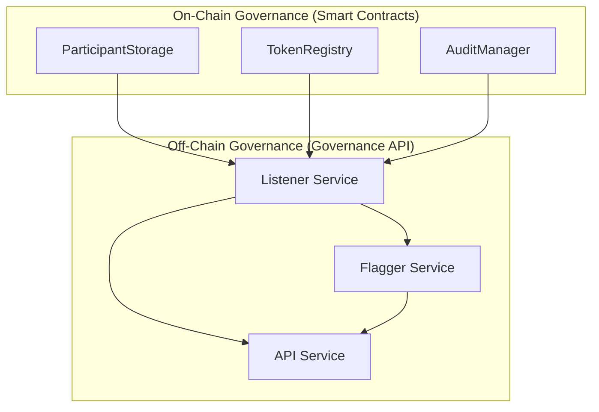
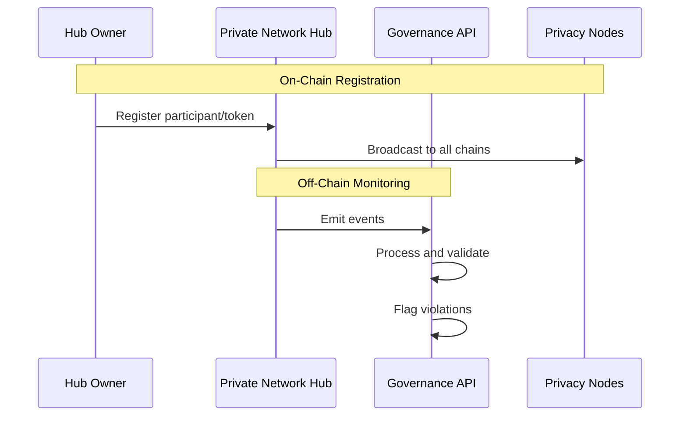

# Governance

Governance in Rayls encompasses two complementary systems: on-chain smart contracts that enforce rules and manage state, and off-chain services that monitor compliance and provide audit capabilities.

---

## Overview

The governance model provides:

- **Participant Management**: Registration and lifecycle management of Privacy Nodes
- **Token Registry**: Token registration originates on the Privacy Node (`PNTokenRegistryV1.registerToken`, ISSUER-gated) and is catalogued on the Hub when submitted (`submitToHub`)
- **Role-Based Access**: PARTICIPANT, ISSUER, and AUDITOR participant roles
- **Authorization System**: Unified, function-level access control via RaylsAccessManagerV1
- **Compliance Monitoring**: Off-chain validation and flagging of non-compliant transactions
- **Audit Capabilities**: Full transaction visibility for authorized auditors

---

## Architecture



---

## On-Chain Governance

Smart contracts deployed on the Private Network Hub manage the authoritative state for participants and tokens.

### Key Contracts

| Contract | Purpose |
|----------|---------|
| **ParticipantStorage** | Main participant registry with modular architecture |
| **TokenRegistry** (Hub) | Hub-side token catalog and lifecycle; approval via `updateStatus(resourceId, ACTIVE)` |
| **TokenFreezeManager** | Chain-level token freezing for compliance |
| **ResourceRegistry** | Cross-chain resource ID generation |
| **AuditManager** | Audit information and chain data storage |
| **RaylsAccessManagerV1** | Central authorization authority — role-based, function-level access control |
| **RaylsAccessManaged** | Consumer base contract providing the `restricted` modifier |

The Privacy Node also runs its own [PNTokenRegistryV1](../components/smart-contracts/pn-token-registry.md), the PN-side entry point for token registration and the three-status lifecycle described below.

### Design Principles

1. **Centralized Control**: The Hub Owner has authority over participant and token registration
2. **Modular Architecture**: Core contracts delegate to specialized modules
3. **Cross-Chain Synchronization**: All governance changes are broadcast to all chains
4. **UUPS Upgradability**: Contracts can be upgraded while preserving state

---

## Off-Chain Governance

The Governance API provides monitoring, validation, and audit services for the network.

### Services

| Service | Port | Purpose |
|---------|------|---------|
| **Listener** | 8081 | Monitors blockchain events, decrypts transaction payloads |
| **API** | 8080 | REST API for querying audit data |
| **Flagger** | 8082 | Validates transactions and flags violations |

### Key Capabilities

- **Event Monitoring**: Listens to all governance and teleport events
- **Payload Decryption**: Uses post-quantum cryptography (ML-KEM) to decrypt encrypted data
- **Balance Validation**: Verifies sender balances before flagging transactions
- **Liveliness Tracking**: Monitors header proof submission timing

---

## Governance Flow



---

## Key Concepts

### Participant Roles

| Role | Description |
|------|-------------|
| **PARTICIPANT** | Standard network participant (Privacy Node) |
| **ISSUER** | Can register new tokens on the network |
| **AUDITOR** | Can access audit information and decrypted data |

### Status Lifecycle

Different subsystems use different status models. Do not conflate them.

**Participants** follow a single lifecycle:

```
NEW → ACTIVE → INACTIVE → FROZEN
```

- **NEW**: Registered but not yet activated
- **ACTIVE**: Fully operational
- **INACTIVE**: Deactivated (can be reactivated)
- **FROZEN**: Suspended (requires explicit unfreezing)

**Hub token registry** activates a token with `updateStatus(resourceId, ACTIVE)` on the Hub-side `TokenRegistry` once it has been submitted from a Privacy Node.

**PN token registry** (`PNTokenRegistryV1`) tracks each token through three independent status state machines — `PrivacyNodeStatus`, `HubStatus`, and `PublicChainStatus`. See [PN Token Registry](../components/smart-contracts/pn-token-registry.md) and the [glossary](../../resources/glossary.md) for the full enums and owners.

Additionally, tokens can be **frozen at the chain level** independently of their status. A chain-level freeze allows a token to remain active globally but have transfers blocked on specific chains. See [Token Freezing](tokens.md#token-freezing) for details.

---

**Navigate:**

- [Participants](participants.md) - Participant registration and management
- [Tokens](tokens.md) - Token registry and lifecycle
- [Authorization](authorization/index.md) - Unified access control system
- [Governance Services](governance-services.md) - Off-chain monitoring services
