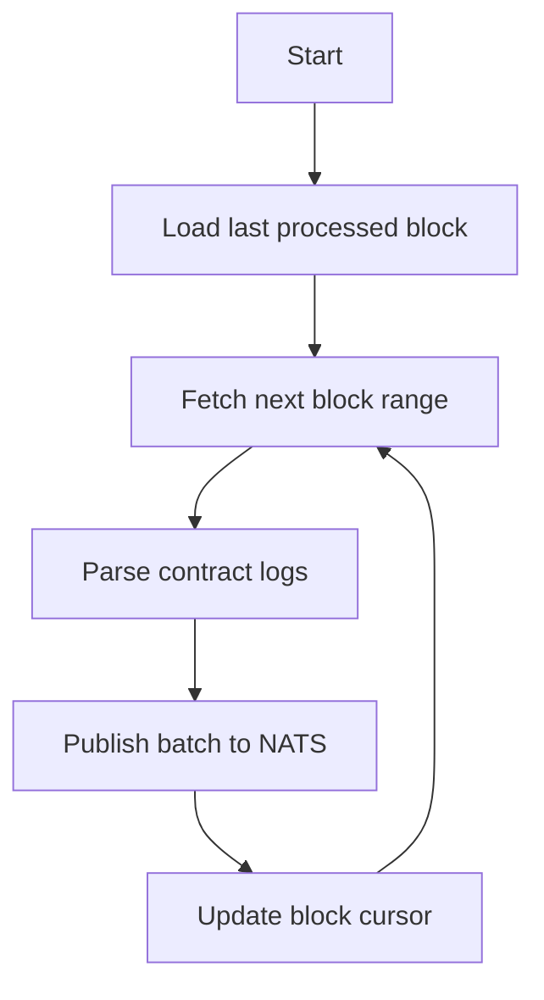
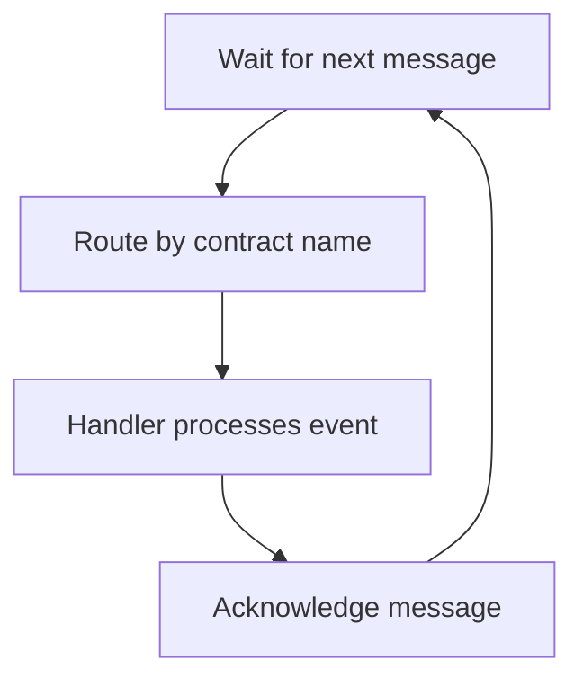
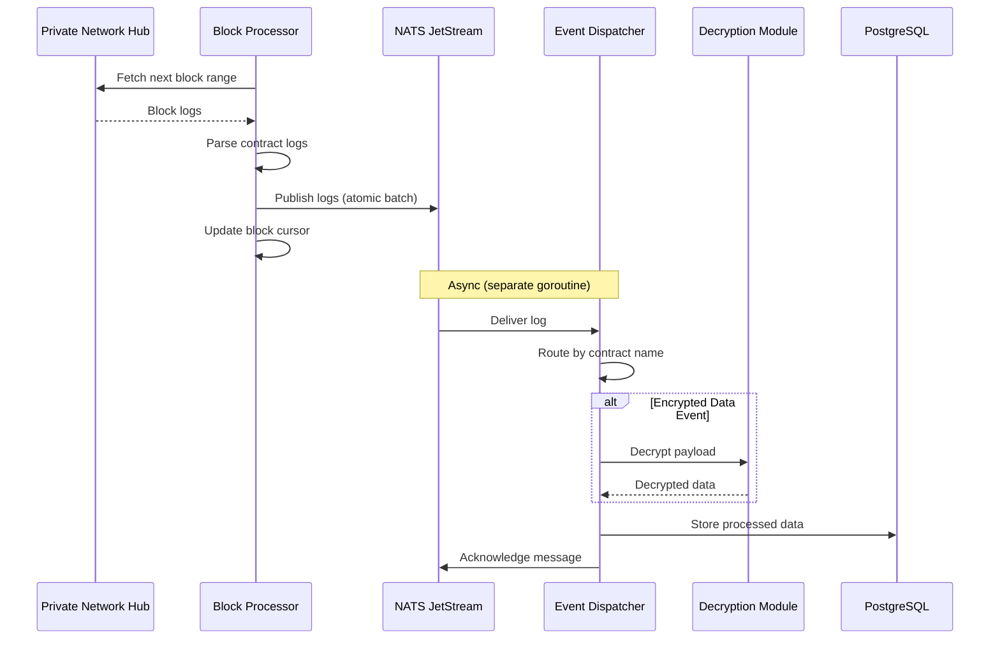
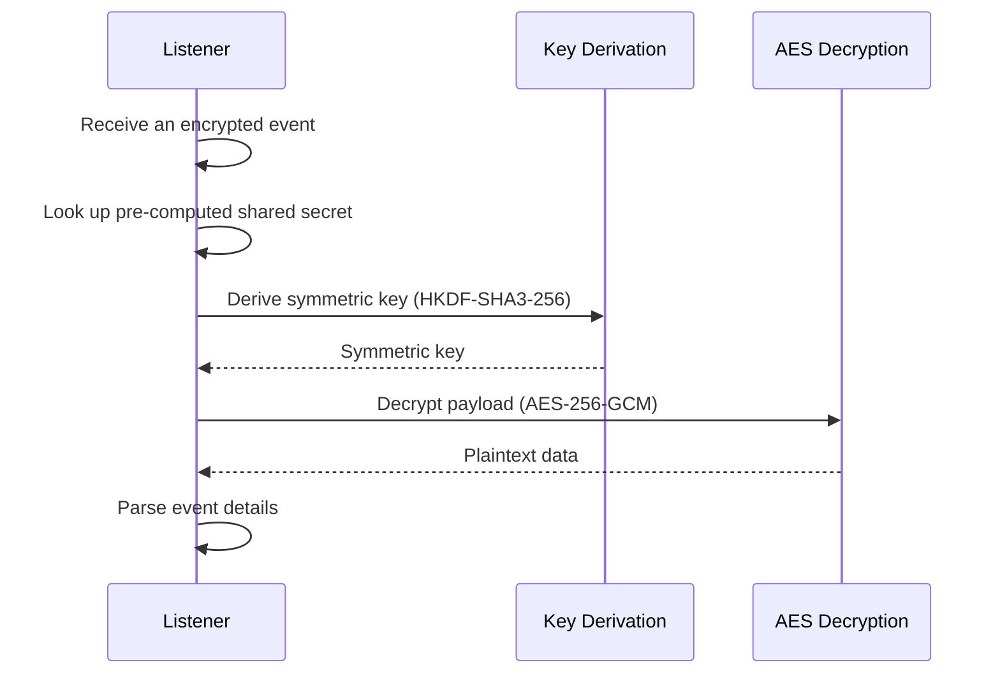

# Listener Service

The Listener Service monitors blockchain events from the Private Network Hub, publishes them to a NATS JetStream message queue, and asynchronously dispatches them to event handlers that decrypt payloads and store transaction data for audit purposes.

---

## Purpose

The Listener Service is the data ingestion layer of the Governance API:

- **Block Processing**: Processes blocks sequentially and publishes parsed logs to NATS JetStream
- **Event Monitoring**: Subscribes to governance and teleport events
- **Async Event Dispatching**: Consumes logs from NATS and routes them to the appropriate handler
- **Payload Decryption**: Decrypts encrypted transaction data using ML-KEM derived shared secrets
- **Data Storage**: Persists participants, tokens, and transactions to PostgreSQL

---

## Block Processing

The Listener runs two concurrent pipelines: a **Block Processor** that fetches and publishes logs, and an **Event Dispatcher** that consumes and handles them.

### Block Processor (Producer)

The Block Processor fetches blockchain blocks sequentially, parses contract logs, and publishes them to NATS JetStream as an atomic batch.
It maintains a persistent block cursor stored in the database, which tracks the last successfully processed block and is loaded on startup.

The block cursor is only advanced after the batch is successfully published. This allows the service to safely resume after restarts or failures, while ensuring that no events are missed or duplicated.

### Event Dispatcher (Consumer)

The Event Dispatcher runs in a separate goroutine, consuming logs from NATS and routing each one to the matching handler by contract name.

### Message Queue Guarantees

- **Deduplication**: 1-hour window prevents reprocessing during restarts
- **Retry**: Failed messages are redelivered up to 10 times before being dropped
- **Atomic batching**: All logs from a block range are published atomically (all-or-nothing)
- **Ordering**: WorkQueue retention with a single consumer preserves message order

---

## Event Processing

---

## Monitored Events

The Listener subscribes to events from multiple contracts:

### Participant Events

| Contract        | Event                   | Purpose               |
| --------------- | ----------------------- | --------------------- |
| ParticipantCore | `ParticipantRegistered` | New participant added |
| ParticipantCore | `ParticipantUpdated`    | Status or role change |

### Token Events

| Contract           | Event                       | Purpose                |
| ------------------ | --------------------------- | ---------------------- |
| TokenCore          | `Erc20TokenRegistered`      | New ERC-20 token       |
| TokenCore          | `Erc721TokenRegistered`     | New ERC-721 token      |
| TokenCore          | `Erc1155TokenRegistered`    | New ERC-1155 token     |
| TokenCore          | `DvpErc721TokenRegistered`  | New DVP ERC-721 token  |
| TokenCore          | `DvpErc1155TokenRegistered` | New DVP ERC-1155 token |
| TokenCore          | `TokenStatusUpdated`        | Token status change    |
| TokenCore          | `TokenBalanceUpdated`       | Balance tracking       |
| EnygmaTokenManager | `EnygmaTokenRegistered`     | New Enygma token       |

!!! note "These are Hub-side events"
    The Listener monitors the **Hub** token catalog (`TokenCore` module of the Hub `TokenRegistryV1`), so these events fire when a token is added to the Hub via `submitToHub` and activated with `updateStatus(resourceId, ACTIVE)`. The PN-side registration lifecycle (`registerToken`, `updatePrivacyNodeStatus`) is tracked separately by [`PNTokenRegistryV1`](../components/smart-contracts/pn-token-registry.md) on each Privacy Node.

### Teleport Events

| Contract | Event                              | Purpose                 |
| -------- | ---------------------------------- | ----------------------- |
| Teleport | `AtomicMessageAdditionalDataBatch` | Additional message data |
| Teleport | `AtomicMessageStatusChangedBatch`  | Message status updates  |
| Teleport | `EncryptedDataBatchStored`         | Encrypted payloads      |

### Enygma Events

| Contract       | Event                     | Purpose                               |
| -------------- | ------------------------- | ------------------------------------- |
| EnygmaTeleport | `EnygmaTransfer`          | Privacy-preserving transfer initiated |
| EnygmaTeleport | `EnygmaTransferCompleted` | Transfer completed                    |
| EnygmaTeleport | `EnygmaSupplyUpdated`     | Supply tracking for Enygma tokens     |
| EnygmaTeleport | `EnygmaDvpBalanceUpdated` | DVP balance updates for Enygma        |

### DVP Events

| Contract    | Event             | Purpose                                                                |
| ----------- | ----------------- | ---------------------------------------------------------------------- |
| DvpTeleport | `SwapInitiated`   | Swap initiated; carries AES-GCM-encrypted message + ML-KEM ciphertext |
| DvpTeleport | `SwapCompleted`   | Swap settled; carries the responder's settlement message              |
| DvpTeleport | `SwapCancelled`   | Swap cancelled manually via `Dvp.cancelSwap(sharedId, preimage)`  |
| DvpTeleport | `SwapTimedOut`    | Swap expired past `expiresAt` via `Dvp.expireSwap(sharedId)`      |

### Proof Events

| Contract | Event                  | Purpose             |
| -------- | ---------------------- | ------------------- |
| Proofs   | `HeaderProofSubmitted` | Liveliness tracking |

### Token Freeze Events

| Contract           | Event                      | Purpose                                      |
| ------------------ | -------------------------- | -------------------------------------------- |
| TokenFreezeManager | `TokenFreezeStatusChanged` | Token frozen or unfrozen on specific chain(s) |

### Audit Events

| Contract     | Event                 | Purpose                                   |
| ------------ | --------------------- | ----------------------------------------- |
| AuditManager | `NewAuditOrChainInfo` | Audit configuration or chain info updates |

---

## Decryption Workflow

When the Listener encounters encrypted data:

See [Decryption](decryption.md) for cryptographic details.

---

## Data Storage

The Listener stores processed data in PostgreSQL:

### Participants Table

| Column                 | Description                   |
| ---------------------- | ----------------------------- |
| `id`                   | Primary key (UUID)            |
| `chain_id`             | Privacy Node ID               |
| `name`                 | Participant name              |
| `owner_id`             | Owner identifier              |
| `status`               | Current status                |
| `role`                 | Assigned role                 |
| `allowed_to_broadcast` | Broadcasting permission       |
| `is_flagged`           | Flag indicator for compliance |
| `flag_reason`          | Reason for flagging           |
| `flagged_at`           | Timestamp when flagged        |
| `created_at`           | Registration timestamp        |
| `updated_at`           | Last update timestamp         |

### Tokens Table

| Column         | Description                            |
| -------------- | -------------------------------------- |
| `id`           | Primary key (UUID)                     |
| `resource_id`  | Unique token identifier                |
| `issuer_id`    | Issuing Privacy Node ID                |
| `name`         | Token name                             |
| `symbol`       | Token symbol                           |
| `erc_standard` | Token standard (ERC-20, ERC-721, etc.) |
| `decimals`     | Decimal places                         |
| `status`       | Current status                         |
| `metadata_url` | Token metadata URL                     |
| `created_at`   | Registration timestamp                 |
| `updated_at`   | Last update timestamp                  |

### Transactions Table

| Column                  | Description                                |
| ----------------------- | ------------------------------------------ |
| `id`                    | Primary key (UUID)                         |
| `message_id`            | Cross-chain message identifier             |
| `resource_id`           | Token resource ID                          |
| `from_chain_id`         | Source chain ID                            |
| `to_chain_id`           | Destination chain ID                       |
| `from`                  | Sender address                             |
| `to`                    | Recipient address                          |
| `amount`                | Transfer amount                            |
| `erc_id`                | Token ID (for ERC-721 and ERC-1155)        |
| `tx_type`               | Transaction type                           |
| `msg_type`              | Message type                               |
| `protocol`              | Protocol identifier                        |
| `teleport_status`       | Processing status                          |
| `cc_tx_hash`            | Private Network Hub transaction hash       |
| `tx_hash_source`        | Source chain transaction hash              |
| `tx_hash_destination`   | Destination chain transaction hash         |
| `block_number`          | Block number                               |
| `log_index`             | Event log index                            |
| `payload`               | Decrypted payload data                     |
| `shared_id`             | Shared identifier for related transactions |
| `batch_id`              | Batch identifier                           |
| `is_flagged`            | Compliance flag                            |
| `is_processed`          | Processing flag                            |
| `aggregation_type`      | Aggregation type for pagination            |
| `aggregation_key`       | Aggregation key for grouping               |
| `source_timestamp`      | Source chain timestamp                     |
| `destination_timestamp` | Destination chain timestamp                |
| `created_at`            | Event capture timestamp                    |
| `updated_at`            | Last update timestamp                      |

### Enygma Transactions Table

| Column              | Description                       |
| ------------------- | --------------------------------- |
| `transaction_id`    | Foreign key to transactions table |
| `enygma_tx_type`    | Enygma-specific transaction type  |
| `to_r_value_to_add` | Cryptographic value for privacy   |
| `reference_id`      | Reference identifier              |
| `rn_hash`           | Receiver Node hash                |
| `batch_id`          | Batch identifier                  |
| `cc_timestamp`      | Private Network Hub timestamp     |
| `updated_at`        | Last update timestamp             |

### Token Freeze States Table

| Column        | Description                                         |
| ------------- | --------------------------------------------------- |
| `resource_id` | Token resource ID (composite PK with `chain_id`)    |
| `chain_id`    | Chain where the freeze applies (composite PK)       |
| `is_frozen`   | Current freeze status                               |
| `created_at`  | First freeze timestamp                              |
| `updated_at`  | Last state change timestamp                         |

### Token Freeze Audits Table

| Column             | Description                                      |
| ------------------ | ------------------------------------------------ |
| `id`               | Primary key (UUID)                               |
| `resource_id`      | Token resource ID                                |
| `chain_id`         | Target chain ID                                  |
| `action`           | Freeze action (0 = unfreeze, 1 = freeze)         |
| `block_number`     | Block number of the event                        |
| `transaction_hash` | Transaction hash of the event                    |
| `created_at`       | Block timestamp of the event                     |

### Header Proof Events Table

| Column         | Description           |
| -------------- | --------------------- |
| `id`           | Primary key           |
| `chain_id`     | Privacy Node ID       |
| `block_number` | Block number of proof |
| `block_hash`   | Block hash            |
| `created_at`   | Submission timestamp  |

---

**Navigate:**

- [Back to Governance Services Overview](governance-services.md)
- [Flagger Service](flagger-service.md) - Compliance validation
- [Decryption](decryption.md) - Cryptographic details
