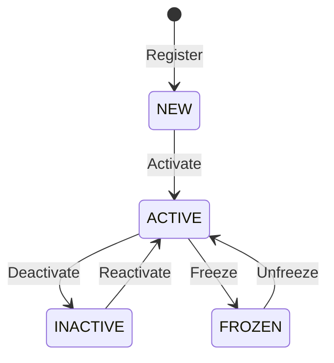
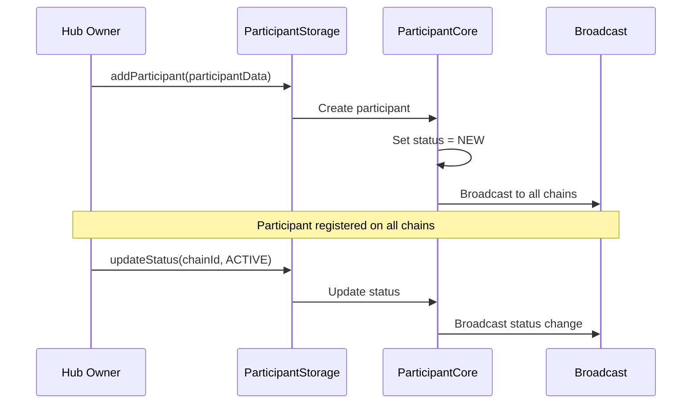
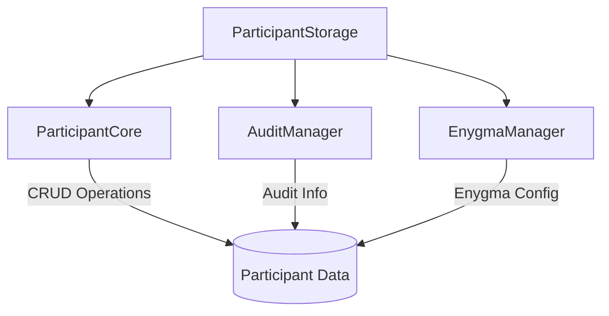
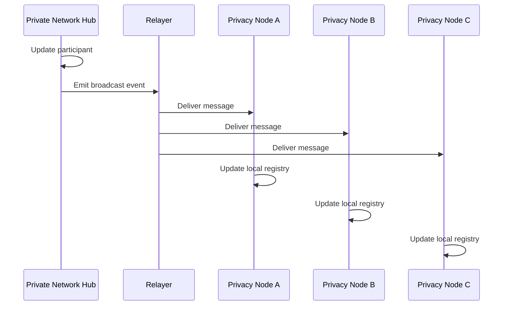

# Participant Management

Participants represent Privacy Nodes registered on the Rayls network. The governance system manages their identity, roles, and operational status through smart contracts on the Private Network Hub.

---

## What is a Participant?

A participant is the on-chain identity of a Privacy Node. Each participant has:

- **Chain ID**: The unique identifier of their Privacy Node
- **Endpoint Address**: The contract address for cross-chain messaging
- **Roles**: Permissions granted to the participant
- **Status**: Current operational state
- **Audit Data**: Chain-specific information for compliance

---

## Participant Data

| Field | Description |
|-------|-------------|
| `chainId` | Unique identifier for the Privacy Node |
| `role` | Assigned role (single enum: PARTICIPANT, ISSUER, or AUDITOR) |
| `status` | Current status (NEW, ACTIVE, INACTIVE, FROZEN) |
| `ownerId` | Owner identifier string |
| `name` | Human-readable name |
| `createdAt` | Timestamp of creation |
| `updatedAt` | Timestamp of last update |
| `allowedToBroadcast` | Whether this participant can broadcast messages |

!!! note "Related Data in Separate Modules"
    Audit information is managed by `AuditManagerV1` and Enygma-specific data by `EnygmaManagerV1`. These are not stored in the participant struct itself.

---

## Roles

Each participant is assigned a single role that determines its permissions on the network.

| Role | Description | Capabilities |
|------|-------------|--------------|
| **PARTICIPANT** | Standard network member | Send/receive cross-chain messages |
| **ISSUER** | Token issuer | Register new tokens on the network |
| **AUDITOR** | Compliance auditor | Access decrypted transaction data |

A participant has exactly one role at a time. Calling `updateRole()` replaces the existing role.

!!! info "Participant Roles vs Authorization Roles"
    Participant roles (PARTICIPANT, ISSUER, AUDITOR) define what a **Privacy Node** can do on the network. Authorization roles (ADMIN, PRIVACY_NODE_OPERATOR, BANK_EMPLOYEE, etc.) define what **individual users** can do within a Privacy Node. See [Authorization](authorization/index.md) for the full authorization system.

---

## Status Lifecycle

| Status | Description |
|--------|-------------|
| **NEW** | Registered but not yet activated |
| **ACTIVE** | Fully operational, can participate in network |
| **INACTIVE** | Deactivated, can be reactivated |
| **FROZEN** | Suspended for compliance reasons |

---

## Registration Flow

### Registration Steps

1. **Hub Owner initiates**: Only the Hub Owner can register participants
2. **Data validated**: Chain ID uniqueness and endpoint validity checked
3. **Participant created**: Status set to NEW
4. **Cross-chain broadcast**: Registration message sent to all existing chains
5. **Activation**: Owner separately activates when ready

---

## Contract Architecture

The participant system uses a modular architecture:

| Contract | Responsibility |
|----------|----------------|
| **ParticipantStorage** | Entry point, delegates to modules |
| **ParticipantCore** | Core CRUD operations and validation |
| **AuditManager** | Audit information management |
| **EnygmaManager** | Enygma-specific data handling |

---

## Cross-Chain Synchronization

When a participant is added or updated, the change is broadcast to all chains in the network:

This ensures all Privacy Nodes have a consistent view of network participants.

---

## Operations

### Adding a Participant

The Hub Owner submits participant data including:
- Chain ID of the new Privacy Node
- Endpoint contract address
- Initial roles to assign

### Updating Status

Status changes follow the lifecycle rules:
- NEW can transition to ACTIVE
- ACTIVE can transition to INACTIVE or FROZEN
- INACTIVE can transition back to ACTIVE
- FROZEN requires explicit unfreezing to return to ACTIVE

### Assigning Roles

Roles can be added or removed from participants:
- Adding ISSUER role enables token registration
- Adding AUDITOR role enables audit data access
- PARTICIPANT role is typically assigned by default

---

## Compliance Considerations

### Freezing

Participants can be frozen for compliance reasons:

- Frozen participants cannot send cross-chain messages
- Existing pending messages may still be processed
- Unfreezing requires explicit Hub Owner action

### Audit Information

The AuditManager module stores:

- Chain verification data
- Compliance flags
- Historical status changes

This data is accessible to participants with the AUDITOR role.

---

**Navigate:**

- [Back to Governance Overview](index.md)
- [Tokens](tokens.md) - Token registry and lifecycle
- [Governance Services](governance-services.md) - Off-chain monitoring services
