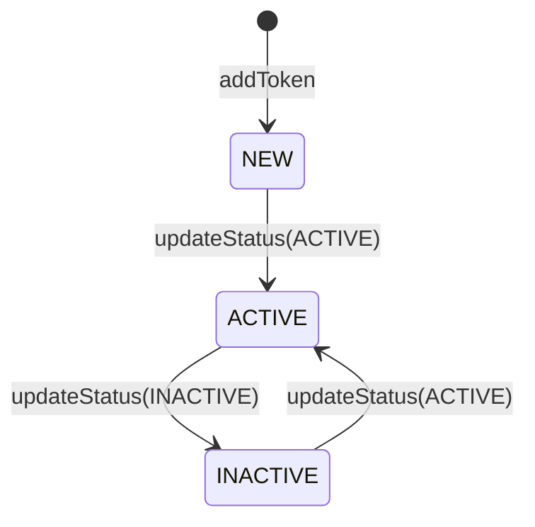
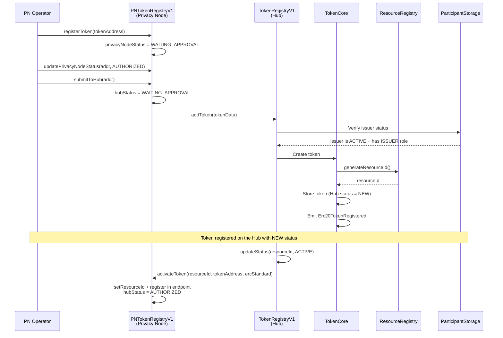
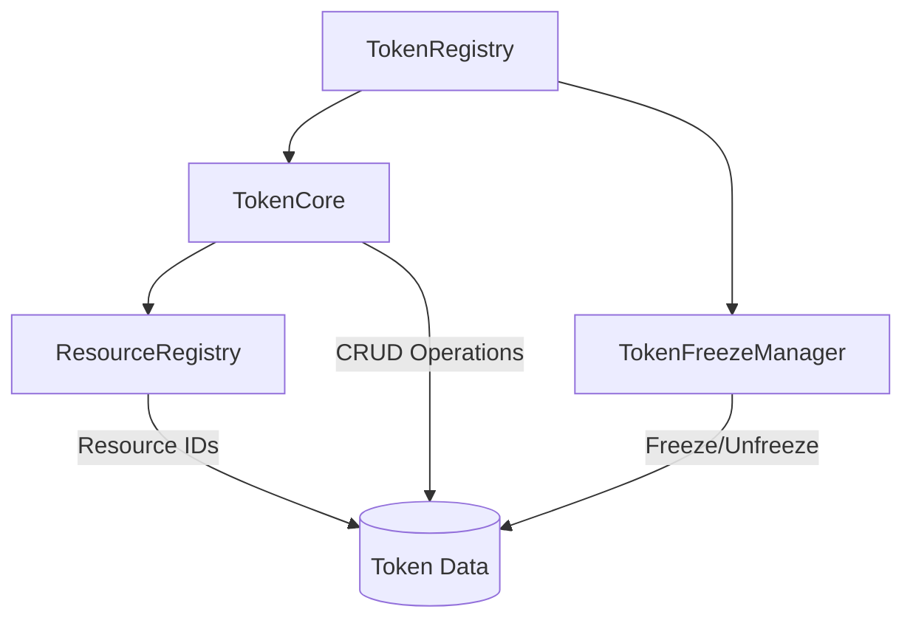
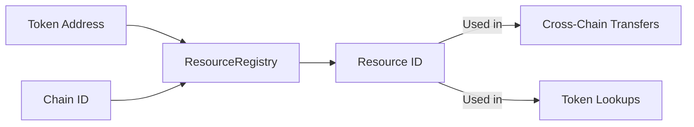
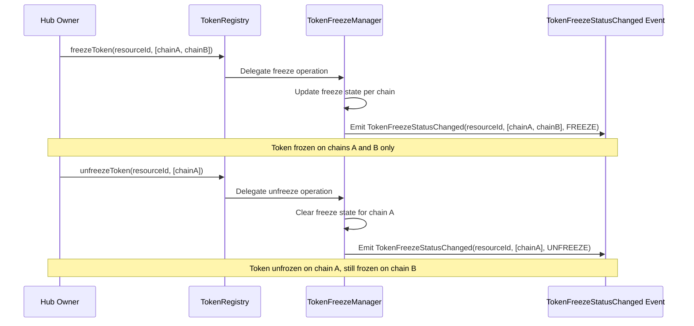
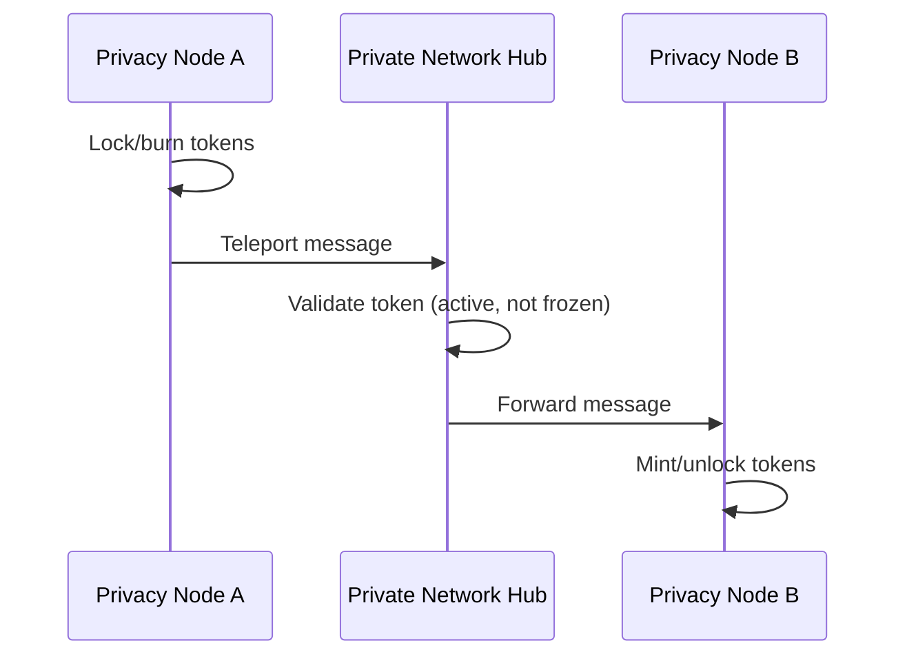

# Token Registry

The Token Registry manages the lifecycle of tokens on the Rayls network. All tokens must be registered and approved before they can be used in cross-chain operations.

!!! info "This page documents the Hub registry"
    This page covers the **Hub-side** `TokenRegistryV1` (network-global token state, resource IDs, and the Hub `ACTIVE` status). Token registration now **originates on the Privacy Node**: an operator registers and approves a token locally in `PNTokenRegistryV1` before optionally submitting it to the Hub. For the PN-side registry, its three independent status models, and the local registration/freeze flows, see [PN Token Registry](../components/smart-contracts/pn-token-registry.md).

---

## What is the Token Registry?

The Token Registry is a centralized on-chain system that:

- Tracks all tokens available on the network
- Validates issuer authorization
- Manages token status lifecycle
- Enables token freezing for compliance
- Generates unique resource IDs for cross-chain addressing

---

## Token Data

| Field | Description |
|-------|-------------|
| `resourceId` | Unique identifier across all chains |
| `issuerChainId` | Chain ID of the issuing Privacy Node |
| `tokenAddress` | Contract address on issuer's chain |
| `name` | Token name |
| `symbol` | Token symbol |
| `decimals` | Decimal places (ERC-20) |
| `standard` | Token standard (ERC-20, ERC-721, ERC-1155, Enygma, DVP-ERC721, DVP-ERC1155) |
| `status` | Current status (NEW, ACTIVE, INACTIVE) |

---

## Supported Token Standards

| Standard | Description | Use Cases |
|----------|-------------|-----------|
| **ERC-20** | Fungible tokens | Currencies, stablecoins |
| **ERC-721** | Non-fungible tokens | Unique assets, certificates |
| **ERC-1155** | Multi-token standard | Gaming assets, mixed collections |
| **Enygma** | Privacy-preserving tokens | Confidential transfers |
| **DVP-ERC721** | ERC-721 compatible tokens with native support for the Delivery versus Payment (DvP) protocol | Private and atomic swaps via zero-knowledge proofs |
| **DVP-ERC1155** | ERC-1155 compatible tokens with native support for the Delivery versus Payment (DvP) protocol | Private and atomic swaps via zero-knowledge proofs |

Each standard has specific registration requirements and cross-chain transfer mechanisms.

---

## Status Lifecycle

The Hub registry tracks a single **Hub token status** for each token, driven by the Hub operator's `updateStatus(resourceId, ...)` call. `ACTIVE` corresponds to numeric value `1`.

| Status | Description |
|--------|-------------|
| **NEW** | Registered on the Hub but not yet activated |
| **ACTIVE** | Available for cross-chain operations |
| **INACTIVE** | Disabled, no new transfers allowed |

!!! warning "Hub status vs. the PN three-status model"
    This `NEW / ACTIVE / INACTIVE` lifecycle applies **only to the Hub token** and is set with the Hub-side `updateStatus(resourceId, ACTIVE)` call. It is **not** the same as the Privacy Node's model, where each token carries three independent statuses — `PrivacyNodeStatus`, `HubStatus`, and `PublicChainStatus` — managed by `PNTokenRegistryV1`. Do not conflate the two. See [PN Token Registry](../components/smart-contracts/pn-token-registry.md) for the PN-side status machines.

---

## Registration Flow

Registration **originates on the Privacy Node**. An operator registers and approves the token locally in `PNTokenRegistryV1`, then submits it to the Hub. The Hub validates the issuer, generates a resource ID, and — once the Hub operator approves — sends the `activateToken` callback back to the PN registry.

### Registration Requirements

1. **PN Registration**: The token must first be registered and approved locally via `PNTokenRegistryV1.registerToken(tokenAddress)` and `updatePrivacyNodeStatus(addr, AUTHORIZED)` before `submitToHub` is allowed.

2. **Issuer Validation**: When the Hub receives `addToken`, the issuing participant must be:
   - In ACTIVE status
   - Have the ISSUER role assigned

3. **Token Data**: Must include:
   - Valid contract address on issuer's chain
   - Token metadata (name, symbol, decimals)
   - Correct token standard identifier

4. **Resource ID Generation**: A unique resource ID is generated for cross-chain addressing and delivered back to the PN via the `activateToken(bytes32, address, uint8)` callback.

---

## Contract Architecture

| Contract | Responsibility |
|----------|----------------|
| **TokenRegistry** | Entry point, delegates to modules |
| **TokenCore** | Core CRUD operations and validation |
| **TokenFreezeManager** | Token freezing capabilities |
| **ResourceRegistry** | Unique resource ID generation |

---

## Resource IDs

Resource IDs provide unique identification for tokens across all chains:

The resource ID is deterministic based on:
- Issuer chain ID
- Token contract address
- Token standard

This enables consistent token identification regardless of which chain the operation originates from.

---

## Token Freezing

For compliance purposes, tokens can be frozen at the chain level. The TokenRegistry delegates freeze operations to the TokenFreezeManager contract, allowing operators to freeze a token on specific chains rather than globally, providing fine-grained control over cross-chain transfers.

### Chain-Level Granularity

A freeze operation targets one or more chain IDs for a given token. This means a token can be frozen on Chain A while remaining fully operational on Chain B.

### Freeze State Tracking

The Governance Services maintain two database tables to track freeze operations:

| Table | Purpose |
|-------|---------|
| `token_freeze_states` | Current freeze state per token-chain pair (composite primary key: `resource_id`, `chain_id`) |
| `token_freeze_audits` | Historical log of all freeze/unfreeze actions with block number and transaction hash |

When querying tokens through the API, any chains where the token is currently frozen are returned in the `frozenChainIds` field. See the [API Service](api-service.md) for the response format.

### Freeze Actions

| Action | Value | Effect |
|--------|-------|--------|
| **Freeze** | `1` | Halts transfers on specified chains |
| **Unfreeze** | `0` | Restores transfers on specified chains |

### Transfer Enforcement

Token freeze is enforced at the smart contract level through modifiers that check freeze state before allowing operations:

| Contract | Modifier | Applied To |
|----------|----------|------------|
| **EnygmaV1** | `checkFreeze` | Enygma batch transfers (Hub-level, zero-knowledge proof-based) |
| **EnygmaDvpIntegration** | `checkFreeze` | DvP deposit and withdraw operations (Hub-level) |
| **EnygmaPLEvents** | `validateTransfer` | Cross-chain Enygma transfers and all DvP functions (deposit, withdraw, swap for ERC-721 and ERC-1155) — Privacy Node level |

The `checkFreeze` modifier (Hub-level) queries the `TokenFreezeManager` through the `TokenRegistry` to verify the token is not frozen on the current chain before allowing the operation to proceed. The `validateTransfer` modifier (Privacy Node level) performs participant and token validation, including freeze checks, for both cross-chain Enygma transfers and DvP operations — acting as the primary enforcement gate before the transaction reaches the Hub.

### Freeze vs Inactive

| Action | Scope | Effect | Reversibility |
|--------|-------|--------|---------------|
| **Freeze** | Per-chain | Immediate halt of transfers on targeted chains | Can unfreeze specific chains |
| **Inactive** | Global | Graceful shutdown, existing transfers complete | Can reactivate |

Freezing is typically used for:

- Compliance investigations targeting specific chains
- Security incidents isolated to certain participants
- Regulatory requirements in specific jurisdictions

---

## Cross-Chain Token Operations

Once registered and active, tokens can participate in cross-chain operations:

### Teleport Transfers

### Validation at Hub

The Private Network Hub validates:

- Token is registered
- Token status is ACTIVE
- Token is not frozen
- Sender is authorized

---

## Token Events

The Token Registry emits events for monitoring:

| Event | Contract | Trigger |
|-------|----------|---------|
| `Erc20TokenRegistered` | TokenCore | New ERC-20 token registered |
| `Erc721TokenRegistered` | TokenCore | New ERC-721 token registered |
| `Erc1155TokenRegistered` | TokenCore | New ERC-1155 token registered |
| `DvpErc721TokenRegistered` | TokenCore | New DVP-ERC721 token registered |
| `DvpErc1155TokenRegistered` | TokenCore | New DVP-ERC1155 token registered |
| `TokenStatusUpdated` | TokenCore | Token status changed |
| `TokenBalanceUpdated` | TokenCore | Balance change (for tracking) |
| `TokenFreezeStatusChanged` | TokenFreezeManager | Token frozen or unfrozen on specific chains |

These events are consumed by the [Governance Services](governance-services.md) for compliance monitoring.

---

**Navigate:**

- [Back to Governance Overview](index.md)
- [PN Token Registry](../components/smart-contracts/pn-token-registry.md) - Privacy Node-side registration and the three-status model
- [Participants](participants.md) - Participant registration and management
- [Governance Services](governance-services.md) - Off-chain monitoring services
