# How It Works

This page provides a technical walkthrough of Rayls, explaining how the components work together to enable private cross-chain transactions.

## System Overview

Rayls uses a **hub-and-spoke architecture** where each institution runs their own Rayls Privacy Node (spoke) and communicates through a shared Private Network Hub (hub).

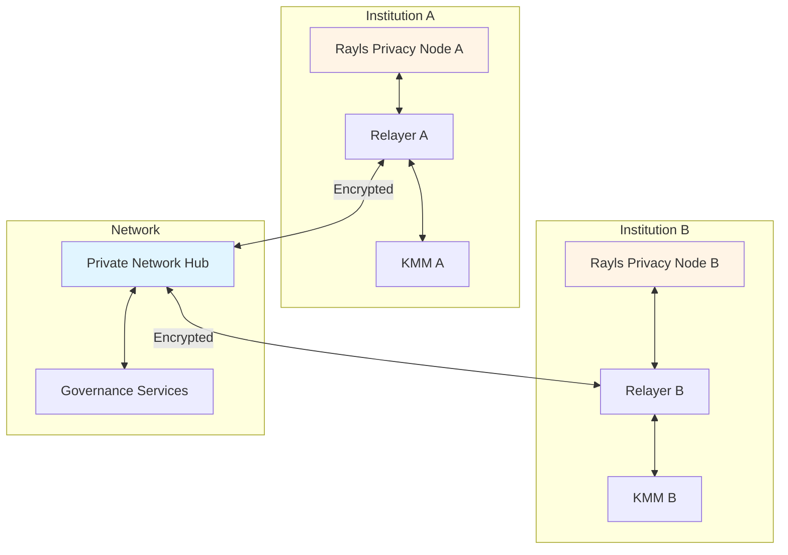

## Component Roles

### Rayls Privacy Node

An Ethereum-compatible blockchain running within each institution:

| Aspect | Details |
|--------|---------|
| **Base** | axyl (Rust, reth-based EVM) |
| **Consensus** | Narwhal + Bullshark BFT |
| **Block time** | 1 second |
| **Storage** | MDBX (execution + consensus DBs) |
| **Contract size** | 1MB limit (extended) |

**What runs on the Privacy Node:**

- Your token contracts (ERC-20/721/1155)
- Endpoint contract (message dispatcher/executor)
- Handler contracts (protocol implementations)
- Your business logic contracts

### Private Network Hub

A shared coordination layer that routes messages:

| Aspect | Details |
|--------|---------|
| **Base** | Hyperledger Besu |
| **Consensus** | IBFT/QBFT (Byzantine Fault Tolerant) |
| **Participants** | Validators run by network operators |
| **Data stored** | Encrypted message blobs, proofs, routing info |

**Hub contracts:**

- **TeleportV1** - Stores encrypted cross-chain messages
- **Proofs** - Stores Merkle proofs for verification
- **ParticipantStorage** - Registry of participating institutions
- **TokenRegistry** - Maps token resources across chains

### Relayer

The orchestration service bridging each Privacy Node to the Hub:

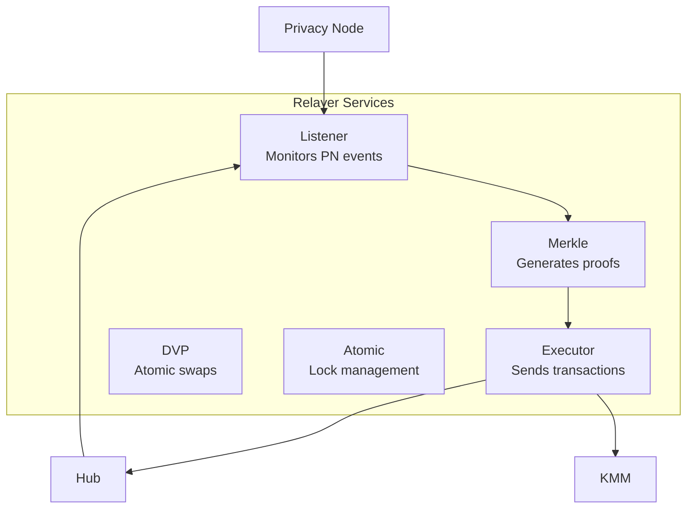

**Service responsibilities:**

| Service | Function |
|---------|----------|
| **Listener** | Detects MessageDispatched events on Privacy Node and Hub |
| **Executor** | Builds, signs, and submits transactions |
| **Merkle** | Creates Merkle trees and inclusion proofs |
| **DVP** | Coordinates zero-knowledge atomic swaps |
| **Atomic** | Manages fund locking for atomic transactions |

### Key Management Module (KMM)

Handles all cryptographic operations:

- **Rayls Sign Keys** (ECDSA) - Blockchain transaction signing
- **Rayls View Keys** (ML-KEM) - Message encryption/decryption
- **Payment Spend Keys** (Baby JubJub) - Enygma ZK proofs and Pedersen commitments

## Transaction Flow: Step by Step

Let's trace a token transfer from Institution A to Institution B.

### Phase 1: Initiation (Source Privacy Node)

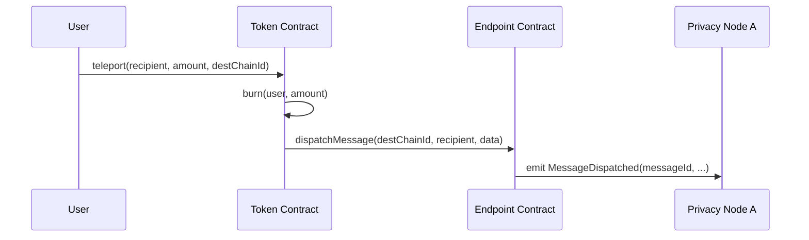

**What happens:**
1. User calls `teleport()` on their token contract
2. Token contract burns the specified amount
3. Token calls Endpoint's `dispatchMessage()`
4. Endpoint emits `MessageDispatched` event

### Phase 2: Relayer Processing (Source)

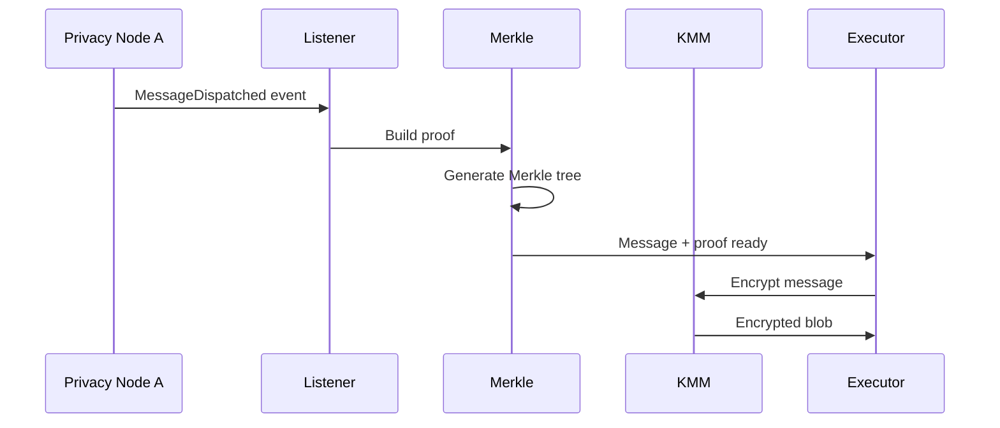

**What happens:**
1. Listener service detects the MessageDispatched event
2. Merkle service builds a Merkle tree of recent messages
3. Generates inclusion proof for this specific message
4. Executor requests encryption from KMM
5. KMM encrypts using recipient's public key

### Phase 3: Hub Routing

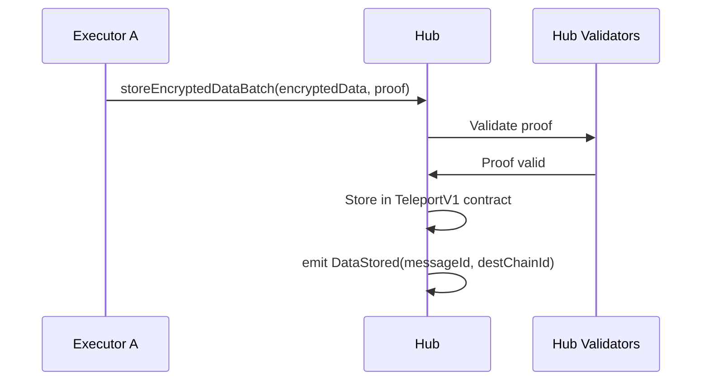

**What happens:**
1. Executor submits encrypted data and Merkle proof to Hub
2. Hub validators verify the Merkle proof
3. Data stored in TeleportV1 contract
4. Event emitted for destination chain

### Phase 4: Destination Processing

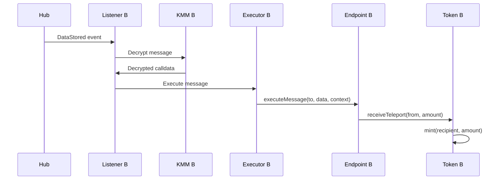

**What happens:**
1. Destination Relayer's Listener detects DataStored event
2. KMM decrypts the message using institution's private key
3. Executor calls Endpoint's `executeMessage()`
4. Endpoint appends context (messageId, fromChainId, from) to calldata
5. Token's `receiveTeleport()` mints tokens to recipient

### Complete Flow Visualization

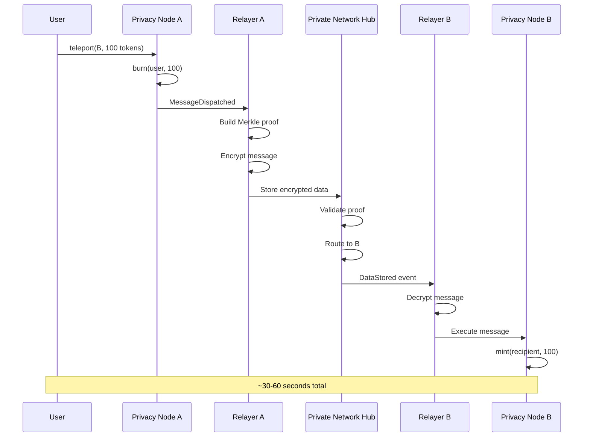

## The EIP-5164 Protocol

Rayls implements EIP-5164 for cross-chain execution. Here's how context flows:

### Dispatching (Source)

```solidity
// On source Privacy Node
endpoint.dispatchMessage(
    destChainId,    // Where to send
    recipient,      // Contract to call
    data            // Encoded function call
);

// Emits:
event MessageDispatched(
    bytes32 indexed messageId,
    address indexed from,
    uint256 indexed toChainId,
    address to,
    bytes data
);
```

### Executing (Destination)

```solidity
// On destination Privacy Node
endpoint.executeMessage(
    to,           // Target contract
    data,         // Original calldata + context
    messageId,    // Unique identifier
    fromChainId,  // Source chain
    from          // Original sender
);

// The 'data' has 84 bytes appended:
// - messageId (32 bytes)
// - fromChainId (32 bytes)
// - from (20 bytes)
```

### Context Extraction

Receiving contracts use helper functions:

```solidity
contract MyToken {
    modifier receiveMethod() {
        require(msg.sender == endpoint, "Only endpoint can call");
        _;
    }

    function receiveTeleport(
        address recipient,
        uint256 amount
    ) external receiveMethod {
        // Extract context
        bytes32 messageId = _getMessageIdOnReceiveMethod();
        uint256 fromChainId = _getFromChainIdOnReceiveMethod();
        address from = _getMsgSenderOnReceiveMethod();

        // Now we know who sent this and from where
        _mint(recipient, amount);
    }
}
```

## Merkle Proofs

Every cross-chain message includes a Merkle proof:

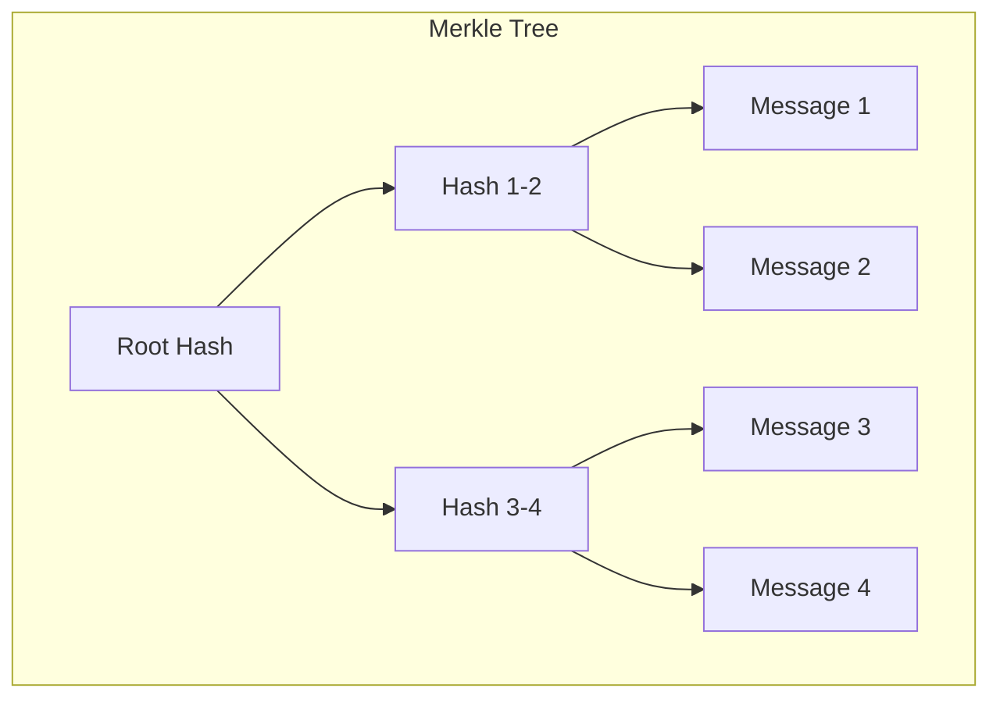

**Purpose:**

- Proves a message was included in a batch
- Enables efficient verification on Hub
- Prevents message forgery

**Tree types:**
| ID | Type | Use |
|----|------|-----|
| 0 | ERC-721 | NFT transfers |
| 1 | ERC-20 | Fungible tokens |
| 2 | ERC-1155 | Multi-tokens |
| 3 | Enygma | Private transfers |

## Encryption Flow

Messages are encrypted before leaving any institution:

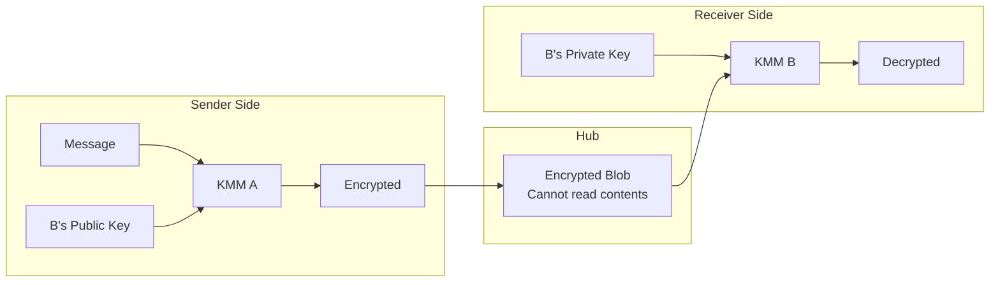

**Encryption scheme:**
1. ML-KEM key agreement establishes shared secret (post-quantum)
2. AES-256 encrypts the actual message
3. Only the intended recipient can decrypt

## Atomic Transactions

For transactions requiring all-or-nothing semantics:

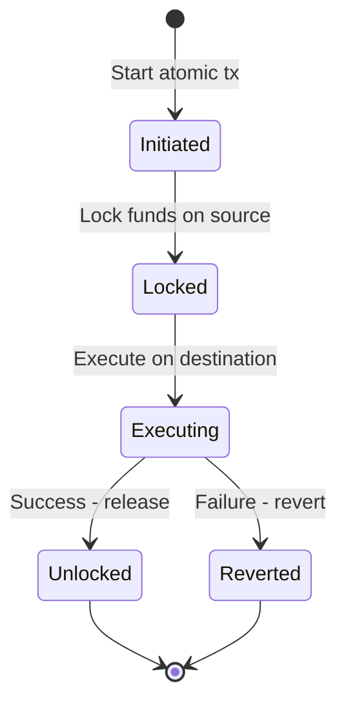

**Four payloads:**

1. **Main** - Primary transaction
2. **Unlock** - Releases locked funds on success
3. **Source Revert** - Undoes source if destination fails
4. **Destination Revert** - Undoes destination if needed

## Privacy Protocols

### Enygma (Hidden Amounts)

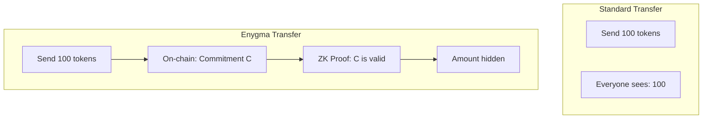

**Key concepts:**

- Pedersen commitments hide amounts
- ZK proofs verify validity without revealing values
- k-anonymity batches multiple transfers together

### DVP (Atomic Swaps)

```mermaid
sequenceDiagram
    participant A as Party A (Seller)
    participant ZK as DVP Contract
    participant B as Party B (Buyer)

    Note over A,B: Shared ID identifies the swap; both parties have deposited
    A->>ZK: initiateSwap(sharedId, encryptedData, ctxt, proof, validityTime)
    Note over ZK: Locks A's nullifiers; status = Pending
    B->>ZK: completeSwap(sharedId, proof, encryptedData)
    Note over ZK: Unlocks + spends A's nullifiers,<br/>inserts both new commitments
    ZK->>A: A's new commitment (Funds)
    ZK->>B: B's new commitment (NFT)
    Note over A,B: Atomic settlement (status = Completed)
```

**Guarantees:**

- The initiator's input is locked the moment `initiateSwap` lands; only `completeSwap` (settlement) or `cancelSwap` / `expireSwap` (refund) can release it
- The two calls are bound together via `dvpId = keccak256(commitments[0], message)` — asymmetric across the two sides
- If completion never happens, the initiator's pre-computed `revertCommitment` (baked into the original proof) is registered to their vault on cancel/timeout — no second proof needed

## Timing Expectations

| Operation | Typical Time | Components |
|-----------|--------------|------------|
| Privacy Node block | 1 second | Local consensus |
| Hub block | ~5 seconds | BFT consensus |
| Standard teleport | 30-60 seconds | Full round trip |
| Atomic transaction | 60-90 seconds | Lock/execute/unlock |
| Enygma transfer | 20-60 seconds | Includes batching |
| ZK proof generation | 2-10 seconds | Gnark API |

## Summary

1. **Rayls Privacy Nodes** execute transactions locally
2. **Relayers** detect events and encrypt messages
3. **Hub** routes encrypted messages without reading them
4. **Destination Relayers** decrypt and execute
5. **Merkle proofs** verify message authenticity
6. **Atomic mode** ensures all-or-nothing execution
7. **Enygma/DVP** add additional privacy layers

---

**Next:** Explore [Components](../components/index.md) for detailed documentation on each system component.
