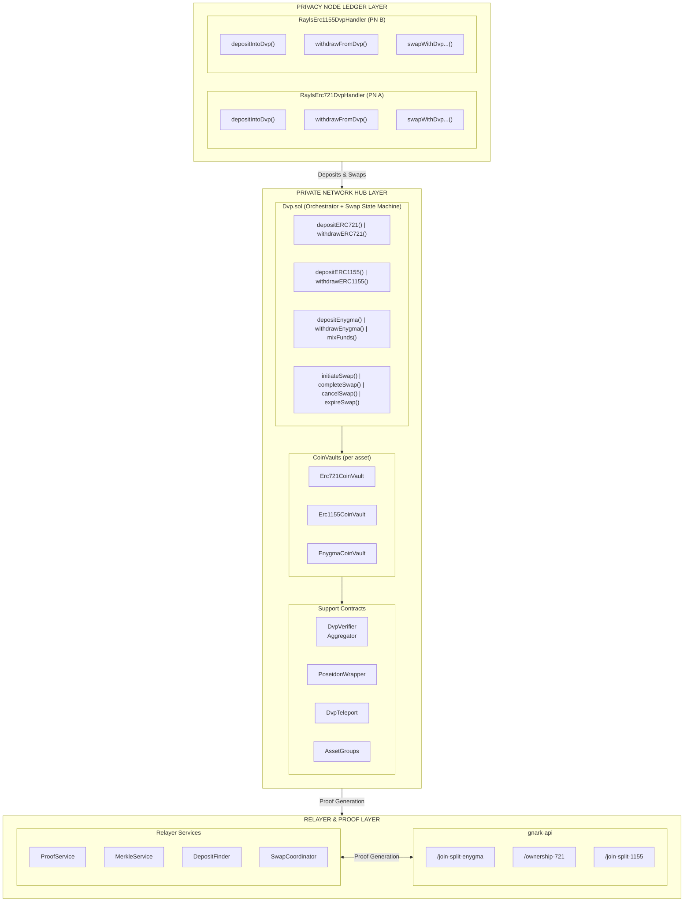
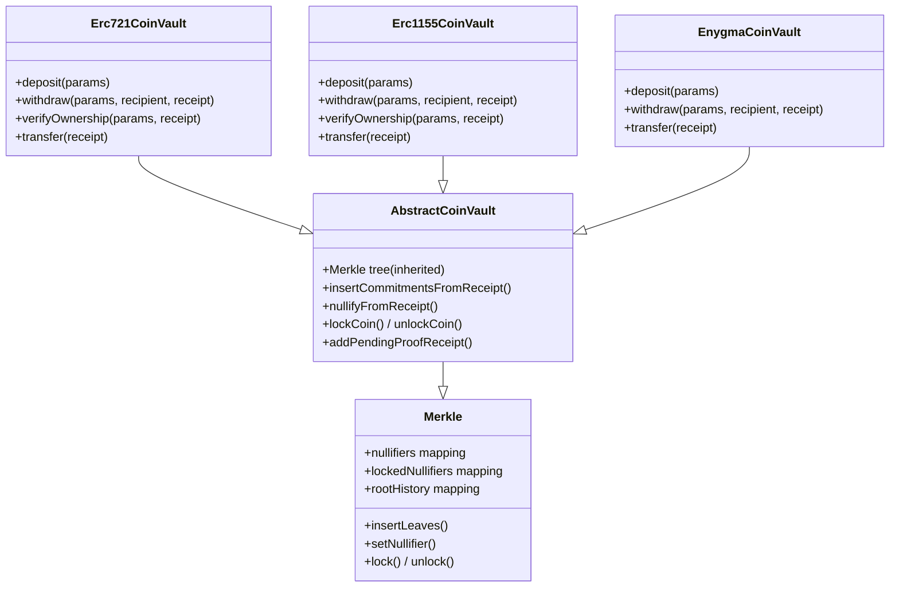
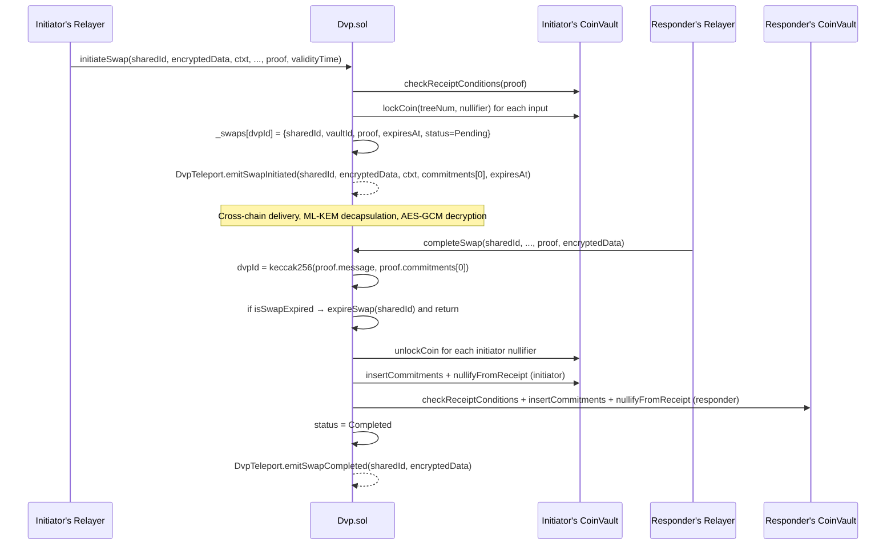

# Architecture

The contract structure, CoinVaults, and verification system of DVP.

## System Overview

DVP consists of smart contracts on the Private Network Hub and supporting services in relayers:



## CoinVault Architecture

Each asset type is managed by its own **CoinVault** — a contract that combines a Merkle tree with asset-specific deposit/withdraw/transfer logic. All CoinVaults inherit from `AbstractCoinVault`.



### CoinVault Types

| CoinVault | Token Type ID | Asset | Commitment formula |
|-----------|---------------|-------|--------------------|
| **Erc721CoinVault** | 2 | ERC-721 NFTs | `H(H(spendPK, salt), H(tokenAddress, nftId))` |
| **Erc1155CoinVault** | 3 | ERC-1155 multi-tokens | `H(H(H(H(spendPK, salt), tokenAddress), tokenId), amount)` |
| **EnygmaCoinVault** | 4 | Enygma privacy tokens | Caller-supplied (`hashCommitment` in `depositParams[0]`) |
| **Erc20CoinVault** | — | ERC-20 (legacy) | `H(H(amount, tokenAddress), publicKey)` (no salt) |

Each CoinVault maintains its own independent Merkle tree. When a tree reaches capacity, a new tree version is created (`treeNumber` increments).

### Commitment Formula

ERC-721 and ERC-1155 commitments combine the asset's unique data with `Poseidon(spendPK, salt)`. The fresh per-deposit [salt](glossary.md#salt) makes two commitments to the same note data indistinguishable. ERC-20 retains the v1 `H(uniqueId, publicKey)` shape; Enygma supplies the commitment directly via the deposit params.

---

## Smart Contracts

### Dvp.sol (Orchestrator)

The central contract that orchestrates all DVP operations. It does not manage Merkle trees directly — it delegates to CoinVaults.

**Key State:**

```solidity
// Vault management
mapping(uint256 => address) _coinVaultAddressById;    // vaultId -> CoinVault address
mapping(address => uint256) _vaultIdsByTokenAddress;   // token -> vaultId

// Asset groups (used by _settleOnGroupPair during completeSwap)
mapping(uint256 => address) _assetGroups;              // groupId -> AssetGroup contract

// V2 swap state machine
struct SwapData {
    bytes32 sharedId;
    uint256 initiatorVaultId;
    IDvp.SwapProofType initiatorProofType;
    IDvp.ProofReceipt initiatorReceipt;
    uint64 expiresAt;
    SwapStatus status;
}
mapping(bytes32 dvpId   => SwapData) private _swaps;
mapping(bytes32 sharedId => bytes32 dvpId) private _sharedIdToDvpId;

// Anti-replay (challenges)
mapping(uint256 => bool) _rottenChallenges;
```

**Key Functions:**

| Category | Function | Purpose |
|----------|----------|---------|
| **Deposit** | `depositERC721(addr, nftId, publicKey, salt, …)` | Transfer NFT to vault, register commitment |
| **Deposit** | `depositERC1155(addr, tokenId, amount, data, publicKey, salt, …)` | Transfer ERC1155 to vault, register commitment |
| **Deposit** | `depositEnygma(...)` | Register caller-supplied commitment in vault |
| **Withdraw** | `withdrawERC721(addr, nftId, recipient, salt, proof, …)` | Verify proof, release NFT |
| **Withdraw** | `withdrawERC1155(addr, tokenId, amount, recipient, salt, proof, …)` | Verify proof, release ERC1155 |
| **Withdraw** | `withdrawEnygma(...)` | Verify proof, signal Enygma withdrawal |
| **Swap (initiate)** | `initiateSwap(sharedId, encryptedData, ctxt, addr, proofType, proof, validityTime, passphrase)` | Lock initiator's nullifiers, store passphrase, set status `Pending`, emit `SwapInitiated` |
| **Swap (complete)** | `completeSwap(sharedId, addr, proofType, proof, encryptedData)` | Unlock + spend initiator's nullifiers, insert both commitments, set status `Completed` |
| **Swap (cancel)** | `cancelSwap(sharedId, preimage)` | Verify preimage against stored passphrase, register `revertCommitment`, unlock + nullify locked inputs, set status `Cancelled` |
| **Swap (expire)** | `expireSwap(sharedId)` | Same as cancel, but requires `block.timestamp >= expiresAt`; sets status `TimedOut` |
| **Swap (helper)** | `isSwapExpired(sharedId)` | Read-only — `block.timestamp > expiresAt` |
| **Mix** | `mixFunds()` | Consolidate Enygma coins in a vault |
| **Mix** | `mixFundsERC1155()` | Consolidate ERC1155 coins in a vault |

The legacy `swap` / `swapOnGroupPair` / `exchange` / `exchangeOnGroupPair` / `submitPartialSettlement` functions are commented out in `IDvp.sol` for historical reference; they are no longer part of the active interface.

### Asset Groups

Asset groups partition vaults so settlement knows which side of a swap is fungible vs. non-fungible:

```solidity
uint256 constant GROUP_ID_FUNGIBLES     = 0;  // Enygma, ERC20
uint256 constant GROUP_ID_NON_FUNGIBLES = 1;  // ERC721, ERC1155
```

`Dvp._proofTypeToGroupId` maps `SwapProofType.Payment → 0` and `SwapProofType.Delivery → 1`. `completeSwap` uses this routing to call the existing `_settleOnGroupPair` pathway when inserting both new commitments.

### Merkle.sol (Tree Contract)

Each CoinVault inherits from Merkle.sol, giving it its own incremental Poseidon-based Merkle tree.

**Key State:**

```solidity
uint256 internal treeDepth;                     // Height of tree
uint256 public merkleRoot;                      // Current root
uint256 public treeNumber;                      // Version counter
uint256[] public zeros;                         // Per-level zero values
uint256[] private filledSubTrees;               // For incremental updates

mapping(uint256 => mapping(uint256 => bool)) public nullifiers;       // treeNum -> nullifier -> spent
mapping(uint256 => mapping(uint256 => bool)) public lockedNullifiers; // treeNum -> nullifier -> locked
mapping(uint256 => mapping(uint256 => bool)) public rootHistory;      // treeNum -> root -> existed
```

**Key Functions:**

| Function | Purpose |
|----------|---------|
| `initializeMerkle()` | Set up tree with depth and zero values |
| `insertLeaves()` | Add commitments to tree |
| `setNullifier()` | Mark coin as spent (permanent) |
| `isValidRoot()` | Check if root exists in history |
| `isValidNullifier()` | Check if nullifier was already spent |
| `lock()` / `unlock()` | Lock/unlock coins during atomic settlement |
| `isLocked()` | Check if a coin is locked |
| `newTree()` | Create new tree version when full |
| `hashLeftRight()` | Poseidon hash of two nodes |

### DvpVerifierAggregator.sol

Routes proofs to the correct verifier based on type.

**Verifier Addresses:**

```solidity
address private enygmaJoinSplitVerifierAddress;
address private erc721OwnershipAddress;
address private erc1155JoinSplitVerifierAddress;
```

**Verification Functions:**

| Function | Public Signals | Purpose |
|----------|---------------|---------|
| `verifyJoinSplitProof()` | 34 elements (`uint256[34]`) | Enygma/ERC20 JoinSplit proofs |
| `verifyOwnershipProof()` | 6 elements (`uint256[6]`) | ERC721 ownership proofs |
| `verifyErc1155JoinSplitProof()` | 34 elements (`uint256[34]`) | ERC1155 JoinSplit proofs |

The aggregator enforces fixed-length 10-input arrays at the JoinSplit boundary (`require(merkleRoots.length == 10 && treeNumbers.length == 10 && nullifiers.length == 10, …)`). Each layout's last public signal is the [revert commitment](glossary.md#revert-commitment).

### DvpTeleport.sol

**Event-only contract.** All transactional swap methods moved to `Dvp` in v2. `DvpTeleport` exposes a small set of `emit*` hooks gated by access-control modifiers, plus admin functions for authorization bookkeeping.

**Authorization Modifiers:**

| Modifier | Gate |
|----------|------|
| `onlyDvpContract` | `authorizedDvpContracts[msg.sender]` — gates the swap-event hooks |
| `onlyCoinVault` | `authorizedCoinVaults[msg.sender]` — gates `emitCommitments` / `emitNullifier` |
| `onlyFactory` | `authorizedFactories[msg.sender]` — used to register new vaults |
| `onlyRelayerAuthorized` | Routes through `RelayAuthorizationRegistry` |

**Event Emit Hooks:**

| Function | Caller | Emits |
|----------|--------|-------|
| `emitSwapInitiated(sharedId, encryptedData, ctxt, responderCommitment, expiresAt)` | `Dvp` | `SwapInitiated` |
| `emitSwapCompleted(sharedId, encryptedData)` | `Dvp` | `SwapCompleted` |
| `emitSwapCancelled(sharedId)` | `Dvp` | `SwapCancelled` |
| `emitSwapTimedOut(sharedId)` | `Dvp` | `SwapTimedOut` |
| `emitSwapFailed(sharedId)` | `Dvp` | `SwapFailed` (body currently disabled) |
| `ercDvpBalanceUpdated(encryptedMessage)` | `Dvp` | `ERCDvpBalanceUpdated` |
| `emitCommitments(token, type, treeNum, commitments)` | CoinVault | `Commitments` |
| `emitNullifier(token, type, treeNum, nullifier)` | CoinVault | `Nullifier` |

### Factory Contracts

CoinVaults and DVP tokens are created via factory contracts:

| Factory | Creates | Purpose |
|---------|---------|---------|
| `DvpErc721Factory` | `DvpErc721CC` + `Erc721CoinVault` | Creates NFT token with vault, registers in Dvp and AssetGroup |
| `DvpErc1155Factory` | `DvpErc1155CC` + `Erc1155CoinVault` | Creates multi-token with vault, registers in Dvp and AssetGroup |
| `EnygmaCoinVaultCreator` | `EnygmaCoinVault` | Creates Enygma vault |
| `DvpIntegrationCreator` | `EnygmaDvpIntegration` | Creates Enygma-DVP bridge |

---

## Data Structures

### ProofReceipt (Universal)

The `ProofReceipt` is the universal data structure for all DVP operations:

```solidity
struct ProofReceipt {
    SnarkProof proof;            // Groth16 proof (a, b, c)
    uint256[] treeNumbers;       // Which Merkle tree version per input
    uint256 message;             // Used (with commitments[0]) to derive dvpId
    uint256[] merkleRoots;       // Merkle root per input
    uint256[] commitments;       // Output commitments
    uint256[] nullifiers;        // Input nullifiers
    uint256 revertCommitment;    // Pre-computed commitment registered on cancelSwap / expireSwap
}
```

### SnarkProof

Groth16 proof components:

```solidity
struct G1Point {
    uint256 x;
    uint256 y;
}

struct G2Point {
    uint256[2] x;
    uint256[2] y;
}

struct SnarkProof {
    G1Point a;      // Proof element A
    G2Point b;      // Proof element B (2x2)
    G1Point c;      // Proof element C
}
```

### Public Signal Layouts

**ERC721 Ownership (`uint256[6]`):**

```
[0] message          // Used (with commitments[0]) to derive dvpId
[1] merkleRoot       // Single root
[2] nullifier        // Single nullifier
[3] treeNumber       // Tree version
[4] commitment       // Output commitment (new owner)
[5] revertCommitment // Self-addressed refund commitment
```

**JoinSplit — Enygma and ERC1155 (`uint256[34]`):**

```
[0]     message          // Used (with commitments[0]) to derive dvpId
[1-10]  merkleRoots      // Root per input (10 entries; padded with "0" for unused slots)
[11-20] nullifiers       // Nullifier per input (padded with the dummy nullifier Poseidon(0,0))
[21-30] treeNumbers      // Tree version per input (padded with "0")
[31-32] commitments      // Output commitments (2 outputs)
[33]    revertCommitment // Self-addressed refund commitment
```

---

## Settlement Lifecycle

V2 uses a single 2-phase flow on `Dvp`. The legacy `swap` / `exchange` / `submitPartialSettlement` patterns are removed.



If `completeSwap` never arrives (or fails), `cancelSwap(sharedId, preimage)` or `expireSwap(sharedId)` is the cleanup path. `cancelSwap` first verifies `poseidon([preimage, preimage]) == stored passphrase`. Both then call `registerCoins([revertCommitment])` on the initiator's vault and `unlockCoin` + `nullifyCoin` on every locked input. The contract emits `SwapCancelled` or `SwapTimedOut` respectively.

**Coin locking** is what reserves the initiator's input across the gap between `initiateSwap` and `completeSwap` / `cancelSwap` / `expireSwap`. Locked coins cannot be spent in any other transaction; the dummy nullifier `Poseidon(0,0)` is used as padding in unused 10-slot positions and is skipped by all lock/unlock/spend paths.

---

## Relayer Components

### ProofService

Generates zero-knowledge proofs for DVP operations. Each `Generate*SwapProof` helper also produces a fresh `revertSalt` and returns the matching `revertCommitment` as the last public signal (the relayer persists it as a `DvpDepositPending` row so it auto-promotes to `Unspent` if `cancelSwap` / `expireSwap` fires).

```go
type ProofService interface {
    GenerateEnygmaJSProof(swap *DvpSwap, deposits []*DvpDeposit, viewPK []byte,
                          selfSalt, destSalt *big.Int, destSpendPK *big.Int) (*ProofReceipt, error)
    GenerateOwnershipProof(swap *DvpSwap, deposit *DvpDeposit, viewPK []byte,
                           selfSalt, destSalt *big.Int, destSpendPK *big.Int) (*ProofReceipt, error)
    GenerateERC1155JSProof(swap *DvpSwap, deposits []*DvpDeposit, viewPK []byte,
                           selfSalt, destSalt *big.Int, destSpendPK *big.Int) (*ProofReceipt, error)
}
```

### MerkleService

Manages local Merkle tree state and generates inclusion proofs (unchanged from v1).

### DvpInitiator / DvpReceiver

The unified handler pair that coordinates the v2 swap state machine:

```go
// DvpInitiator runs on the side whose user-facing CLI command lands first.
// Each Handle{X}Swap{Y} method does either initiateSwap or completeSwap based on
// the persisted swap row's status.
type DvpInitiator interface {
    HandleEnygmaSwapERC721(...) error
    HandleEnygmaSwapERC1155(...) error
    HandleERC721SwapEnygma(...) error
    HandleERC1155SwapEnygma(...) error
    HandleSwapCancellation(...) error  // user-triggered cancel → Dvp.cancelSwap(sharedId, preimage)
}

// DvpReceiver consumes the cross-chain SwapInitiated / SwapCompleted /
// SwapCancelled / SwapTimedOut events from DvpTeleport.
type DvpReceiver interface {
    HandleSwapInitiated(blockNum *big.Int, data *DvpSwapInitiatedData) error
    HandleSwapCompleted(...) error
    HandleSwapRevert(sharedId string, status DvpSwapStatus) error
}
```

### SwapExpiration

Background ticker that polls the contract for expired swaps:

```go
// dvp/service/swap_expiration.go
for _, swap := range repo.GetPendingSwaps() {       // status ∈ {Initiated, WaitingConfirmation}
    if dvpClient.IsSwapExpired(swap.SharedID) {
        dvpClient.RevertSwap(swap.SharedID, DvpSwapTimedOut)
    }
}
```

`expires_at` is **not** mirrored on the relayer — the contract is the single source of truth.

---

## Token Handler Contracts (Privacy Node Layer)

### RaylsErc721DvpHandler

On each Privacy Node, handles ERC721 interactions with DVP:

```solidity
mapping(uint256 => bool) public lockedForDvp;           // NFT in DVP
mapping(uint256 => bool) readyForUnlockForDvp;           // Ready to withdraw
```

| Function | Purpose |
|----------|---------|
| `depositIntoDvp()` | Lock NFT for DVP use |
| `swapWithDvpForEnygma()` | Initiate NFT-for-Enygma swap |
| `withdrawFromDvp()` | Request withdrawal |
| `unlockFromDvp()` | Complete withdrawal (relayer-authorized) |
| `dvpSwapCompleted()` | Handle incoming swap (relayer-authorized) |
| `cancelSwap()` | Cancel in-progress swap |

### RaylsErc1155DvpHandler

Similar structure for ERC1155 tokens, with amount-based locking:

```solidity
mapping(address => mapping(uint256 => uint256)) public lockedForDvp;  // owner -> tokenId -> amount
```

### RaylsEnygmaHandler (DVP Functions)

Enygma tokens interact with DVP through their handler:

| Function | Purpose |
|----------|---------|
| `depositToDvp()` | Burn tokens locally, emit deposit event |
| `callWithdrawFromDvp()` | Initiate withdrawal request |
| `receiveWithdrawFromDvp()` | Mint tokens after DVP withdrawal (relayer-authorized) |
| `swapWithDvpForERC721()` | Initiate Enygma-for-NFT swap |
| `swapWithDvpForERC1155()` | Initiate Enygma-for-ERC1155 swap |

On the Hub side, `EnygmaDvpIntegration` applies a `checkFreeze` modifier on `depositToDvp()` and `withdrawFromDvp()`. At the Privacy Node level, `EnygmaPLEvents` applies a `validateTransfer` modifier on all DvP functions (deposit, withdraw, swap) as well as on cross-chain Enygma transfers, acting as the primary enforcement gate. If the token is [frozen](../../governance/tokens.md#token-freezing) on the current chain, these operations revert.

---

## Event System

### Commitment Events (via DvpTeleport)

Emitted by CoinVaults when coins are created:

```solidity
event Commitments(
    address indexed tokenAddress,
    uint256 indexed tokenType,
    uint256 indexed treeNumber,
    uint256[] commitments
);
```

### Nullifier Events (via DvpTeleport)

Emitted by CoinVaults when coins are spent:

```solidity
event Nullifier(
    address indexed tokenAddress,
    uint256 indexed tokenType,
    uint256 indexed treeNumber,
    uint256 nullifier
);
```

### Swap State Events (via DvpTeleport)

```solidity
event SwapInitiated(
    bytes32 indexed sharedId,
    bytes encryptedData,         // AES-GCM(message, salt)
    bytes ctxt,                  // ML-KEM-768 ciphertext (carries the salt)
    uint256 responderCommitment, // proof.commitments[0]
    uint256 expiresAt            // block.timestamp + validityTime
);
event SwapCompleted(bytes32 indexed sharedId, bytes encryptedData);
event SwapCancelled(bytes32 indexed sharedId);
event SwapTimedOut(bytes32 indexed sharedId);
event SwapFailed(bytes32 indexed sharedId);  // reserved (currently unused)
event ERCDvpBalanceUpdated(bytes encryptedMessage);
```

---

## Security Model

### Access Control

| Role | Purpose |
|------|---------|
| `DEFAULT_OWNER_ROLE` | Contract management |
| `DEFAULT_ENYGMA_ROLE` | Enygma deposit/withdraw (granted to Dvp) |
| `DEFAULT_DVP_ROLE` | CoinVault operations (granted to Dvp) |
| `DEFAULT_VAULT_ROLE` | Challenge registration |
| `DEFAULT_AUCTION_ROLE` | Auction operations |

### Double-Spend Prevention

Each CoinVault maintains its own permanent nullifier set:

```
1. Each coin has unique nullifier: Poseidon(privateKey, pathIndex) mod BN254
2. Nullifier derived from DVP Spend secret key (only owner can produce)
3. CoinVault maintains nullifiers mapping per tree number
4. Before accepting proof:
   - Check nullifier NOT in set → reject if already spent
   - Check nullifier NOT locked → reject if locked by another operation
   - If valid → mark as spent and proceed
```

### Coin Locking

`Dvp.initiateSwap` locks the initiator's input nullifiers in the CoinVault to reserve them for the pending swap:

- `lockCoin(treeNumber, nullifier)` — adds to `lockedNullifiers`. Any other transaction spending this nullifier reverts.
- `unlockCoin(treeNumber, nullifier)` — releases the lock. Called by `completeSwap` (before `nullifyFromReceipt`) and by `cancelSwap` / `expireSwap` (before `nullifyCoin` + `registerCoins([revertCommitment])`).
- The dummy nullifier `Poseidon(0,0)` is used for padding unused 10-slot positions and is skipped by all lock/unlock/spend paths.

The locked input has exactly two terminal outcomes: spent by `completeSwap` (with both new commitments inserted) or replaced by `revertCommitment` via `cancelSwap` / `expireSwap`. Partial execution is impossible.

---

**Next:** [The Atomic Swap](the-atomic-swap.md) - How the contract state machine enforces atomicity.
