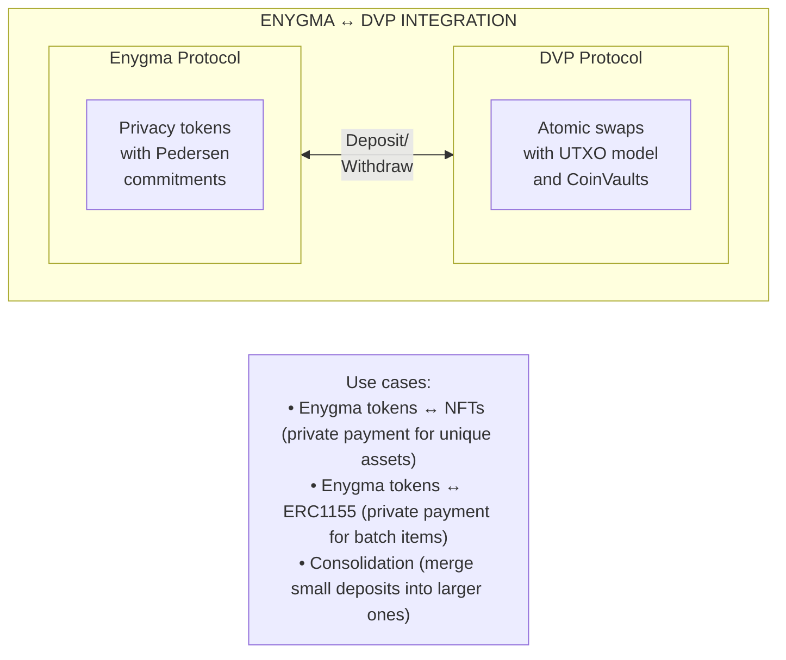
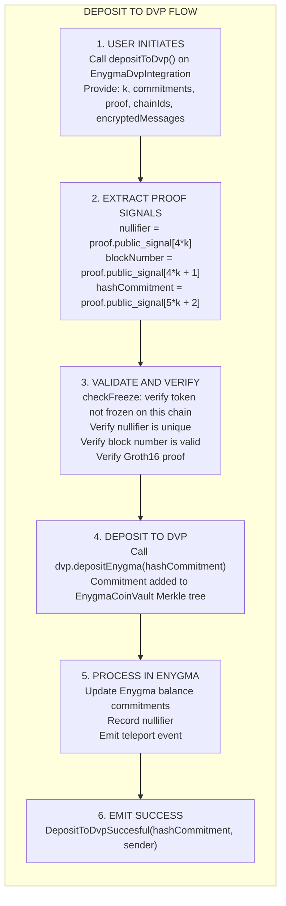
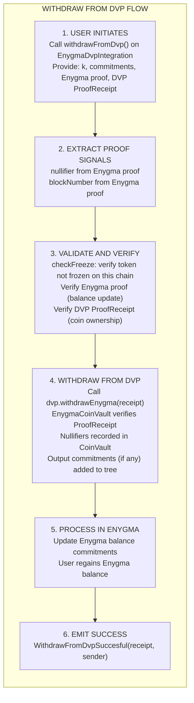

# Enygma Integration

How Enygma privacy tokens participate in DVP atomic swaps.

## Overview

Enygma tokens can be deposited into DVP to participate in atomic swaps. This integration allows users to exchange privacy-preserving tokens for NFTs (ERC721) or semi-fungible tokens (ERC1155) while maintaining privacy guarantees.



## EnygmaDvpIntegration Contract

The bridge contract connects Enygma's privacy system with DVP's swap mechanism.

### Key Properties

```solidity
// Verifiers for different k values (2-6 participants)
mapping(uint256 => address) public depositToDvpVerifiers;
mapping(uint256 => address) public withdrawFromDvpVerifiers;

// Reference to DVP contract
address public dvp;

// Reference to Enygma teleport
address public enygmaTeleport;

// Resource ID for this Enygma token
bytes32 public resourceId;
```

### Role-Based Access

Only the EnygmaDvpIntegration contract can call Enygma-related functions on DVP:

```solidity
// In Dvp.sol
bytes32 public constant DEFAULT_ENYGMA_ROLE = keccak256(abi.encodePacked('EnygmaRole'));

function depositEnygma(uint256 hashCommitment) public onlyRole(DEFAULT_ENYGMA_ROLE) returns (bool, uint256);
function withdrawEnygma(ProofReceipt memory receipt) public onlyRole(DEFAULT_ENYGMA_ROLE) returns (bool);
function mixFunds(ProofReceipt memory receipt) public onlyRole(DEFAULT_ENYGMA_ROLE) returns (bool);
```

## Deposit Flow

### Depositing Enygma to DVP

When a user deposits Enygma tokens into DVP:



### Deposit Code

```solidity
function depositToDvp(
    uint8 k,                                    // Number of participants
    IEnygmaV1.Point[] memory commitments,       // New balance commitments
    WithdrawOrDepositProof memory proof,        // Groth16 proof
    uint256[] memory chainIds,                  // Participant chain IDs
    bytes[] memory encryptedMessages            // Encrypted batch data
) public checkFreeze nonReentrant returns (bool) {

    // Extract signals from proof
    uint256 nullifier = proof.public_signal[4 * k];
    uint256 blockNumber = proof.public_signal[4 * k + 1];
    uint256 hashCommitment = proof.public_signal[5 * k + 2];

    // Validate and verify
    _validateAndVerifyDeposit(k, commitments, proof, chainIds, nullifier, blockNumber);

    // Deposit into DVP
    bool success;
    (success, ) = IDvp(dvp).depositEnygma(hashCommitment);
    require(success, "Deposit to DVP failed");

    // Process in Enygma system
    _processCommonTransactionSteps(commitments, proof, chainIds, encryptedMessages, nullifier, blockNumber);

    emit DepositToDvpSuccesful(hashCommitment, msg.sender);
    return true;
}
```

## Withdrawal Flow

### Withdrawing from DVP Back to Enygma

When a user withdraws from DVP after a swap:



### Withdrawal Code

```solidity
function withdrawFromDvp(
    uint8 k,
    IEnygmaV1.Point[] memory commitments,
    WithdrawOrDepositProof memory proof,
    uint256[] memory chainIds,
    bytes[] memory encryptedMessages,
    IDvp.ProofReceipt memory receipt  // DVP proof
) public checkFreeze nonReentrant returns (bool) {

    // Extract signals
    uint256 nullifier = proof.public_signal[4 * k];
    uint256 blockNumber = proof.public_signal[4 * k + 1];

    // Validate Enygma proof
    _validateAndVerifyWithdraw(k, commitments, proof, chainIds, nullifier, blockNumber);

    // Execute withdrawal on DVP
    bool success = IDvp(dvp).withdrawEnygma(receipt);
    require(success, "Withdraw from DVP failed");

    // Process in Enygma
    _processCommonTransactionSteps(commitments, proof, chainIds, encryptedMessages, nullifier, blockNumber);

    emit WithdrawFromDvpSuccesful(receipt, msg.sender);
    return true;
}
```

## Consolidation (MixFunds)

### Why Consolidation is Needed

When users receive many small deposits, they accumulate many coins. JoinSplit proofs support at most 10 inputs, so consolidation merges small coins into larger ones.

```mermaid
flowchart LR
    subgraph before["Before Consolidation"]
        direction TB
        c1["Coin_1: 10 tokens"]
        c2["Coin_2: 15 tokens"]
        c3["Coin_3: 5 tokens"]
        c4["Coin_4: 8 tokens"]
        c5["Coin_5: 12 tokens"]
        c6["Coin_6: 20 tokens"]
        c7["Coin_7: 3 tokens"]
        c8["Coin_8: 7 tokens"]
        more["... many more small coins"]
    end

    problem["Problem:<br/>Can't spend more than<br/>10 coins in one proof"]

    subgraph consolidate["Consolidation"]
        direction TB
        js["ProofReceipt: 10 inputs → 2 outputs"]
        inputs["Inputs: Coin_1 through Coin_10"]
        out1["Output_1: Sum of all inputs (consolidated)"]
        out2["Output_2: Zero (no change)"]
    end

    subgraph after["After Consolidation"]
        newcoin["Coin_new: 100 tokens<br/>(single large coin)"]
        remaining["Remaining small coins (if any)"]
    end

    before --> problem --> consolidate --> after
```



### MixFunds Function

Consolidation is performed by the `mixFunds` function on `Dvp.sol`, which delegates to the `EnygmaCoinVault`:

```solidity
function mixFunds(ProofReceipt memory receipt) public onlyRole(DEFAULT_ENYGMA_ROLE) returns (bool) {
    // Get EnygmaCoinVault
    address vault = _coinVaultAddressById[enygmaVaultId];

    // Verify the ProofReceipt against the CoinVault
    IAbstractCoinVault(vault).checkReceiptConditions(receipt);

    // Nullify input coins in the CoinVault
    IAbstractCoinVault(vault).nullifyFromReceipt(receipt);

    // Insert output commitments into the CoinVault's Merkle tree
    IAbstractCoinVault(vault).insertCommitmentsFromReceipt(receipt);

    return true;
}
```

### Relayer Consolidation Service

The relayer automatically consolidates when needed:

```go
type ConsolidationService struct {
    depositRepo     DepositRepository
    proofService    ProofService
    dvpClient       DvpClient
}

func (s *ConsolidationService) ConsolidateIfNeeded(user string) error {
    // Find all unspent Enygma deposits for user
    deposits := s.depositRepo.FindEnygmaDeposits(user, MaxNumberOfJSDeposits)

    if len(deposits) <= MaxNumberOfJSDeposits {
        return nil  // No consolidation needed
    }

    // Take first 10 deposits
    toConsolidate := deposits[:10]

    // Generate consolidation proof
    proof, err := s.proofService.GenerateConsolidationProof(toConsolidate)
    if err != nil {
        return err
    }

    // Submit to contract
    err = s.dvpClient.MixFunds(proof)
    if err != nil {
        return err
    }

    // Update deposit statuses
    for _, d := range toConsolidate {
        d.Status = DvpDepositSpent
        s.depositRepo.UpdateDeposit(d)
    }

    // Create new consolidated deposit (with the fresh salt produced by proof generation)
    newDeposit := &DvpDeposit{
        UserAddress:  user,
        TokenAmount:  sumAmounts(toConsolidate),
        Commitment:   proof.Commitments[0],
        Salt:         proof.OutputSalts[0],
        Status:       DvpDepositPending,
    }
    s.depositRepo.CreateDeposit(newDeposit)

    return nil
}
```

## Proof Verifier Registration

Different k values require different verifiers:

### Variable-Size Verifiers

```solidity
// Register deposit verifier for k participants
function registerDepositToDvpVerifier(address verifierAddress, uint8 k) external onlyRole(DEFAULT_OWNER_ROLE) {
    depositToDvpVerifiers[k] = verifierAddress;
    emit VerifierDepositToDvpRegistered(verifierAddress, k);
}

// Register withdraw verifier for k participants
function registerWithdrawFromDvpVerifier(address verifierAddress, uint8 k) external onlyRole(DEFAULT_OWNER_ROLE) {
    withdrawFromDvpVerifiers[k] = verifierAddress;
    emit VerifierWithdrawFromDvpRegistered(verifierAddress, k);
}
```

### Public Signal Sizes

The number of public signals varies by k:

| k   | Deposit Signals | Withdraw Signals |
| --- | --------------- | ---------------- |
| 2   | 13              | 22               |
| 3   | 18              | 27               |
| 4   | 23              | 32               |
| 5   | 28              | 37               |
| 6   | 33              | 42               |

## Complete Swap Scenario

### NFT Purchase with Enygma Tokens

```mermaid
flowchart TB
    subgraph scenario["COMPLETE SCENARIO: ALICE BUYS NFT FROM BOB"]
        direction TB
        initial["Initial State:<br/>Alice: 500 Enygma tokens on PN A<br/>Bob: NFT #42 on PN B<br/>Agreed price: 100 Enygma<br/>Both agree on a sharedId off-chain"]

        subgraph step1["STEP 1: Alice deposits Enygma to DVP"]
            S1a["Alice calls depositToDvp(100 tokens)"]
            S1b["Enygma burns 100 from Alice's balance commitment"]
            S1c["DVP creates Enygma coin (commitment in EnygmaCoinVault)"]
            S1d["Alice now has: 400 Enygma + 1 DVP coin(100)"]
        end

        subgraph step2["STEP 2: Bob deposits NFT to DVP"]
            S2a["Bob calls depositIntoDvp(NFT #42, salt)"]
            S2b["NFT transferred to DVP contract"]
            S2c["DVP creates NFT coin (commitment in Erc721CoinVault)"]
            S2d["Bob now has: 1 DVP coin(NFT #42)"]
        end

        subgraph step3["STEP 3: Initiator goes first"]
            S3a["Whoever submits first becomes the initiator. Suppose Alice submits first."]
            S3b["Alice's relayer:<br/>- ML-KEM encapsulates against Bob's view PK → (salt, ctxt)<br/>- Generates JoinSplit proof with revertCommitment for refund<br/>- Calls Dvp.initiateSwap(sharedId, encryptedData, ctxt, ..., proof, validityTime)"]
            S3c["Contract: locks Alice's Enygma nullifier, status=Pending,<br/>emits SwapInitiated"]
        end

        subgraph step4["STEP 4: Responder completes"]
            S4a["Bob's relayer receives SwapInitiated event:<br/>- Decapsulates ctxt → salt<br/>- AES-GCM decrypts encryptedData → trade terms"]
            S4b["Bob's relayer:<br/>- Generates Ownership proof for NFT (with revertCommitment)<br/>- Calls Dvp.completeSwap(sharedId, ..., proof, encryptedData)"]
            S4c["Contract:<br/>- Unlocks + spends Alice's Enygma nullifier<br/>- Spends Bob's NFT nullifier<br/>- Inserts both new commitments<br/>- status=Completed, emits SwapCompleted"]
        end

        subgraph step5["STEP 5: Withdrawals"]
            S5a["Alice: withdrawERC721(NFT #42, salt) → gets NFT on PN A"]
            S5b["Bob: callWithdrawFromDvp(100) → gets 100 Enygma on PN B"]
        end

        final["Final State:<br/>Alice: 400 Enygma + NFT #42 on PN A<br/>Bob: 100 Enygma on PN B"]

        initial --> step1 --> step2 --> step3 --> step4 --> step5 --> final
    end
```



If Bob never shows up at Step 4, the swap is recoverable: either party's relayer can call `Dvp.cancelSwap(sharedId, preimage)` using the stored `CancelPreimage` (or the relayer's expiration ticker calls `Dvp.expireSwap(sharedId)` past `expiresAt`), which adds Alice's pre-computed `revertCommitment` to the EnygmaCoinVault and unlocks her input. She can then spend it like any other deposit.

## User-Facing Functions

On the Privacy Node Ledger, users interact with handler contracts. The token-handler swap wrapper is what the user invokes; the relayer's unified `Handle{X}Swap{Y}` handler decides whether to call `Dvp.initiateSwap` or `Dvp.completeSwap` based on the persisted swap status.

### RaylsEnygmaHandler Functions

```solidity
// Deposit Enygma to DVP for swapping
function depositToDvp(
    uint256 amount,
    bytes32 zkDvpResourceId
) external;

// Request withdrawal from DVP
function callWithdrawFromDvp(
    bytes32 zkDvpResourceId,
    uint256 amount
) external;

// User-facing swap trigger — relayer routes to initiateSwap or completeSwap
function swapWithDvpForERC721(
    uint256 nftId,
    bytes32 nftResourceId,
    uint256 enygmaAmount,
    uint256 destChainId,
    bytes32 sharedId,
    uint256 validityTime
) external;

function swapWithDvpForERC1155(
    uint256 tokenId,
    uint256 tokenAmount,
    bytes32 tokenResourceId,
    uint256 enygmaAmount,
    uint256 destChainId,
    bytes32 sharedId,
    uint256 validityTime
) external;

// Manual cancel (validates ownership, then triggers Dvp.cancelSwap on the Hub)
function cancelERC721Swap(
    bytes32 sharedId,
    uint256 toChainId,
    uint256 nftId,
    bytes32 nftResourceId,
    uint256 enygmaAmount
) external;

function cancelERC1155Swap(
    bytes32 sharedId,
    uint256 toChainId,
    uint256 nftId,
    uint256 nftAmountOrOne,
    bytes32 nftResourceId,
    uint256 enygmaAmount
) external;
```

## Security Considerations

### Protection Mechanisms

| Mechanism                  | Purpose                                                         |
| -------------------------- | --------------------------------------------------------------- |
| **Role-based access**      | Only EnygmaDvpIntegration can call depositEnygma/withdrawEnygma |
| **Reentrancy guard**       | Prevents recursive calls during deposit/withdraw                |
| **Freeze check**           | `checkFreeze` modifier blocks deposits and withdrawals if the token is [frozen](../../governance/tokens.md#token-freezing) on the current chain |
| **Nullifier verification** | Prevents double-spending across both systems                    |
| **Proof verification**     | Both Enygma and DVP proofs must be valid                        |

### Cross-System Consistency

```text
Enygma State:
  - Balance commitments updated
  - Nullifiers recorded
  - Teleport events emitted

DVP State:
  - CoinVault Merkle tree updated
  - Nullifiers recorded in CoinVault
  - Commitment events emitted via DvpTeleport

Both systems must be consistent:
  - If Enygma deposit succeeds, EnygmaCoinVault must have the coin
  - If DVP withdrawal succeeds, Enygma must update balance
```

## Summary

| Concept                  | Purpose                                    |
| ------------------------ | ------------------------------------------ |
| **EnygmaDvpIntegration** | Bridge contract between protocols          |
| **Deposit to DVP**       | Convert Enygma balance to DVP coin         |
| **Withdraw from DVP**    | Convert DVP coin back to Enygma            |
| **MixFunds**             | Consolidate small coins via EnygmaCoinVault|
| **Variable k verifiers** | Support different anonymity sets           |
| **Role-based access**    | Secure integration between contracts       |

---

**Continue learning:** [Enygma Protocol](../enygma/index.md) - Deep dive into the privacy token system.
