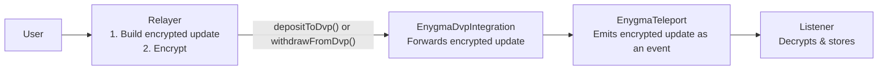
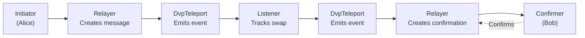
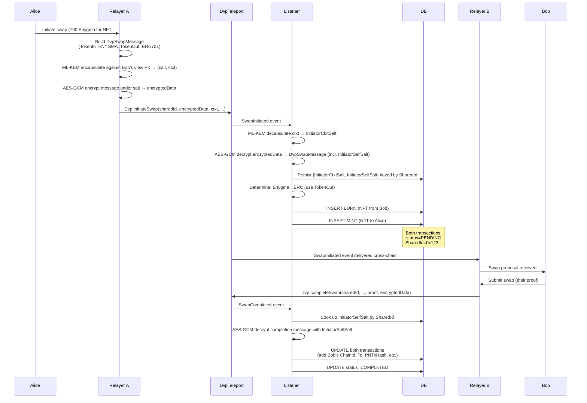

# Governance Integration

How Governance Services monitor DVP atomic swaps, deposits, and withdrawals across the network.

## Overview

DVP operations involve two sides exchanging different asset types (an Enygma side and the DVP-ERC721/1155 part). Governance tracks both sides through encrypted events:

| Side            | Asset Type           | Contract Event Source |
| --------------- | -------------------- | --------------------- |
| **Enygma**      | Privacy tokens       | EnygmaTeleport        |
| **DVP-ERC721**  | Unique tokens        | DvpTeleport           |
| **DVP-ERC1155** | Semi-fungible tokens | DvpTeleport           |

## Enygma Side

### Event Flow

When users deposit or withdraw Enygma tokens to/from DVP, the Relayer constructs balance update events **before** the EnygmaDvpIntegration contract call, encrypts them, and passes them as parameters. The contract then emits these events for Governance to capture.



### Event Data Structure

The `EnygmaDvpBalanceUpdated` event contains:

| Field                | Description                                                |
| -------------------- | ---------------------------------------------------------- |
| `TokenType`          | Enygma                                                     |
| `Protocol`           | DVP Deposit or Withdraw                                    |
| `UpdateType`         | Burn (deposit) or Mint (withdrawal)                        |
| `ResourceId`         | Token's resource identifier                                |
| `From` / `To`        | Source and destination addresses  (destination always Hub) |
| `Amount`             | Token amount                                               |
| `SourceChainId`      | Privacy Node chain ID                                      |
| `SourceTxHash`       | Privacy Node transaction hash                              |
| `DestinationChainId` | Hub chain ID                                               |
| `DestinationTxHash`  | Hub transaction hash                                       |

### Operation Types

| Operation    | UpdateType | From         | To                      |
| ------------ | ---------- | ------------ | ----------------------- |
| **Deposit**  | Burn       | User address | DVP Integration address |
| **Withdraw** | Mint       | User address | DVP Integration address |

Both operations are subject to the `checkFreeze` modifier on `EnygmaDvpIntegration`. If the token is [frozen](../../governance/tokens.md#token-freezing) on the current chain, deposits and withdrawals are blocked and the transaction reverts before any event is emitted.

### Monitored Event

**EnygmaDvpBalanceUpdated** - Emitted by EnygmaTeleport contract on the Hub

- Contains encrypted `DvpBalanceUpdated` data
- Listener decrypts and stores in `transactions` table
- Tracks both deposits (burn) and withdrawals (mint)

## DVP-ERC721/ERC1155 Side

### Event Flow

Unlike Enygma side, DVP-ERC721/ERC1155 tracking is based on **swap transactions** rather than individual deposits/withdrawals. When participants exchange messages to coordinate a swap, Governance captures and tracks both sides of the exchange.



### Two-Phase Tracking

#### Phase 1: Swap Initiation

When the initiator's relayer calls `Dvp.initiateSwap`, the contract emits a `SwapInitiated` event on the Hub:

```solidity
event SwapInitiated(
    bytes32 indexed sharedId,
    bytes encryptedData,         // AES-GCM(DvpSwapMessage, salt)
    bytes ctxt,                  // ML-KEM-768 ciphertext (carries the salt)
    uint256 responderCommitment,
    uint256 expiresAt
);
```

`encryptedData` carries an AES-GCM-encrypted `DvpSwapMessage` containing the trade specification:

| Field                | Description                                      |
| -------------------- | ------------------------------------------------ |
| `SharedId`           | Unique identifier for this swap                  |
| `To`                 | Recipient address                                |
| `ChainId`            | Initiator Privacy Node chain ID                  |
| `PNTxHash`           | Privacy Node initialization transaction hash     |
| `PNTxTimestamp`      | Initialization transaction timestamp             |
| `TokenIn`            | `{Amount, Address, ResourceID, Type, ID}` — token being sent |
| `TokenOut`           | `{Amount, Address, ResourceID, Type, ID}` — token expected |
| `InitiatorSelfSalt`  | Salt the initiator used for their self-destination commitment |

The Governance Listener:

1. ML-KEM-768 decapsulates `ctxt` against its view secret key → shared secret → `InitiatorCtxtSalt` (used to decrypt **this** event's `encryptedData`)
2. AES-GCM decrypts `encryptedData` to obtain the `DvpSwapMessage`
3. Reads `InitiatorSelfSalt` from the decrypted message and persists **both salts** keyed by `SharedId` (needed later to decrypt `SwapCompleted`, which is not carried inside another `ctxt`)
4. Determines swap direction (Enygma→ERC or ERC→Enygma) based on `TokenIn.Type`
5. Extracts ERC token data (from `TokenIn` or `TokenOut` depending on direction)
6. Creates **two pending transactions**: one BURN and one MINT
7. Stores both with `status = pending`, the `SharedId`, and `expiresAt` for timeout handling

Two distinct salts are in play, and both must be retained:

| Salt                  | Derived from                      | Decrypts                                             |
| --------------------- | --------------------------------- | ---------------------------------------------------- |
| `InitiatorCtxtSalt`   | ML-KEM decapsulation of `ctxt`    | `SwapInitiated.encryptedData` (this event)           |
| `InitiatorSelfSalt`   | Carried inside `DvpSwapMessage`   | `SwapCompleted.encryptedData` (the later settlement) |

#### Phase 2: Swap Completion

When the responder's relayer calls `Dvp.completeSwap`, the contract emits a `SwapCompleted` event:

```solidity
event SwapCompleted(bytes32 indexed sharedId, bytes encryptedData);
```

`encryptedData` here is a small `DvpSwapMessage` containing only `SharedId`, `To`, `PNTxHash`, `PNTxTimestamp` (the responder's settlement data). The responder received `InitiatorSelfSalt` cross-chain as part of the original initiation payload and uses it to AES-GCM-encrypt this message — there is no `ctxt` on `SwapCompleted`.

Governance:

1. Looks up `InitiatorSelfSalt` from the salts store by `SharedId` (persisted during Phase 1)
2. AES-GCM decrypts the completion message with that salt
3. Finds the two pending transactions by `SharedId`
4. Updates both transactions with the responder's data (`ChainId`, `To`, `PNTxHash`, `PNTxTimestamp`)

### Swap Direction Logic

The swap direction determines which token data to extract:

| TokenIn.Type    | Direction    | ERC Data Source | Initiator Side | Responder Side |
| --------------- | ------------ | --------------- | -------------- | -------------- |
| **ENYGMA**      | Enygma → ERC | `TokenOut`      | Enygma         | ERC            |
| **ERC721/1155** | ERC → Enygma | `TokenIn`       | ERC            | Enygma         |

### Status Tracking

Swap status maps to the on-chain `SwapStatus` enum (`Dvp` contract). Governance maintains its own `PENDING` status while waiting for `SwapCompleted` / `SwapCancelled` / `SwapTimedOut`:

| State       | Value | Source | Description                                              |
| ----------- | ----- | ------ | -------------------------------------------------------- |
| `PENDING`   | —     | Governance-only | Created when `SwapInitiated` is observed; awaiting completion or revert |
| `COMPLETED` | 2     | `Dvp.SwapStatus.Completed` | `SwapCompleted` event fired |
| `CANCELLED` | 4     | `Dvp.SwapStatus.Cancelled` | `SwapCancelled` event fired (manual cancel) |
| `TIMEDOUT`  | 5     | `Dvp.SwapStatus.TimedOut`  | `SwapTimedOut` event fired (validity period elapsed) |
| `FAILED`    | 3     | `Dvp.SwapStatus.Failed`    | Reserved (no event currently emitted) |

When any of `SwapCompleted` / `SwapCancelled` / `SwapTimedOut` is observed, Governance updates the `teleport_status` field of both transactions by `SharedId`.

### Monitored Events

**SwapInitiated** — Emitted by `DvpTeleport` on the Hub when `Dvp.initiateSwap` succeeds

- Carries `encryptedData` (AES-GCM-encrypted `DvpSwapMessage`) + `ctxt` (ML-KEM-768 ciphertext) + `responderCommitment` + `expiresAt`
- Listener decapsulates `ctxt` to recover the salt, then AES-GCM decrypts `encryptedData`
- One emitted per swap

**SwapCompleted** — Emitted when `Dvp.completeSwap` succeeds

- Carries the responder's small settlement message, AES-GCM-encrypted under `InitiatorSelfSalt` (no `ctxt` — the salt was already shared with the responder during Phase 1 and persisted locally by the listener)
- Listener retrieves `InitiatorSelfSalt` by `SharedId` from the salts store, decrypts, and updates the two pending transactions with the responder's settlement metadata

**SwapCancelled** / **SwapTimedOut** — Emitted by `Dvp.cancelSwap` / `Dvp.expireSwap`

- Carry only the `sharedId`
- Listener flips the matching transactions to `CANCELLED` or `TIMEDOUT`
- If no transactions match the `sharedId` (foreign swap this governance never observed, or a swap initiated before the listener's start block), the event is acknowledged and skipped without error

### Data Flow Example

**Scenario:** Alice (Enygma) swaps with Bob (DVP-ERC721)



## Summary

| Side                | Tracking Method                | Event Source   | Transactions Created   |
| ------------------- | ------------------------------ | -------------- | ---------------------- |
| **Enygma**          | Pre-constructed balance events | EnygmaTeleport | 1 per operation        |
| **DVP ERC721/1155** | Swap coordination messages     | DvpTeleport    | 2 per swap (burn+mint) |

| Concept                  | Purpose                                                    |
| ------------------------ | ---------------------------------------------------------- |
| **DvpSwapMessage**       | Encrypted swap coordination payload (AES-GCM-encrypted)    |
| **SwapInitiated**        | Hub event marking swap initiation (carries `encryptedData` + `ctxt` + `expiresAt`) |
| **SwapCompleted**        | Hub event marking successful settlement                    |
| **SwapCancelled / SwapTimedOut** | Hub events marking revert (manual or post-expiry)  |
| **Two-phase tracking**   | Create pending transactions on `SwapInitiated`, update on `SwapCompleted` |
| **SharedId**             | Links both transactions and status updates                 |
| **Swap direction logic** | Determines which token data to extract from message        |

---

**Related documentation:**

- [DVP Architecture](architecture.md) - Technical details of atomic swaps
- [Enygma Integration](enygma-integration.md) - How Enygma tokens participate in DVP