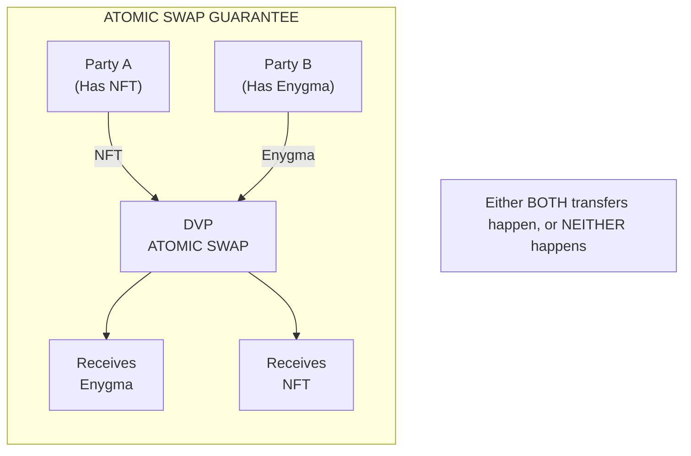
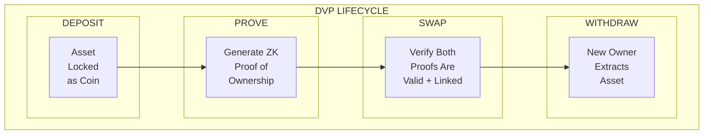

# DVP Protocol

Delivery vs Payment: Privacy-preserving atomic swaps between different asset types.

## What is DVP?

DVP (Delivery vs Payment) is a protocol that enables **atomic exchanges** between different asset types while preserving privacy. It allows participants to swap assets across Privacy Node Ledgers with cryptographic guarantees that either both sides of the trade execute, or neither does.



## Key Properties

| Property | Description |
|----------|-------------|
| **Atomicity** | Both sides of the swap execute together, or neither does |
| **Privacy** | Transfer amounts remain hidden through commitments |
| **Trustless** | No intermediary holds assets; cryptographic proofs ensure safety |
| **Cross-Asset** | Exchange different token types (ERC721, ERC1155, Enygma) |
| **Validity Window** | Configurable per-swap deadline; cancel/timeout refunds via a pre-computed revert commitment (no second proof needed) |

## Supported Asset Types

DVP supports swaps between different asset types, each managed by its own **CoinVault**:

| Asset Type  | Token Type ID | CoinVault              | Description                                |
|-------------|---------------|------------------------|--------------------------------------------|
| **ERC721**  | 2             | `Erc721CoinVault`      | Non-fungible tokens (unique items)         |
| **ERC1155** | 3             | `Erc1155CoinVault`     | Semi-fungible tokens (items with quantity) |
| **Enygma**  | 4             | `EnygmaCoinVault`      | Privacy-preserving fungible tokens         |

Common swap patterns:
- NFT for Enygma tokens (asset sale)
- ERC1155 for Enygma tokens (batch item sale)
- Any combination where one side provides assets, other provides payment

## How It Works (Overview)

DVP uses a **UTXO (Unspent Transaction Output) model** similar to Bitcoin:

1. **Deposit** - Assets are locked into a CoinVault, creating "coins" (commitments in the vault's Merkle tree). All DvP token types (ERC-721, ERC-1155, and Enygma) verify the token is not [frozen](../../governance/tokens.md#token-freezing) on the current chain — ERC-721/ERC-1155 perform this check on the Privacy Node via `EnygmaPNEvents`, while Enygma tokens additionally enforce it on the Hub through the `checkFreeze` modifier in the DvP contract.
2. **Prove Ownership** - Zero-knowledge proofs demonstrate coin ownership without revealing details. Each swap proof also bakes in a self-addressed `revertCommitment` for refund.
3. **Initiate** - The first party calls `Dvp.initiateSwap` — the contract locks their nullifiers and emits `SwapInitiated` with the AES-GCM-encrypted trade message and an ML-KEM ciphertext.
4. **Complete** - The other party calls `Dvp.completeSwap` — the contract unlocks + spends both nullifiers and inserts both new commitments atomically. If completion never happens, `Dvp.cancelSwap` or `Dvp.expireSwap` adds the pre-computed `revertCommitment` back to the initiator's vault.
5. **Withdraw** - New owners can withdraw assets from the contract. Like deposits, all token types check freeze status — with the same distinction between Privacy Node-level checks (all types) and Hub-level enforcement (Enygma only).



## The UTXO Model

Unlike account-based systems where balances are simple numbers, DVP tracks "coins":

### Account Model (Standard ERC20)
```solidity
balances[alice] = 1000;
// Alice sends 100 to Bob
balances[alice] = 900;
balances[bob] = 100;
// Balance changes are public
```

### UTXO Model (DVP)
```
Alice has: Coin(commitment=0xabc..., value=1000)

Alice sends 100 to Bob:
  - Destroy: Coin(0xabc..., 1000) via nullifier
  - Create: Coin(0xdef..., 100) for Bob
  - Create: Coin(0x123..., 900) for Alice (change)

Observers see: commitments destroyed and created
Observers cannot see: actual values or who owns what
```

## What You'll Learn

This documentation section covers:

- [ ] [Problem and Solution](problem-and-solution.md) - Why atomic swaps need special handling
- [ ] [UTXO and Commitments](utxo-and-commitments.md) - The coin model and Poseidon hashing
- [ ] [Architecture](architecture.md) - CoinVaults, contract structure, and the 2-phase swap state machine
- [ ] [The Atomic Swap](the-atomic-swap.md) - How the contract state machine enforces atomicity
- [ ] [Swap Cancellation](swap-cancellation.md) - Manual cancel and automatic timeout
- [ ] [Merkle State](merkle-state.md) - Tree management and nullifier system
- [ ] [Enygma Integration](enygma-integration.md) - How Enygma tokens participate in DVP

## Prerequisites

Before diving in, you should understand:

- Basic blockchain concepts (transactions, smart contracts)
- [Enygma Protocol](../enygma/index.md) fundamentals (recommended)
- General zero-knowledge proof concepts (helpful but not required)

## Quick Comparison: Traditional vs DVP Swaps

| Aspect | Traditional (HTLC) | DVP |
|--------|-------------------|-------|
| **Atomicity** | Time-lock based | Contract state machine (lock → complete or revert) |
| **Privacy** | Amounts visible | Amounts hidden (AES-GCM + ML-KEM trade message) |
| **Timeout Risk** | Must claim before expiry | Pre-computed revert commitment refunds the initiator on cancel/timeout |
| **Trust** | Trust clock synchronization | Trust only math |
| **Asset Types** | Usually same type | Different types supported |

---

**Start learning:** [Problem and Solution](problem-and-solution.md) - Why traditional swaps aren't enough.
