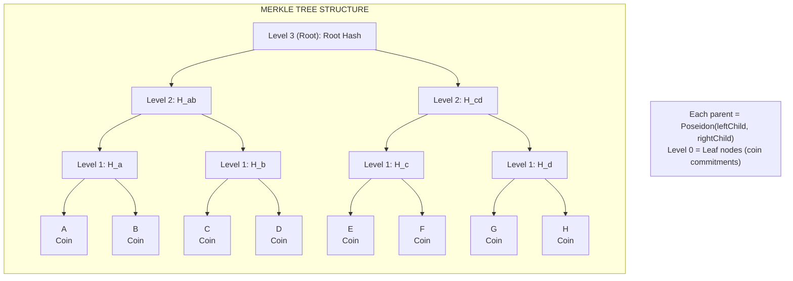
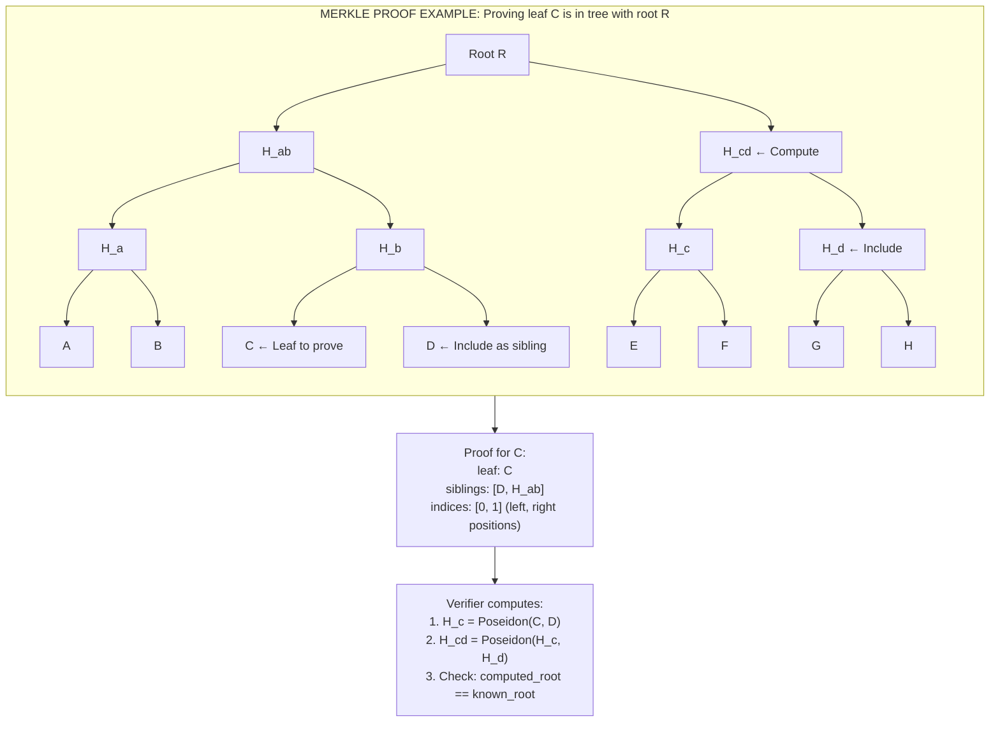
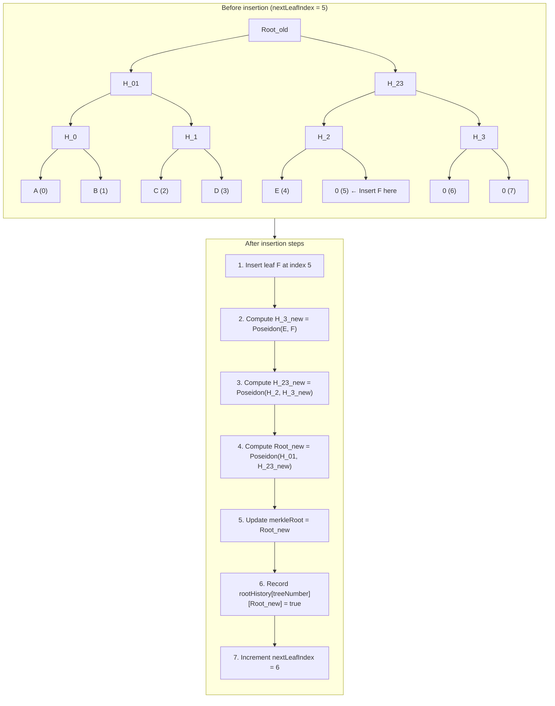
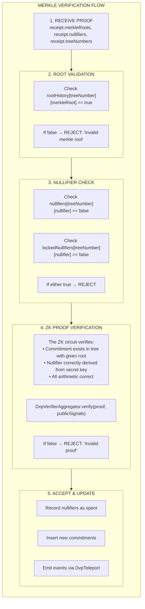

# Merkle State

How Merkle trees track coin existence and nullifiers prevent double-spending.

## Merkle Tree Fundamentals

A **Merkle tree** is a cryptographic data structure that enables efficient proofs of membership.

### Structure



### Merkle Proof

To prove a leaf is in the tree, provide the **sibling path**:



## CoinVault Merkle Implementation

Each CoinVault inherits from `Merkle.sol`, giving it its own independent incremental Poseidon-based Merkle tree. There is no shared tree — each vault (Erc721CoinVault, Erc1155CoinVault, EnygmaCoinVault) manages its own tree.

### Tree Configuration

```solidity
uint256 constant SNARK_SCALAR_FIELD = 21888242871839275222246405745257275088548364400416034343698204186575808495617;

// Base zero value
uint256 public constant ZERO_VALUE = uint256(keccak256("Dvp")) % SNARK_SCALAR_FIELD;

// Tree parameters
uint256 internal treeDepth;           // Height (typically 32)
uint256 internal nextLeafIndex;       // Next insertion point
uint256 public merkleRoot;            // Current root
uint256 public treeNumber;            // Version counter
```

### Zero Values

Empty positions use calculated zero values, different at each level:

```text
Level 0: ZERO_VALUE = keccak256("Dvp") mod Q
Level 1: zeros[1] = Poseidon(zeros[0], zeros[0])
Level 2: zeros[2] = Poseidon(zeros[1], zeros[1])
...
Level N: zeros[N] = Poseidon(zeros[N-1], zeros[N-1])
```

This optimization means:

- Empty subtrees have predictable hashes
- Only need to store/compute actual leaves
- Verification is efficient

### Tree State Variables

```solidity
// Per-level zero values (computed once)
uint256[] public zeros;

// Filled subtree hashes for incremental updates
uint256[] private filledSubTrees;

// Root history for proof verification
mapping(uint256 => mapping(uint256 => bool)) public rootHistory;
// rootHistory[treeNumber][root] = true if root existed

// Nullifier set for double-spend prevention
mapping(uint256 => mapping(uint256 => bool)) public nullifiers;
// nullifiers[treeNumber][nullifier] = true if spent

// Locked nullifiers reserved by a Pending swap (lockCoin → unlockCoin)
mapping(uint256 => mapping(uint256 => bool)) public lockedNullifiers;
// lockedNullifiers[treeNumber][nullifier] = true if locked by an in-flight swap
```

## Leaf Insertion

When a new coin is created, its commitment is inserted as a leaf:

### Incremental Update Algorithm



### Batch Insertion

Multiple leaves can be inserted efficiently:

```solidity
function insertLeaves(uint256[] memory _leafHashes) public onlyRole(DEFAULT_DVP_ROLE) {
    uint256 count = _leafHashes.length;

    // Check capacity
    if (nextLeafIndex + count > 2**treeDepth) {
        // Tree full, create new one
        newTree();
    }

    uint256 currentIndex = nextLeafIndex;
    uint256 currentHash;

    // Process each level
    for (uint256 level = 0; level < treeDepth; level++) {
        // ... update nodes at this level
        // ... store filled subtrees for future updates
    }

    // Update root
    merkleRoot = currentHash;
    rootHistory[treeNumber][merkleRoot] = true;

    nextLeafIndex += count;
}
```

## Tree Versioning

When a tree fills up, a new version is created:

### Tree Rotation

```solidity
function newTree() public onlyRole(DEFAULT_DVP_ROLE) {
    // Increment version
    treeNumber++;

    // Reset leaf index
    nextLeafIndex = 0;

    // Reset root to initial state
    merkleRoot = zeros[treeDepth];

    // Record initial root
    rootHistory[treeNumber][merkleRoot] = true;
}
```

### Why Multiple Tree Versions?

```text
Problem: Tree has 2^32 slots. What happens when full?

Solution: Create new tree version

Tree 0: Leaves 0 to 2^32-1
Tree 1: Leaves 0 to 2^32-1 (fresh start)
Tree 2: ...

Each proof specifies which treeNumber it references.
Old trees remain valid for existing proofs.
```

### Root History

Every root that ever existed is recorded:

```solidity
function isValidRoot(uint256 _treeNumber, uint256 _merkleRoot) public view returns (bool) {
    return rootHistory[_treeNumber][_merkleRoot];
}
```

This is crucial because:

- Proofs are generated against a specific root
- Between proof generation and submission, new leaves may be added
- The old root must still be valid for the proof to verify

```text
Timeline:
  T0: Root = R1
  T1: User generates proof against R1
  T2: New leaf inserted, Root = R2
  T3: User submits proof with root R1

If we only stored current root:
  → Proof rejected (R1 ≠ R2)

With root history:
  → rootHistory[treeNum][R1] = true
  → Proof accepted
```

## Nullifier System

### Purpose

Nullifiers prevent double-spending of coins:

```mermaid
flowchart TB
    subgraph nullsystem["NULLIFIER SYSTEM"]
        direction TB
        subgraph without["Without nullifiers (PROBLEM)"]
            W1["1. Alice has coin C in Merkle tree"]
            W2["2. Alice creates proof: 'I own C, transfer to Bob'"]
            W3["3. Bob receives new coin"]
            W4["4. Alice creates ANOTHER proof: 'I own C, transfer to Carol'"]
            W5["5. Carol receives new coin"]
            W6["6. Alice has spent same coin twice!"]
            W1 --> W2 --> W3 --> W4 --> W5 --> W6
        end

        subgraph with["With nullifiers (SOLUTION)"]
            N1["1. Alice has coin C"]
            N2["2. Coin C has nullifier N = Poseidon(secret_key, pathIndex)"]
            N3["3. Alice creates proof, reveals N"]
            N4["4. CoinVault records: nullifiers[N] = true"]
            N5["5. Alice tries second proof, reveals N again"]
            N6["6. CoinVault checks: nullifiers[N] already true"]
            N7["7. Second transfer REJECTED"]
            N1 --> N2 --> N3 --> N4 --> N5 --> N6 --> N7
        end
    end
```



### Nullifier Properties

| Property          | Description                                |
|-------------------|--------------------------------------------|
| **Deterministic** | Same coin → same nullifier                 |
| **Secret-bound**  | Only owner can compute (needs secret key)  |
| **Unlinkable**    | Can't connect nullifier to commitment      |
| **Unique**        | Different coins → different nullifiers     |

### Nullifier Check

```solidity
// Check if nullifier is fresh (not spent and not locked)
function isValidNullifier(uint256 _treeNumber, uint256 _nullifierId) public view returns (bool) {
    return !nullifiers[_treeNumber][_nullifierId];  // Valid if NOT in set
}

// Mark nullifier as spent (permanent)
function nullifyCoin(uint256 _treeNumber, uint256 _nullifierId) public onlyRole(DEFAULT_DVP_ROLE) {
    require(!nullifiers[_treeNumber][_nullifierId], "Nullifier already used");
    nullifiers[_treeNumber][_nullifierId] = true;
}
```

### Nullifier Locking (2-Phase Swap Lifecycle)

During `Dvp.initiateSwap`, the initiator's input nullifiers are **locked** rather than spent. This reserves them for the pending swap so they cannot be used elsewhere while waiting for `completeSwap` (settlement) or `cancelSwap` / `expireSwap` (refund):

```solidity
// Lock a nullifier (called by Dvp.initiateSwap; prevents spending, reversible)
function lockCoin(uint256 _treeNumber, uint256 _nullifierId) public onlyRole(DEFAULT_DVP_ROLE) {
    require(!nullifiers[_treeNumber][_nullifierId], "Already spent");
    require(!lockedNullifiers[_treeNumber][_nullifierId], "Already locked");
    lockedNullifiers[_treeNumber][_nullifierId] = true;
}

// Unlock a nullifier (called by Dvp.completeSwap before nullify, or by Dvp.cancelSwap / expireSwap)
function unlockCoin(uint256 _treeNumber, uint256 _nullifierId) public onlyRole(DEFAULT_DVP_ROLE) {
    lockedNullifiers[_treeNumber][_nullifierId] = false;
}
```

The locked input has exactly two terminal outcomes:

- **`completeSwap`** — `unlockCoin` followed by `nullifyFromReceipt` (spends the coin, inserts both new commitments).
- **`cancelSwap` / `expireSwap`** — `unlockCoin` followed by `nullifyCoin` (spends the coin) **plus** `registerCoins([revertCommitment])` (adds the initiator's pre-computed refund commitment).

### Dummy Nullifiers

JoinSplit proofs always have 10 input slots. Unused slots use a dummy nullifier:

```solidity
uint256 dummyNullifier = 14744269619966411208579211824598458697587494354926760081771325075741142829156;

// In verification:
for (uint256 i = 0; i < 10; i++) {
    if (proof.nullifiers[i] != dummyNullifier) {
        setNullifier(proof.treeNumbers[i], proof.nullifiers[i]);
    }
    // Skip dummy nullifiers - they don't represent real coins
}
```

## Relayer Merkle Service

The relayer maintains local copies of Merkle trees (one per CoinVault):

### Service Interface

```go
type MerkleService interface {
    // Rebuild tree from commitments
    RebuildSparseTree(leaves []*big.Int) error

    // Generate Merkle proof for a commitment
    GenerateProof(commitment *big.Int) (*MerkleProof, error)

    // Get current root
    GetRoot() *big.Int

    // Get zero values
    GetZeros() []*big.Int
}
```

### Proof Generation

```go
func (m *MerkleService) GenerateProof(commitment *big.Int) (*MerkleProof, error) {
    // Find leaf index
    leafIndex := m.findLeaf(commitment)
    if leafIndex < 0 {
        return nil, errors.New("commitment not found")
    }

    // Collect sibling path
    elements := make([]*big.Int, m.depth)
    indices := big.NewInt(0)

    currentIndex := leafIndex
    for level := 0; level < m.depth; level++ {
        siblingIndex := currentIndex ^ 1  // Toggle last bit
        elements[level] = m.tree[level][siblingIndex]

        // Record position (left=0, right=1)
        if currentIndex % 2 == 1 {
            indices.SetBit(indices, level, 1)
        }

        currentIndex = currentIndex / 2
    }

    return &MerkleProof{
        Element:  commitment,
        Elements: elements,
        Indices:  indices,
        Root:     m.root,
    }, nil
}
```

### Tree Synchronization

The relayer syncs with on-chain state via events emitted through DvpTeleport:

```go
// Event listener for commitment events
func (l *MerkleListener) handleCommitments(event *DvpCommitmentsEvent) error {
    // Get current tree from database (identified by token address + type)
    tree := l.repo.GetByTokenAndType(event.TokenAddress, event.TokenType, event.TreeNumber)

    // Add new commitments
    tree.Leaves = append(tree.Leaves, event.Commitments...)

    // Save updated tree
    l.repo.UpdateMerkleTree(tree)

    // Confirm any deposits matching these commitments
    l.depositService.ConfirmDeposits(event.Commitments)

    return nil
}
```

## Verification Flow

When a proof is submitted, Merkle verification happens within the CoinVault:



## State Consistency

### On-Chain State (Per CoinVault)

```text
CoinVault (inherits Merkle):
├── merkleRoot: Current root hash
├── treeNumber: Current version
├── nextLeafIndex: Next insertion point
├── zeros[]: Per-level zero values
├── filledSubTrees[]: For incremental updates
├── rootHistory[treeNum][root]: All historical roots
├── nullifiers[treeNum][nullifier]: Spent coins (permanent)
└── lockedNullifiers[treeNum][nullifier]: Locked coins (reversible)
```

### Relayer State

```text
Database (per CoinVault/token):
├── treeNumber: Synced version
├── leaves[]: All commitment values
├── computedRoot: Locally computed
└── lastSyncedBlock: Event sync progress

Deposits (per user):
├── commitment: Hash value
├── treeNumber: Which tree version
├── status: Pending/Unspent/Locked/Spent
├── nullifier: For spending
└── tokenDetails: Asset information
```

### Synchronization Events

Events are emitted via DvpTeleport (not directly from CoinVaults):

```solidity
// Emitted when commitments added
event Commitments(
    address indexed tokenAddress,
    uint256 indexed tokenType,
    uint256 indexed treeNumber,
    uint256[] commitments
);

// Emitted when nullifier recorded
event Nullifier(
    address indexed tokenAddress,
    uint256 indexed tokenType,
    uint256 indexed treeNumber,
    uint256 nullifier
);
```

## Summary

| Component              | Purpose                                |
|------------------------|----------------------------------------|
| **Merkle tree**        | Efficiently prove coin existence       |
| **Root history**       | Allow proofs against past states       |
| **Tree versioning**    | Handle capacity limits                 |
| **Nullifiers**         | Prevent double-spending (permanent)    |
| **Locked nullifiers**  | Reserve initiator's coins between initiateSwap and completeSwap / cancelSwap / expireSwap |
| **Dummy nullifier**    | Fill unused proof slots                |
| **Relayer sync**       | Maintain local tree copy               |
| **Event-driven**       | Keep state consistent via DvpTeleport  |

---

**Next:** [Enygma Integration](enygma-integration.md) - How Enygma tokens participate in DVP.
