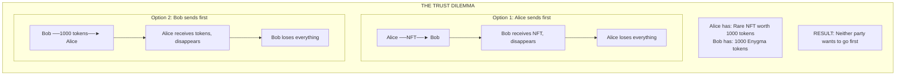
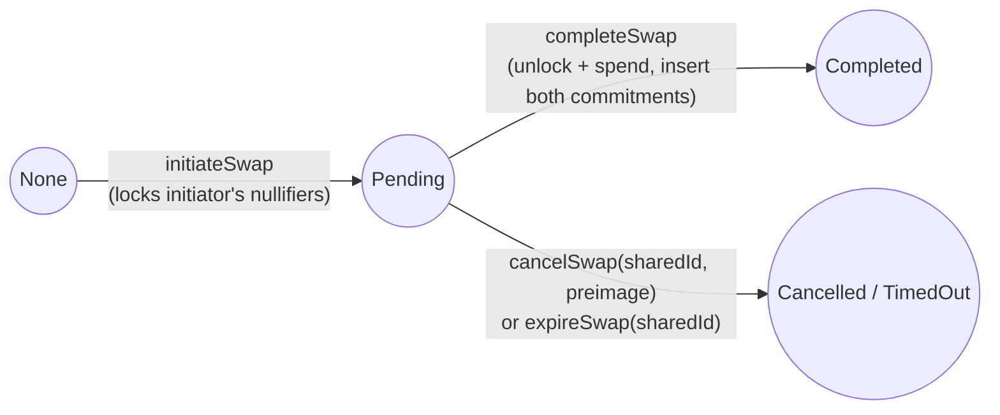

# Problem and Solution

Why atomic swaps between different asset types require a specialized protocol.

## The Cross-Asset Exchange Problem

When two parties want to exchange different types of assets (e.g., an NFT for payment tokens), they face a fundamental trust problem:



## Traditional Solutions (And Their Problems)

### Trusted Intermediary (Escrow)

A third party holds both assets and releases them simultaneously.

**Problems:**
- Requires trusting the intermediary
- Intermediary could be compromised or malicious
- Adds fees and delays
- Single point of failure
- Not decentralized

### Hash Time-Locked Contracts (HTLCs)

Uses cryptographic locks and time limits:

```
1. Alice locks NFT with hash(secret) for 24 hours
2. Bob locks tokens with same hash(secret) for 12 hours
3. Alice reveals secret to claim tokens
4. Bob uses revealed secret to claim NFT
5. If timeout, both get refunds
```

**Problems:**

| Issue | Impact |
|-------|--------|
| **Time sensitivity** | Must claim before expiry or lose assets |
| **Clock dependency** | Requires synchronized time across chains |
| **Public reveal** | Secret becomes visible, reducing privacy |
| **Griefing attacks** | Party can wait until last moment to act |
| **Value transparency** | Amounts are visible to all observers |
| **Different timeouts** | Complex when asset types have different finality |

### Simple Two-Transaction Approach

Rely on both parties sending transactions quickly.

**Problems:**
- Race conditions
- Network congestion delays
- One party can front-run or back out
- No atomicity guarantee

## What "Atomic" Really Means

An atomic swap has one simple guarantee:

```
EITHER:
  - Both Alice's NFT goes to Bob
  - AND Bob's tokens go to Alice

OR:
  - Nothing happens at all

There is NO state where:
  - Alice loses her NFT but doesn't get tokens
  - Bob loses his tokens but doesn't get the NFT
```

This property must hold even if:
- One party tries to cheat
- Network has delays
- Transactions arrive out of order
- Any technical failure occurs

## The Privacy Dimension

Even if we solve atomicity, there's another problem: **privacy**.

### Public Swaps Reveal

In a standard atomic swap, observers can see:

- Who is trading with whom
- What asset is being exchanged
- The exact price paid
- Trading patterns and frequency

### Why This Matters

```
Scenario: Corporate Bond Trading

Company A wants to buy $10M in bonds from Company B.

Public blockchain:
  - Competitors see Company A is accumulating bonds
  - Market front-runs the trade
  - Price moves against Company A
  - Strategic information leaked

With privacy:
  - Trade completes privately
  - Only parties know the details
  - No market impact from information leakage
  - Strategic advantage preserved
```

## DVP's Solution

DVP solves both problems simultaneously:

### Atomicity via the Contract State Machine

Instead of time locks or paired-proof cross-references, DVP runs a 2-phase state machine on the `Dvp` contract. The initiator's input nullifiers are *locked* on `initiateSwap` and can only be released by `completeSwap` (settlement) or `cancelSwap` / `expireSwap` (refund):



The locked input has exactly two terminal outcomes: spent atomically by `completeSwap` (with both new commitments inserted) or replaced by a pre-computed `revertCommitment` via `cancelSwap` / `expireSwap`. **Partial execution is impossible.**

### Privacy via Encrypted Trade Data

Trade-data privacy is preserved on-chain:

- The trade message (token addresses, amounts, recipient hints) is **AES-GCM** encrypted under a per-swap secret.
- The secret is derived by **ML-KEM-768** encapsulation against the responder's view public key. The encapsulated ciphertext travels in the `SwapInitiated` event so the responder can decapsulate it.
- Other observers see only the encrypted blob and the ciphertext.

```
Public view of a swap:
  - SwapInitiated(sharedId, encryptedData, ctxt, responderCommitment, expiresAt)
  - SwapCompleted(sharedId, encryptedData)

Private knowledge:
  - Alice and Bob can decrypt encryptedData (only they hold the right view secret keys)
  - Other observers see opaque bytes
```

### No Time Dependency from Either Side

```
Traditional HTLC:
  T=0:  Alice locks (24h timeout)
  T+1h: Bob locks (12h timeout)
  T+2h: Alice must claim before T+12h
  T+3h: Bob must claim before T+24h
  RISK: Clock skew, network delays, griefing

DVP:
  - Initiator submits initiateSwap, nullifiers lock
  - Responder submits completeSwap when ready (within validityTime)
  - If responder never shows up:
      - Either party's relayer can call cancelSwap(sharedId, preimage), OR
      - The relayer's expiration ticker calls expireSwap(sharedId)
        as soon as block.timestamp > expiresAt
  - In the revert path, the initiator's pre-computed revertCommitment
    is added to their vault — no second proof, no race condition
  ATOMIC by construction
```

## How DVP Achieves This

### The UTXO Model

Assets become "coins" with cryptographic properties:

```
Deposit NFT → Creates coin (commitment in Merkle tree)
Coin has:
  - Commitment: H(H(spendPK, salt), tokenData…)   [ERC-721 / ERC-1155]
  - Membership: Proof coin exists in Merkle tree
  - Nullifier:  Prevents double-spending

To spend a coin:
  - Prove: "I know the secret key for this commitment"
  - Prove: "This commitment is in the Merkle tree"
  - Reveal: Nullifier (marks coin as spent)
  - Create: New commitment for recipient
```

### The 2-Phase Swap Contract API

```solidity
enum SwapStatus { None, Pending, Completed, Failed, Cancelled, TimedOut }

// Initiator: locks input nullifiers, emits SwapInitiated.
function initiateSwap(
    bytes32 sharedId,
    bytes calldata encryptedData,
    bytes calldata ciphertext,
    address tokenAddress,
    SwapProofType proofType,
    ProofReceipt memory proof,    // includes revertCommitment
    uint64 validityTime,
    uint256 passphrase             // poseidon([preimage, preimage]) — gates future cancelSwap
) public returns (bytes32 dvpId);

// Responder: unlock + spend initiator's nullifiers, insert both commitments.
function completeSwap(
    bytes32 sharedId,
    address tokenAddress,
    SwapProofType proofType,
    ProofReceipt memory proof,
    bytes calldata encryptedData
) public;

// Refund: registers initiator's revertCommitment (pre-computed at initiate time).
// Manual cancel — verifies preimage against stored passphrase, reverts initiator's funds, emits SwapCancelled.
function cancelSwap(bytes32 sharedId, uint256 preimage) public;

// Timeout — requires block.timestamp >= expiresAt. Reverts funds, emits SwapTimedOut.
function expireSwap(bytes32 sharedId) public;
```

Both calls are bound together via `dvpId = keccak256(commitments[0], message)` (asymmetric across the two sides). The responder's proof must derive the same `dvpId` as the initiator's call — otherwise the contract reverts with `Dvp__SwapNotFound`.

The two terminal outcomes for the locked input:

```text
Pending → Completed:  unlockCoin → nullifyFromReceipt + insert both commitments
Pending → Cancelled (cancelSwap) / TimedOut (expireSwap):  unlockCoin → nullifyCoin + registerCoins([revertCommitment])
```

## Comparison Summary

| Aspect | Escrow | HTLC | DVP |
|--------|--------|------|-------|
| **Trust required** | Yes (intermediary) | No | No |
| **Time-sensitive** | No | Yes | No |
| **Privacy** | Depends | No | Yes |
| **Cross-asset** | Yes | Complex | Yes |
| **Single transaction** | No | No | Yes |
| **Griefing resistant** | Depends | No | Yes |

## Real-World Applications

DVP enables scenarios that were previously impossible or impractical:

### Private Securities Trading
- Trade bonds or securities without revealing positions
- Comply with regulations while maintaining privacy
- No market impact from information leakage

### Cross-Chain Asset Exchange
- Swap assets across different Privacy Node Ledgers
- Each party stays on their own ledger
- Settlement is guaranteed and private

### NFT Marketplaces with Privacy
- Buy and sell unique assets
- Price remains confidential
- Ownership history is protected

### Institutional OTC Trading
- Large trades without market visibility
- Counterparty risk eliminated
- Settlement is instant and final

---

**Next:** [UTXO and Commitments](utxo-and-commitments.md) - How coins work in DVP.
