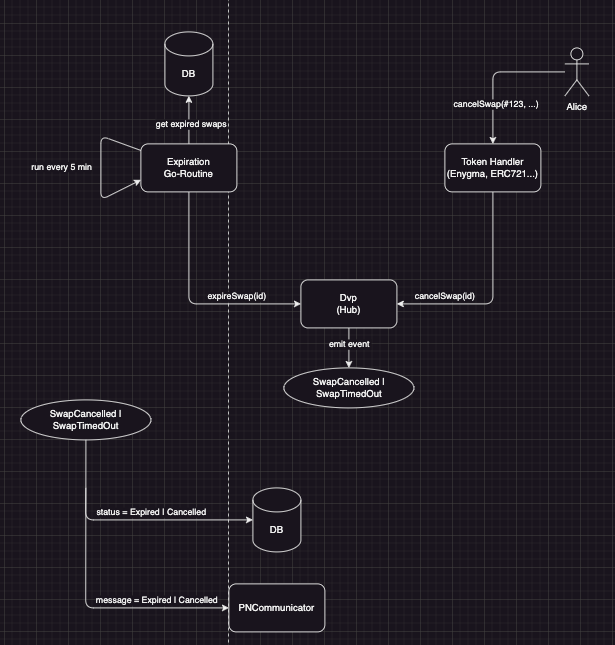
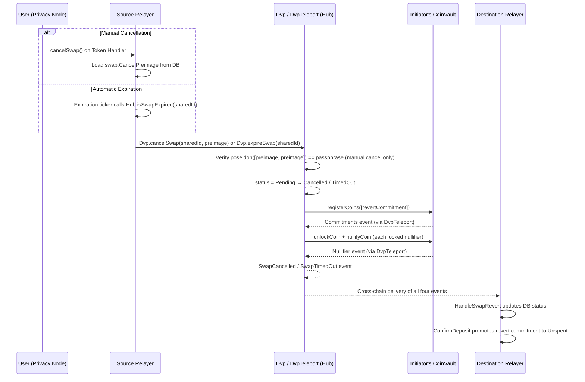

# Swap Cancellation

How in-progress swaps are terminated through manual cancellation or automatic expiration.

## Overview

The DVP protocol supports two mechanisms for terminating an in-progress swap:

1. **Manual Cancellation** — A user calls `cancelSwap()` on their token handler contract (Enygma, ERC721, or ERC1155) on the Privacy Node.
2. **Automatic Expiration (Timeout)** — The relayer periodically polls the Hub contract for expired swaps and triggers the revert.

Both paths use a dedicated on-chain function on the Private Network Hub — `Dvp.cancelSwap(sharedId, preimage)` for manual cancel or `Dvp.expireSwap(sharedId)` for timeout. Manual cancellation is gated by a [passphrase](glossary.md#passphrase-cancel) committed at `initiateSwap` time — the caller must supply a [cancel preimage](glossary.md#cancel-preimage) that the contract verifies via `poseidon([preimage, preimage]) == passphrase`. Both paths release the initiator's locked input nullifiers and register the pre-computed [revert commitment](glossary.md#revert-commitment) into the initiator's vault, then emit `SwapCancelled` or `SwapTimedOut` for cross-chain consumers.



---

## Swap Lifecycle States

A swap transitions through a small state machine on the Hub. The cancellation-relevant states are highlighted below.

### On-Chain `SwapStatus` (`Dvp` contract)

```solidity
enum SwapStatus { None, Pending, Completed, Failed, Cancelled, TimedOut }
```

| Value | Name | Description |
|-------|------|-------------|
| 0 | `None` | No swap with this `dvpId` exists |
| 1 | `Pending` | `initiateSwap` succeeded; **only state eligible for revert** |
| 2 | `Completed` | `completeSwap` settled the swap |
| 3 | `Failed` | Reserved for future proof-verification failure reporting |
| **4** | **`Cancelled`** | **`cancelSwap(sharedId, preimage)` succeeded (manual cancel)** |
| **5** | **`TimedOut`** | **`expireSwap(sharedId)` succeeded (post-`expiresAt`)** |

### Relayer-Side `DvpSwapStatus`

The relayer maintains an 8-value enum for off-chain bookkeeping. The cancellation-relevant values are:

| Value | Name | Description |
|-------|------|-------------|
| 1 | `DvpSwapInitiated` | `initiateSwap` succeeded — eligible for the expiration ticker |
| 3 | `DvpSwapWaitingConfirmation` | `SwapInitiated` event received on this side — also eligible |
| **6** | **`DvpSwapCancelled`** | **`cancelSwap(sharedId, preimage)` succeeded** |
| **7** | **`DvpSwapTimedOut`** | **`expireSwap(sharedId)` succeeded** |

The relayer keeps `Initiated` + `WaitingConfirmation` as the "pending" set; both are scanned by the expiration service.

---

## Automatic Expiration

### Validity Time

When a user initiates a swap, they can specify a custom validity period. If omitted, the default is used.

| Parameter | Value |
|-----------|-------|
| **Default** | 2 days |
| **Minimum** | 5 hours |
| **Maximum** | 14 days |

The contract computes `expiresAt = block.timestamp + validityTime` inside `initiateSwap` and emits it in the `SwapInitiated` event. **The contract is the single source of truth for expiry** — the relayer does not mirror the deadline locally.

### How Expiration Works

There are **two complementary expiration paths**:

1. **Lazy auto-timeout inside `completeSwap`** — When the responder's relayer submits `completeSwap`, the contract checks `isSwapExpired(sharedId)` first and self-routes to `expireSwap` if the window has passed:

    ```solidity
    // Dvp.sol::completeSwap
    if (isSwapExpired(sharedId)) return expireSwap(sharedId);
    ```

2. **Active expiration ticker on the relayer** — A background process iterates pending swaps and asks the contract:

    ```go
    // dvp/service/swap_expiration.go
    pending := repository.GetPendingSwaps()                // Status ∈ {Initiated, WaitingConfirmation}
    for _, swap := range pending {
        if dvpClient.IsSwapExpired(swap.SharedID) {
            dvpClient.ExpireSwap(swap.SharedID)
        }
    }
    ```

Either path lands on the same internal `_revertSwap` logic.

---

## Manual Cancellation

A user cancels a swap by calling the appropriate `cancelSwap()` function on the token handler contract deployed on their Privacy Node. The handler validates ownership, then routes through the relayer to `Dvp.cancelSwap(sharedId, preimage)` on the Hub.

### Passphrase Verification

Manual cancellation is gated by a [passphrase](glossary.md#passphrase-cancel) committed at initiation time. The caller must supply a [cancel preimage](glossary.md#cancel-preimage) that satisfies:

```text
poseidon([preimage, preimage]) == stored passphrase
```

The passphrase is derived during swap initiation and stored on-chain as part of the swap data. The preimage is stored off-chain by the relayer as `swap.CancelPreimage`. See [Passphrase Derivation](#passphrase-derivation) for how both values are computed.

### Validation Requirements

Each token handler enforces ownership validation before allowing cancellation:

| Handler | Function | Validation |
|---------|----------|------------|
| **Enygma** | `cancelERC721Swap()` | `balanceOf(msg.sender) > 0` |
| **Enygma** | `cancelERC1155Swap()` | `balanceOf(msg.sender) > 0` |
| **ERC721** | `cancelSwap()` | `ownerOf(_nftId) == msg.sender` |
| **ERC1155** | `cancelSwap()` | `lockedForDvp[msg.sender][_tokenId] >= _tokenValue` |

All handlers emit a `DvpSwapCancelled` event on the Privacy Node containing the full swap details (shared ID, chain IDs, token amounts, resource IDs, and ERC standards for both sides). The relayer's `DvpInitiator.HandleSwapCancellation` consumes this event, loads `swap.CancelPreimage` from the database, and submits the on-chain `Dvp.cancelSwap(sharedId, preimage)` call.

---

## Passphrase Derivation

The cancel passphrase is derived from the same underlying salt (`destSalt`) used by both sides of the swap:

```text
preimage   = poseidon(destSalt)
passphrase = poseidon([preimage, preimage])
```

The same `destSalt` is accessible to both parties:
- The **initiator** stores it as `swap.DestSalt`
- The **responder** stores it as `swap.SelfSalt` (set from `InitiatorDestSalt` in the encrypted trade message)

Both derive the same `preimage`, so **either side can cancel**.

### When Each Value Is Computed

| Step | Who | What happens |
|------|-----|--------------|
| **Swap initiation** (`initiator.go:initiateSwap`) | Initiator's relayer | Computes `preimage = poseidon(destSalt)`, computes `passphrase = poseidon([preimage, preimage])`, passes `passphrase` to the contract's `initiateSwap`, and stores `preimage` as `swap.CancelPreimage` in the DB |
| **Swap reception** (`receiver.go:HandleSwapInitiated`) | Responder's relayer | Computes `preimage = poseidon(InitiatorDestSalt)` (same value), stores it as `swap.CancelPreimage` |
| **Cancellation** (`initiator.go:HandleSwapCancellation`) | Either relayer | Loads `swap.CancelPreimage` from DB, passes it to the contract's `cancelSwap` |

### Why Store `CancelPreimage` Instead of Computing On-the-Fly

`HandleSwapCancellation` can be called from either side. The initiator would need `DestSalt` while the responder would need `SelfSalt`. Rather than determining which side we're on, the relayer computes and stores the preimage once at creation time — both sides store the same value, so cancellation just reads it directly.

---

## Cross-Chain Cancellation Flow

Whether triggered manually or by timeout, the cancellation flows through the Hub via `cancelSwap` or `expireSwap`:



### `Dvp.cancelSwap` / `Dvp.expireSwap` on the Hub

Two dedicated entry points on the Hub:

```solidity
// Dvp.sol — manual cancellation (passphrase-gated)
function cancelSwap(bytes32 sharedId, uint256 preimage) public {
    bytes32 dvpId = _sharedIdToDvpId[sharedId];
    SwapData storage swapData = _swaps[dvpId];
    if (swapData.status != SwapStatus.Pending) revert Dvp__SwapNotPending();

    // Verify the preimage matches the passphrase committed at initiateSwap
    uint256 computedPassphrase = poseidon([preimage, preimage]);
    if (computedPassphrase != swapData.passphrase) revert Dvp__InvalidPassphrase();

    swapData.status = SwapStatus.Cancelled;
    _revertSwap(swapData);
    _dvpTeleport.emitSwapCancelled(sharedId);
}

// Dvp.sol — timeout (requires block.timestamp >= expiresAt)
function expireSwap(bytes32 sharedId) public {
    bytes32 dvpId = _sharedIdToDvpId[sharedId];
    SwapData storage swapData = _swaps[dvpId];
    if (swapData.status != SwapStatus.Pending) revert Dvp__SwapNotPending();
    require(block.timestamp >= swapData.expiresAt, "Swap not yet expired");

    swapData.status = SwapStatus.TimedOut;
    _revertSwap(swapData);
    _dvpTeleport.emitSwapTimedOut(sharedId);
}
```

`_revertSwap` calls `IAbstractCoinVault.registerCoins` with the initiator's pre-computed `revertCommitment`, then iterates the locked nullifiers to `unlockCoin` + `nullifyCoin` each. The whole operation is one transaction.

### `DvpTeleport` Events

`DvpTeleport` is now event-only. It exposes `emitSwapCancelled(sharedId)` and `emitSwapTimedOut(sharedId)` callable only by the authorized `Dvp` contract:

```solidity
event SwapCancelled(bytes32 indexed sharedId);
event SwapTimedOut(bytes32 indexed sharedId);

function emitSwapCancelled(bytes32 sharedId) external onlyDvpContract { ... }
function emitSwapTimedOut(bytes32 sharedId) external onlyDvpContract { ... }
```

Destination relayers' log parsers consume these events to update their local DB status to `DvpSwapCancelled` or `DvpSwapTimedOut`.

---

## Why No Second Proof Is Needed

In v2, the revert commitment is generated **at proof time**, not at cancel time:

- The initiator's `Generate{X}SwapProof` helper generates a fresh `revertSalt` and embeds the commitment `H(senderPK, revertSalt, tokenData…)` into the proof's public signals.
- The proof is verified once on `initiateSwap`, so the revert commitment is already trusted on-chain.
- On `cancelSwap` / `expireSwap`, the contract simply calls `registerCoins([revertCommitment])` to add it to the initiator's vault tree — no ZK verification needed at cancel time.
- The relayer also persists the matching `revertSalt` as a `DvpDepositPending` row at proof-generation time. When the on-chain `Commitments` event fires, the standard `ConfirmDeposit` path promotes it to `Unspent`, so the initiator can spend it like any other deposit.

This is what makes the cancel/timeout path cheap and reliable: no second proof, no second ZK verification, no race against the prover.

---

## Smart Contract Reference

### Custom Errors

```solidity
// On Dvp
error Dvp__SwapAlreadyExists();
error Dvp__SwapNotFound();
error Dvp__SwapNotPending();
error Dvp__InvalidPassphrase();
```

### `DvpSwapCancelled` Event (Privacy Node)

Emitted by the token handler when a user initiates a manual cancellation:

```solidity
event DvpSwapCancelled(
    bytes32 _sharedId,
    uint256 _destChainId,
    bytes32 _tokenInResourceId,
    uint256 _tokenInAmount,
    uint256 _tokenInId,
    SharedObjects.ErcStandard _tokenInStandard,
    bytes32 _tokenOutResourceId,
    uint256 _tokenOutAmount,
    uint256 _tokenOutId,
    SharedObjects.ErcStandard _tokenOutStandard
);
```

### Token Handler Cancel Functions

**ERC721 Handler:**

```solidity
function cancelSwap(
    bytes32 _sharedId,
    uint256 _toChainId,
    uint256 _nftId,
    uint256 _enygmaAmount,
    bytes32 _enygmaResourceId
) public virtual nonReentrant
// Validation: ownerOf(_nftId) == msg.sender
```

**ERC1155 Handler:**

```solidity
function cancelSwap(
    bytes32 _sharedId,
    uint256 _toChainId,
    uint256 _tokenId,
    uint256 _tokenValue,
    bytes32 _enygmaResourceId,
    uint256 _enygmaAmount
) public virtual nonReentrant
// Validation: lockedForDvp[msg.sender][_tokenId] >= _tokenValue
```

**Enygma Handler (cancel ERC721 swap):**

```solidity
function cancelERC721Swap(
    bytes32 _sharedId,
    uint256 _toChainId,
    uint256 _nftId,
    bytes32 _nftResourceId,
    uint256 _enygmaAmount
) public virtual
// Validation: balanceOf(msg.sender) > 0
```

**Enygma Handler (cancel ERC1155 swap):**

```solidity
function cancelERC1155Swap(
    bytes32 _sharedId,
    uint256 _toChainId,
    uint256 _nftId,
    uint256 _nftAmountOrOne,
    bytes32 _nftResourceId,
    uint256 _enygmaAmount
) public virtual
// Validation: balanceOf(msg.sender) > 0
```

---

## Next Steps

- [DVP Glossary](glossary.md) — Cancellation-related term definitions
- [Build: Cancelling a Swap](../../../build/advanced/dvp-atomic-swaps.md#cancelling-a-swap) — Hardhat tasks for cancellation
- [The Atomic Swap](the-atomic-swap.md) — How atomicity and the lock/unlock/revert lifecycle work
