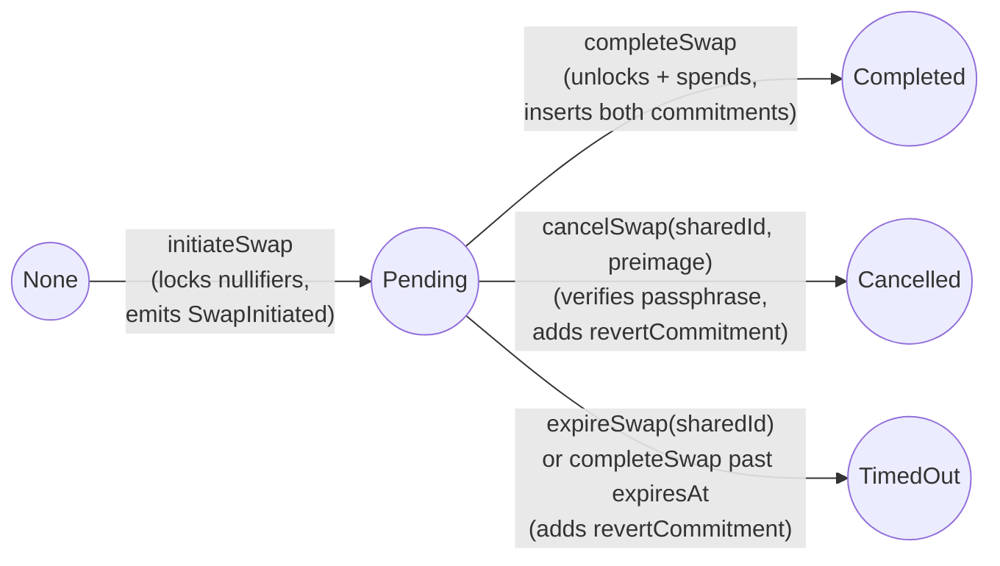
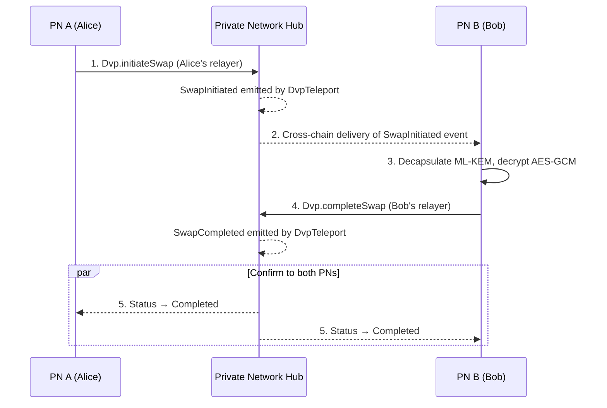
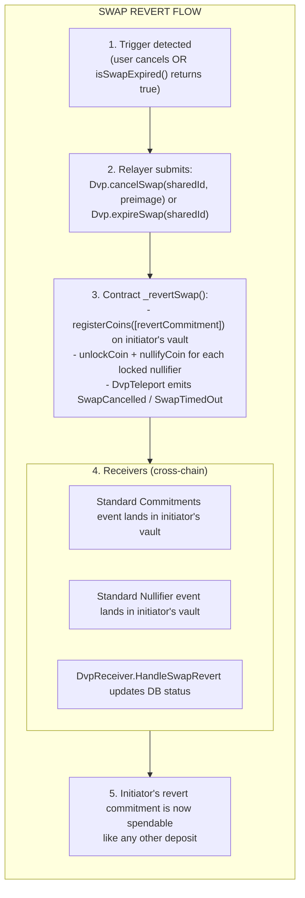

# The Atomic Swap

How the contract state machine creates cryptographic atomicity in DVP.

## The Atomicity Mechanism

DVP achieves atomicity through a **two-phase contract state machine** on the `Dvp` contract. The initiator's input nullifiers are locked on `initiateSwap` and can only ever be released by `completeSwap` (which spends them and inserts both new commitments) or `cancelSwap` / `expireSwap` (which releases the lock and registers the initiator's pre-computed [revert commitment](glossary.md#revert-commitment)). Manual cancellation via `cancelSwap` is gated by a [passphrase](glossary.md#passphrase-cancel) committed at initiation time — the caller must supply a valid [cancel preimage](glossary.md#cancel-preimage).



The state machine exists in `Dvp.sol` and is driven by two on-chain calls and an optional revert path. There is no longer a single-transaction `swap()` mode.

## How It Works

### The Two Calls

```solidity
enum SwapProofType { Payment, Delivery }
enum SwapStatus   { None, Pending, Completed, Failed, Cancelled, TimedOut }

// Initiator's relayer
function initiateSwap(
    bytes32 sharedId,
    bytes calldata encryptedData,   // AES-GCM(message, salt)
    bytes calldata ciphertext,      // ML-KEM-768 ciphertext
    address tokenAddress,
    IDvp.SwapProofType proofType,
    IDvp.ProofReceipt memory proof,
    uint64 validityTime,
    uint256 passphrase              // poseidon([preimage, preimage]) — gates future cancelSwap
) public returns (bytes32 dvpId);

// Responder's relayer
function completeSwap(
    bytes32 sharedId,
    address tokenAddress,
    IDvp.SwapProofType proofType,
    IDvp.ProofReceipt memory proof,
    bytes calldata encryptedData
) public;

// Manual cancel — verifies preimage against stored passphrase, reverts initiator's funds, emits SwapCancelled.
function cancelSwap(bytes32 sharedId, uint256 preimage) public;

// Timeout — requires block.timestamp >= expiresAt. Reverts funds, emits SwapTimedOut.
function expireSwap(bytes32 sharedId) public;
```

### `dvpId` — Binding the Two Calls

The initiator's and responder's `ProofReceipt` payloads must reference each other for the on-chain lookup to succeed:

```solidity
// Dvp.sol, on initiate
dvpId = keccak256(abi.encodePacked(proof.commitments[0], proof.message));

// Dvp.sol, on complete
bytes32 dvpId = keccak256(abi.encodePacked(proof.message, proof.commitments[0]));
```

The orderings are asymmetric — the responder's `(message, commitments[0])` must equal the initiator's `(commitments[0], message)`. This is how the two calls are bound into a single swap. The relayer wires this into proof generation; the user only sees the higher-level [`sharedId`](glossary.md#shared-id), which the contract maps to `dvpId` via `_sharedIdToDvpId`.

### The Nullifier Lifecycle

Each input nullifier on the initiator's `ProofReceipt` flows through three stages, all in the appropriate `CoinVault`:

| Stage | Trigger | Vault method | Effect |
|-------|---------|--------------|--------|
| **Lock** | `initiateSwap` | `lockCoin(treeNumber, nullifier)` | Adds to `lockedNullifiers`. Coin cannot be spent in any other transaction. Emits `CoinLocked`. |
| **Unlock + spend** | `completeSwap` | `unlockCoin` then `nullifyFromReceipt` | Releases the lock and marks the nullifier permanently spent. Emits `Nullifier` via `DvpTeleport`. |
| **Unlock + revert** | `cancelSwap(sharedId, preimage)` / `expireSwap` | `unlockCoin` then `nullifyCoin` (then `registerCoins([revertCommitment])`) | Releases the lock, marks the nullifier spent, and inserts the pre-computed [revert commitment](glossary.md#revert-commitment) into the tree so the initiator can spend it like any other deposit. `cancelSwap` verifies the preimage against the stored [passphrase](glossary.md#passphrase-cancel). |

The locked input has exactly two terminal outcomes: spent by `completeSwap` (settlement) or replaced by the revert commitment via `cancelSwap` / `expireSwap` (refund). Partial execution is impossible.

### Why This Works

```text
Scenario: Alice has an NFT, Bob has Enygma. They've agreed off-chain on
a sharedId and the trade terms.

1. Whichever side moves first becomes the initiator. Suppose Alice's
   transaction lands first.

2. Alice's relayer:
   - Generates an Ownership proof spending Alice's NFT coin, with
     output commitment to Bob's spend PK + a fresh salt.
   - Embeds a revertCommitment locking the same NFT to Alice (via her
     own spend PK + a fresh revertSalt) — used only on cancel/timeout.
   - Computes preimage = poseidon(destSalt) and
     passphrase = poseidon([preimage, preimage]).
   - Stores preimage as swap.CancelPreimage in the DB.
   - Calls Dvp.initiateSwap(sharedId, encryptedData, ciphertext, ..., passphrase).
   - Contract: stores passphrase, locks Alice's NFT nullifier,
     sets status = Pending, emits SwapInitiated.

3. Bob receives the SwapInitiated event:
   - Decapsulates the ML-KEM ciphertext with his view secret key to
     recover the per-swap salt.
   - AES-GCM decrypts encryptedData to learn the trade terms.
   - Generates a JoinSplit proof spending his Enygma inputs, with
     output[0] = NFT-priced commitment to Alice's spend PK,
     output[1] = his change.
   - Calls Dvp.completeSwap(sharedId, ...).

4. Contract on completeSwap:
   - Looks up dvpId from sharedId; status must be Pending.
   - If block.timestamp > expiresAt, self-routes to expireSwap(sharedId).
   - Otherwise:
     - Unlocks Alice's NFT nullifier.
     - Spends both Alice's and Bob's nullifiers.
     - Inserts Bob's NFT-receiving commitment into the ERC721 vault.
     - Inserts Alice's Enygma-receiving commitment + Bob's change into
       the Enygma vault.
   - Status: Pending → Completed. Emits SwapCompleted.

5. If Bob never shows up:
   - Either party's relayer can call Dvp.cancelSwap(sharedId, preimage)
     using the stored CancelPreimage, or wait for the expiration ticker
     to call expireSwap(sharedId).
   - On manual cancel, the contract verifies
     poseidon([preimage, preimage]) == stored passphrase.
   - Contract registers Alice's revertCommitment into the ERC721 vault
     and unlocks + nullifies her input. Alice's NFT is now spendable again.
```

## Trade Data Privacy

The full trade payload (token addresses, amounts, recipient hints) is encrypted before being put on-chain:

- The initiator's relayer derives a per-swap `salt` by ML-KEM-768 encapsulation against the responder's view public key. The 768-byte ciphertext travels in the `SwapInitiated` event as `ctxt`.
- The trade message is AES-GCM encrypted under that `salt` and travels in the same event as `encryptedData`.
- Only the responder can decapsulate the ciphertext (with their view secret key), recover the `salt`, and decrypt the message. Other observers see opaque bytes.
- AES-GCM authentication tag failure is the relayer's "this event isn't for me" signal — destination relayers silently skip events whose payload they cannot decrypt.

## Cross-Chain Swaps

When parties are on different Privacy Node Ledgers, the same 2-phase flow runs across the Hub:



### `SwapInitiated` Event Payload

The on-chain event carries everything needed for the responder's relayer to learn about the trade:

```solidity
event SwapInitiated(
    bytes32 indexed sharedId,
    bytes encryptedData,         // AES-GCM ciphertext of the trade message
    bytes ctxt,                  // ML-KEM-768 ciphertext (carries the salt)
    uint256 responderCommitment, // proof.commitments[0]
    uint256 expiresAt            // block.timestamp + validityTime
);
```

The encrypted message contains the full trade specification, including the initiator's self-destination salt:

```go
// Decrypted DvpSwapMessage (in the relayer)
type DvpSwapMessage struct {
    SharedId, To, ChainId, PNTxHash, PNTxTimestamp ...
    TokenIn  { Amount, Address, ResourceID, Type, ID }
    TokenOut { Amount, Address, ResourceID, Type, ID }
    InitiatorSelfSalt *big.Int   // so the responder can derive the matching commitments
}
```

### Relayer Status Tracking

The relayer maintains its own 8-value status enum to coordinate the cross-chain flow (the on-chain [`SwapStatus`](glossary.md#swapstatus) is the source of truth for terminal state):

```go
const (
    DvpSwapCreated             // in-memory only, never persisted
    DvpSwapInitiated           // contract initiateSwap succeeded
    DvpSwapInitiationFailed    // contract revert during initiation
    DvpSwapWaitingConfirmation // counterparty's SwapInitiated event received
    DvpSwapCompleted           // SwapCompleted event received
    DvpSwapFailed              // proof verification failed on-chain
    DvpSwapCancelled           // RevertSwap with status=Cancelled succeeded
    DvpSwapTimedOut            // RevertSwap with status=TimedOut succeeded
)
```

Each relayer's unified `Handle{X}Swap{Y}` handler runs on both sides of the swap. Whether it submits `initiateSwap` or `completeSwap` is decided by the persisted swap row's status when the user-side CLI command arrives.

## Failure Handling

### What Can Go Wrong

| Failure Mode                   | Handling                                                                                              |
|--------------------------------|-------------------------------------------------------------------------------------------------------|
| **Token frozen**               | Deposit/withdraw reverted by the freeze checks (`EnygmaPNEvents`, `checkFreeze` modifier on the Hub) |
| **Proof invalid**              | `initiateSwap` / `completeSwap` reverts before any state change                                       |
| **Nullifier reused**           | Revert (double-spend attempt)                                                                         |
| **Nullifier locked**           | Revert (coin reserved by another swap currently in `Pending`)                                         |
| **Root not in history**        | Revert (stale proof — likely after tree consolidation)                                                |
| **`dvpId` lookup fails**       | `Dvp__SwapNotFound` — responder's `(message, commitments[0])` doesn't match initiator's pair          |
| **Already-pending swap**       | `Dvp__SwapAlreadyExists` on `initiateSwap` — relayer falls through to `completeSwap`                  |
| **Already-settled swap**       | `Dvp__SwapNotPending` on `completeSwap` / `cancelSwap` / `expireSwap`                                                |
| **One party doesn't respond**  | Swap times out after the validity period (default 2 days). See [Swap Cancellation](swap-cancellation.md) |

### The Revert Process

If a cross-chain swap is cancelled or times out:



The revert commitment is *not* generated at cancel time — it was bound into the original `ProofReceipt` at `initiateSwap`. That is why no second proof is needed at cancel/timeout.

### Coin Locking Across the Lifecycle

```text
Before initiateSwap:  nullifier ∉ lockedNullifiers
                      User can spend the coin freely.

After initiateSwap:   nullifier ∈ lockedNullifiers
                      Any other transaction spending this nullifier reverts.

After completeSwap:   nullifier ∉ lockedNullifiers
                      AND nullifier is permanently spent (in the tree's spent set).

After cancelSwap/expireSwap:  Same as completeSwap (nullifier unlocked + spent),
                      AND revertCommitment inserted into the initiator's vault tree.
```

## Security Properties

### Property 1: No Partial Execution

```text
The initiator's locked nullifier has exactly two terminal outcomes:
  - completeSwap: spent atomically with both new commitments inserted
  - cancelSwap / expireSwap: spent + revertCommitment registered to the initiator

There is no path from Pending to "input spent without output" or vice versa.
```

### Property 2: No Forged Linking

```text
The responder's proof must satisfy:
  keccak256(proof.message, proof.commitments[0])
    == keccak256(initiator.commitments[0], initiator.message)

The ZK circuit guarantees the message and commitments fields were
computed correctly from the inputs and the agreed sharedId-derived salts.
An attacker cannot forge a proof that lands on someone else's pending swap.
```

### Property 3: No Trade Visibility for Third Parties

```text
The trade message (token addresses, amounts, recipients) is AES-GCM
encrypted under a per-swap salt that only the responder can derive
(via ML-KEM-768 decapsulation with their view secret key).

Other observers see only the encrypted blob and the ciphertext.
```

### Attack Scenarios (Prevented)

#### Front-Running

```text
Attack: See Alice's SwapInitiated event, race a fake completeSwap to
        steal her NFT.

Defense: The responder's proof must spend its own valid inputs (proven
         in the ZK circuit) AND derive the same dvpId as Alice's call.
         An attacker who doesn't know Alice's intended counterparty's
         keys cannot satisfy both constraints simultaneously.
```

#### Replay

```text
Attack: Reuse an old SwapInitiated event to settle the same swap twice.

Defense: After completeSwap, the swap status is Completed. A second
         completeSwap reverts with Dvp__SwapNotPending. Nullifiers are
         also marked permanently spent.
```

#### Initiator Holdup

```text
Attack: Initiate a swap to lock the responder's anticipated commitment,
        then never let it complete.

Defense: Locking only affects the *initiator's* own nullifiers — the
         responder's coins are never touched by initiateSwap. If the
         responder never completes, the initiator can cancel (or wait
         for timeout) and recover via the revertCommitment.
```

#### Double-Spend During Pending

```text
Attack: After initiateSwap, try to spend the locked input in another
        transaction.

Defense: The CoinVault's lockedNullifiers mapping rejects any spend of
        a locked nullifier until the lock is released by completeSwap
        or cancelSwap / expireSwap.
```

## Summary

| Concept                   | Purpose                                                          |
|---------------------------|------------------------------------------------------------------|
| **`SwapStatus`**          | Contract-side state machine that enforces atomicity              |
| **`dvpId`**               | Asymmetric `(commitments[0], message)` hash binding both calls   |
| **Coin lock**             | Reserves the initiator's input between initiate and complete/revert |
| **Revert commitment**     | Pre-computed self-output letting cancel/timeout refund without a second proof |
| **`expiresAt`**           | Contract-owned absolute expiry; `IsSwapExpired(sharedId)` is the source of truth |
| **AES-GCM + ML-KEM**      | On-chain trade-data privacy (only the responder can decrypt)     |
| **`sharedId`**            | User-facing swap identifier; mapped to `dvpId` by the contract   |

---

**Next:** [Merkle State](merkle-state.md) - How Merkle trees manage coin existence.
