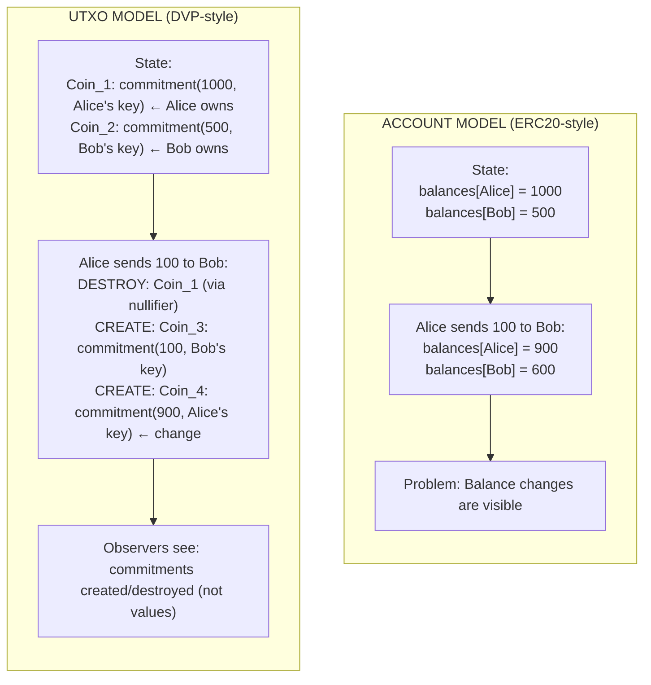
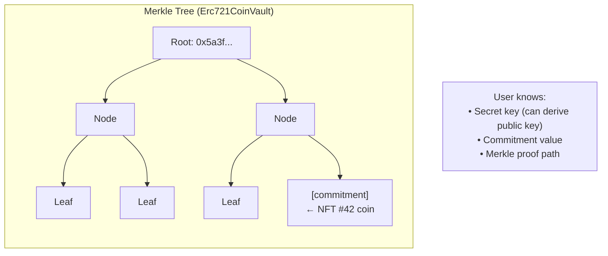
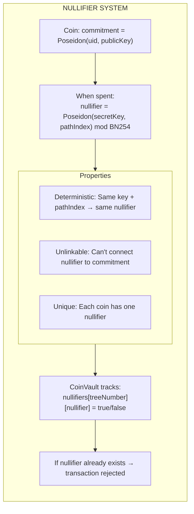
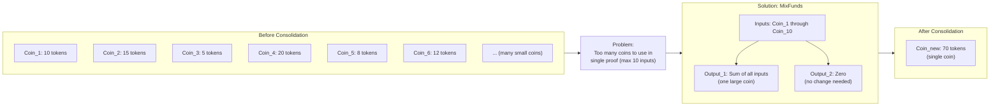

# UTXO and Commitments

How DVP represents assets as spendable coins using cryptographic commitments.

## The UTXO Model

DVP uses an **Unspent Transaction Output (UTXO)** model, similar to Bitcoin. Instead of tracking account balances, it tracks individual "coins" that can be spent.

### Account Model vs UTXO Model



### Why UTXO for Privacy?

| Property                            | Benefit                              |
|-------------------------------------|--------------------------------------|
| **No running totals**               | Can't sum up someone's total balance |
| **Indistinguishable coins**         | All commitments look alike           |
| **Explicit spending**               | Must prove ownership to use          |
| **Natural double-spend prevention** | Nullifiers mark coins as spent       |

## What is a Commitment?

A **commitment** is a cryptographic hash that hides information while binding the committer to that information.

### Commitment Properties

1. **Hiding**: Looking at the commitment reveals nothing about the underlying value
2. **Binding**: Once committed, the value cannot be changed

### DVP Commitment Structure

ERC-721 and ERC-1155 commitments combine the asset's unique data with `Poseidon(spendPK, salt)`. ERC-20 retains the v1 shape without salt:

```text
ERC-721 / ERC-1155: commitment = H(H(spendPK, salt), tokenData…)
ERC-20:             commitment = H(uniqueId, publicKey)
```

Where:

- `spendPK` is the owner's DVP Spend public key, derived as `Poseidon(sk, sk) mod JubJubPrimeSubGroup` so the relayer and the gnark circuit agree on the value
- `salt` is a fresh per-deposit `uint256` (see below)
- `tokenData` is asset-specific (see [Unique ID Calculation](#unique-id-calculation))
- `Poseidon` is a ZK-friendly hash function

**Why salt?** Without it, two deposits with the same `(spendPK, tokenData)` would produce identical commitments, leaking the fact that two notes refer to the same value. The salt makes commitments to the same note data indistinguishable. It is generated by ML-KEM-768 encapsulation against the recipient's view public key — the encapsulated ciphertext travels alongside the commitment so the recipient can decapsulate it and recover the salt.

## Unique ID Calculation

Different asset types compute their unique IDs differently. All use chained 2-input Poseidon for ZK-circuit compatibility.

### ERC721 (Non-Fungible Tokens)

```text
uniqueId   = Poseidon(tokenAddress, nftId)
commitment = Poseidon(Poseidon(spendPK, salt), uniqueId)
```

```text
Example:
  NFT #42 from contract 0xABC...
  uniqueId   = Poseidon(0xABC..., 42)
  commitment = Poseidon(Poseidon(spendPK, salt), uniqueId)
```

### ERC1155 (Semi-Fungible Tokens)

ERC1155 chains the unique data through a four-level Poseidon:

```text
h1         = Poseidon(spendPK, salt)
h2         = Poseidon(h1, tokenAddress)
h3         = Poseidon(h2, tokenId)
commitment = Poseidon(h3, amount)
```

```text
Example:
  50 units of Token #7 from contract 0xDEF...
  h1 = Poseidon(spendPK, salt)
  h2 = Poseidon(h1, 0xDEF...)
  h3 = Poseidon(h2, 7)
  commitment = Poseidon(h3, 50)
```

### Enygma (Privacy Tokens)

Enygma vault deposits accept a caller-supplied `hashCommitment` (`depositParams[0]`) — the commitment is computed off-chain by the Enygma proof generator and the vault simply registers it.

### ERC20 (Legacy)

```text
uniqueId   = Poseidon(amount, tokenAddress)
commitment = Poseidon(uniqueId, publicKey)
```

ERC-20 commitments do **not** carry a salt in v2.

### Summary of Commitment Formulas

| CoinVault            | Token Type ID | Commitment formula                                            |
|----------------------|---------------|---------------------------------------------------------------|
| `Erc721CoinVault`    | 2             | `H(H(spendPK, salt), H(tokenAddress, nftId))`                 |
| `Erc1155CoinVault`   | 3             | `H(H(H(H(spendPK, salt), tokenAddress), tokenId), amount)`    |
| `EnygmaCoinVault`    | 4             | Caller-supplied                                                |
| `Erc20CoinVault`     | —             | `H(H(amount, tokenAddress), publicKey)` (no salt)             |

## Poseidon Hash Function

DVP uses **Poseidon** instead of Keccak256 for commitments because:

| Property             | Keccak256        | Poseidon         |
|----------------------|------------------|------------------|
| **ZK circuit cost**  | Very expensive   | Optimized for ZK |
| **Constraints**      | ~27,000 per hash | ~300 per hash    |
| **Proof generation** | Slow             | Fast             |
| **Security**         | Well-studied     | Designed for ZK  |

## Coin Lifecycle

### 1. Deposit (Create Coin)

```text
User deposits NFT #42 to DVP:

1. User provides:
   - NFT to lock
   - publicKey for ownership
   - salt (fresh per-deposit value, generated via ML-KEM
     encapsulation against the recipient's view PK)

2. CoinVault calculates:
   uniqueId   = Poseidon(nftAddress, 42)
   commitment = Poseidon(Poseidon(publicKey, salt), uniqueId)

3. CoinVault stores:
   - NFT held in contract
   - Commitment added to vault's Merkle tree

4. User receives:
   - Knowledge of commitment + salt
   - Merkle proof of inclusion
```

### 2. Hold (Coin Exists)



### 3. Spend (Destroy Coin, Create New)

```text
User wants to transfer coin to new owner:

1. Generate ZK proof showing:
   - "I know secret key for this commitment"
   - "This commitment is in the Merkle tree at root R"
   - "This nullifier is correctly derived"

2. Submit ProofReceipt with:
   - Nullifier (marks this coin as spent)
   - New commitment (for recipient)
   - Merkle root (at proof time)
   - SNARK proof

3. CoinVault:
   - Verifies proof is valid
   - Records nullifier (prevents reuse)
   - Adds new commitment to tree
```

### 4. Nullifier (Prevent Double-Spend)



## Deposit Data Structure

The relayer tracks deposits with this structure:

```go
type DvpDeposit struct {
    UserAddress  string         // Owner's address
    TokenAmount  big.Int        // Value (for fungibles)
    TokenAddress string         // Token contract
    TokenType    DvpTokenType   // ERC721/ERC1155/Enygma
    TokenID      string         // For non-fungibles
    TreeNumber   uint           // Merkle tree version
    Commitment   big.Int        // Hash commitment
    Nullifier    big.Int        // Spending proof
    Salt         *big.Int       // Per-deposit salt (ERC-721/ERC-1155)
    Status       DvpDepositStatus
    CreatedAt    time.Time
}
```

### Deposit Status Flow

```text
PENDING     →    UNSPENT    →    LOCKED     →    SPENT
    │              │               │               │
    │              │               │               │
 Created,       Merkle tree    Being used     Nullifier
 waiting for    inclusion      in active      recorded,
 confirmation   confirmed      swap           spent
```

## Proof Types

DVP uses the universal `ProofReceipt` structure for all operations, but the underlying ZK circuits differ by asset type:

### Ownership Proof (ERC721)

Single input, single output. For unique assets that don't split:

```solidity
// ProofReceipt for ownership: arrays have 1 element each
ProofReceipt {
    proof: SnarkProof,
    treeNumbers: [treeNum],       // 1 tree version
    message: linkValue,           // For atomic linking
    merkleRoots: [root],          // 1 root
    commitments: [newCommit],     // 1 output commitment
    nullifiers: [nullifier]       // 1 nullifier
}

// 1 input → 1 output
// NFT ownership transfers completely
```

### JoinSplit Proof (ERC1155/Enygma)

Multiple inputs, two outputs. For fungible/semi-fungible assets:

```solidity
// ProofReceipt for JoinSplit: arrays have up to 10 inputs, 2 outputs
ProofReceipt {
    proof: SnarkProof,
    treeNumbers: [t0, t1, ..., t9],     // 10 tree versions
    message: linkValue,                  // For atomic linking
    merkleRoots: [r0, r1, ..., r9],     // 10 roots
    commitments: [out0, out1],           // 2 output commitments
    nullifiers: [n0, n1, ..., n9]        // 10 nullifiers
}

// Up to 10 inputs → 2 outputs
// Coins can be combined and split
```

### Why 10 → 2?

```text
Example: Alice has many small deposits:
  Coin_1: 10 tokens
  Coin_2: 25 tokens
  Coin_3: 15 tokens
  Coin_4: 30 tokens
  Coin_5: 20 tokens
  Total: 100 tokens

Alice wants to send 80 tokens:

JoinSplit proof:
  Inputs: Coin_1 through Coin_5 (+ 5 dummy inputs)
  Output_1: 80 tokens (to recipient)
  Output_2: 20 tokens (change back to Alice)

Result: 5 coins consumed, 2 new coins created
```

## Consolidation

When a user has too many small deposits, they need consolidation:



The relayer's ConsolidationService handles this automatically:

```go
func (s *ConsolidationService) ConsolidateIfNeeded(deposits []*ZkdvpDeposit) error {
    if len(deposits) > MaxNumberOfJSDeposits {
        // Generate consolidation proof
        // Call MixFunds on contract via the appropriate CoinVault
        // Create new consolidated deposit
    }
}
```

## Summary

| Concept             | Purpose                                    |
|---------------------|--------------------------------------------|
| **UTXO model**      | Track individual coins instead of balances |
| **Commitment**      | Hide asset details while proving ownership |
| **Unique ID**       | Identify specific asset within commitment  |
| **Poseidon hash**   | ZK-friendly hashing for all commitments    |
| **Nullifier**       | Prevent double-spending of coins           |
| **Ownership proof** | 1→1 transfer for NFTs                      |
| **JoinSplit proof** | 10→2 transfer for fungibles                |
| **Consolidation**   | Merge small coins into larger ones         |

---

**Next:** [Architecture](architecture.md) - CoinVaults, contract structure, and settlement patterns.
