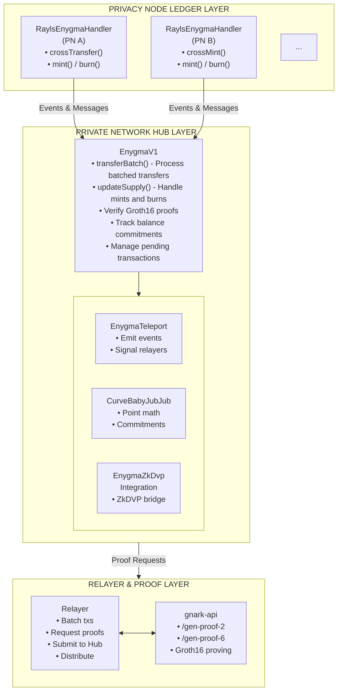
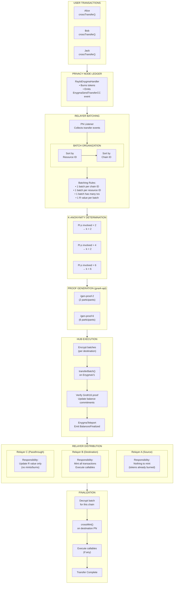
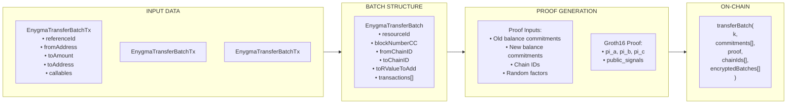
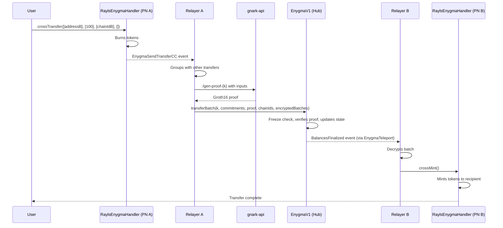

# Architecture

The components and structure of the Enygma protocol.

## Three-Layer Architecture

Enygma operates across three distinct layers:



## Smart Contracts

### EnygmaV1 (Core Coordinator)

The central contract on the Private Network Hub that manages all Enygma token state.

**Key State Variables:**

```solidity
// Token metadata
string private name;
string private symbol;
uint8 private decimals;

// Total supply as a curve point
uint256 public totalSupplyX;
uint256 public totalSupplyY;
uint256 public totalSupply;  // Scalar value

// Balance commitments per block and chain
mapping(uint256 => mapping(uint256 => EnygmaPointWithChainId)) public referenceBalance;
// referenceBalance[blockNumber][chainId] = Point(c1, c2, chainId)

// Verifier contracts for each k value
mapping(uint256 => address) public transferVerifiers;
// transferVerifiers[k] = verifier contract address

// Pending state
PendingTransaction[] public pendingTransactions;
PendingMintOrBurn[] public pendingMintsAndBurns;
```

**Key Functions:**

| Function | Purpose |
|----------|---------|
| `transferBatch()` | Process a batch of private transfers with ZK proof |
| `updateSupply()` | Handle mint or burn operations |
| `finalisePendingTransactions()` | Advance the block state machine |
| `processPendingActions()` | Apply pending mints/burns to total supply |

The `transferBatch()` function applies a `checkFreeze` modifier that queries the `TokenFreezeManager` (via `TokenRegistry`) to verify the token is not frozen on the current chain before processing. If the token is frozen, the transaction reverts. See [Token Freezing](../../governance/tokens.md#token-freezing) for details.

### RaylsEnygmaHandler (User Interface)

Deployed on each Privacy Node Ledger, this is what users interact with.

**Key Functions:**

| Function | Purpose |
|----------|---------|
| `mint()` | Create new tokens (owner only) |
| `burn()` | Destroy tokens (owner only) |
| `crossTransfer()` | Initiate cross-chain private transfer |
| `crossMint()` | Receive tokens from cross-chain transfer |
| `depositToZkDvp()` | Send tokens to ZkDVP for atomic swaps |
| `callWithdrawFromZkDvp()` | Request withdrawal from ZkDVP |

**Programmability:**

Each transfer can include up to 5 "callables" - actions to execute on the destination:

```solidity
struct EnygmaCrossTransferCallable {
    bytes32 resourceId;       // Target contract by resource ID
    address contractAddress;  // OR direct address
    bytes payload;            // Call data to execute
}
```

### EnygmaTeleport (Event Broadcaster)

Emits events that relayers listen for to coordinate cross-chain operations.

**Key Events:**

```solidity
// Signals a transfer batch was submitted
event EnygmaTransfer(bytes32 indexed resourceId, uint256 indexed toChainId, bytes encryptedMessage);

// Signals balances are finalized for a block
event BalancesFinalized(bytes32 indexed resourceId, uint256 indexed finalizedBlockNumber, ...);

// Signals supply was updated
event EnygmaSupplyUpdated(bytes32 indexed resourceId, uint256 indexed blockNumber, ...);
```

### CurveBabyJubJub (Cryptography Library)

Pure math functions for elliptic curve operations.

**Key Functions:**

| Function | Purpose |
|----------|---------|
| `pointAdd()` | Add two curve points |
| `pointDouble()` | Double a curve point |
| `derivePk()` | Compute v×G (scalar multiplication) |
| `derivePkH()` | Compute r×H (scalar multiplication with H) |
| `pedCom()` | Compute v×G + r×H (Pedersen commitment) |
| `isOnCurve()` | Verify a point is on the curve |

### EnygmaZkDvpIntegration (ZkDVP Bridge)

Enables Enygma tokens to participate in ZkDVP atomic swaps.

**Key Functions:**

| Function | Purpose |
|----------|---------|
| `depositToZkDvp()` | Deposit Enygma commitment into ZkDVP |
| `withdrawFromZkDvp()` | Withdraw from ZkDVP back to Enygma |
| `consolidateFunds()` | Merge multiple ZkDVP deposits |

## Data Structures

### EnygmaTransferBatch

Represents a batch of transfers to process together:

```solidity
struct EnygmaTransferBatch {
    string ResourceId;              // Token identifier
    *big.Int BlockNumberCC;         // Block number on Hub
    *big.Int FromChainID;           // Source chain
    *big.Int ToChainID;             // Destination chain
    *big.Int ToRValueToAdd;         // R-factor for this chain
    []*EnygmaTransferBatchTx Transactions;  // Individual transfers
}
```

### EnygmaTransferBatchTx

A single transfer within a batch:

```solidity
struct EnygmaTransferBatchTx {
    [32]byte ReferenceId;           // Unique identifier
    common.Address FromAddress;     // Sender
    *big.Int ToAmount;              // Transfer amount
    common.Address ToAddress;       // Recipient
    []EnygmaCrossTransferCallable ToCallables;  // Actions to execute
}
```

### Point

A point on the BabyJubJub curve:

```solidity
struct Point {
    uint256 c1;  // X coordinate
    uint256 c2;  // Y coordinate
}
```

### EnygmaPointWithChainId

A point associated with a specific chain:

```solidity
struct EnygmaPointWithChainId {
    uint256 c1;      // X coordinate
    uint256 c2;      // Y coordinate
    uint256 chainId; // Associated chain
}
```

### TransferProof

The Groth16 proof structure:

```solidity
struct TransferProof {
    uint256[2] pi_a;         // Proof element A
    uint256[2][2] pi_b;      // Proof element B (2x2 matrix)
    uint256[2] pi_c;         // Proof element C
    uint256[] public_signal; // Public inputs (size varies by k)
}
```

### PendingTransaction

A transfer awaiting finalization:

```solidity
struct PendingTransaction {
    EnygmaPointWithChainId[] pointsToAddToBalance;  // Output commitments
    uint256 nullifier;                              // Prevents double-spend
    TxType transactionType;                         // Transfer/Deposit/Withdraw
}
```

### Transaction Types

```solidity
enum TxType {
    Creation,   // 0 - Initial token creation
    Mint,       // 1 - New tokens minted
    Burn,       // 2 - Tokens destroyed
    Transfer,   // 3 - Standard transfer
    Deposit,    // 4 - Deposit to ZkDVP
    Withdraw    // 5 - Withdraw from ZkDVP
}
```

## Relayer Components

### EnygmaBatchingService

Orchestrates the batching and proof generation process:

- Groups transactions by resource ID and chain ID
- Enforces batch limits (default: 1000 tx per batch)
- Manages k-anonymity set fulfillment
- Coordinates with proof service
- Handles retries and errors

### EnygmaProofService

Interfaces with the gnark-api for proof generation:

- Prepares proof inputs (keys, balances, commitments)
- Calls appropriate proof endpoint (/gen-proof-k, where k=2 to 6)
- Parses and validates proof responses
- Generates random factors for commitments

### EnygmaSyncService

Maintains state consistency:

- Validates checkpoint finalization
- Syncs database state with on-chain state
- Handles discrepancy resolution

## Batching Flow

The complete batching process from user transactions to final distribution:



### Batching Rules Detail

| Rule | Description |
|------|-------------|
| **One batch per chain ID** | All transfers to the same destination chain are grouped together |
| **One batch per resource ID** | Each token type is batched separately |
| **Multiple transactions per batch** | A single batch can contain many individual transfers |
| **One R value per batch** | Each batch uses a single random factor for commitment blinding |

### Relayer Responsibilities

Different relayers have different roles based on their relationship to each transfer:

| Relayer Role | Action | Reason |
|--------------|--------|--------|
| **Source (A)** | Nothing | Tokens already burned on source PN |
| **Destination (B)** | Mint all txs | Must create tokens for recipients |
| **Passthrough (C)** | Update R only | Part of anonymity set but no local transfers |

### Data Flow



## Component Interaction

User wants to send 100 Enygma tokens from PN A to PN B:



---

**Next:** [The Proof System](the-proof-system.md) - How batching and k-anonymity work in detail.
