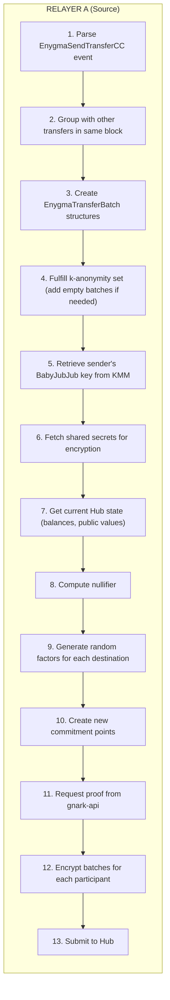
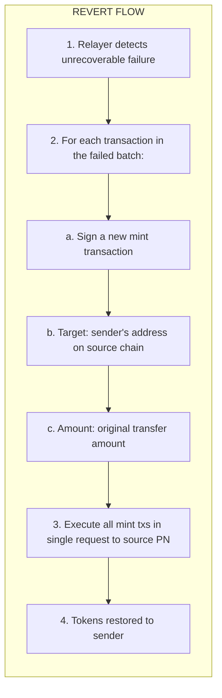
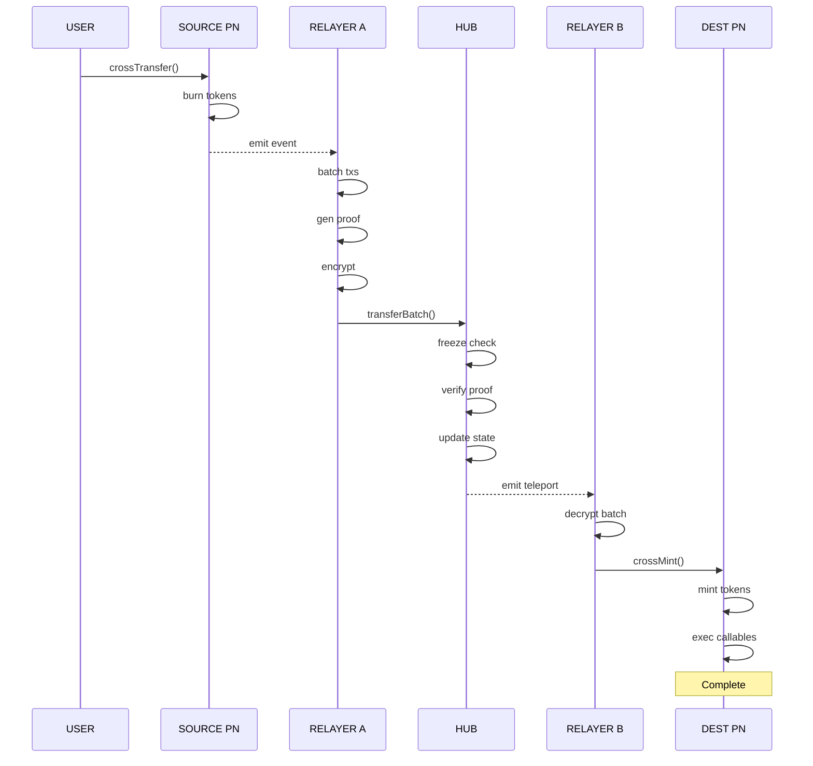

# Cross-Chain Transfers

The complete lifecycle of a private transfer between Privacy Node Ledgers.

## Overview

An Enygma cross-chain transfer moves tokens from one Privacy Node Ledger to another while keeping the amount private. The process involves:

1. Initiation on the source chain
2. Proof generation by the relayer
3. Verification on the Private Network Hub
4. Distribution to destination chain
5. Minting on the destination

## Transfer Lifecycle

### Phase 1: Initiation (Source Chain)

The user calls `crossTransfer()` on their Privacy Node Ledger:

```solidity
// User on PL A sends 100 tokens to Bob on PL B
enygmaHandler.crossTransfer(
    [bobAddress],     // Recipients array
    [100 * 10**18],   // Amounts array
    [chainIdB],       // Destination chains array
    [[]]              // Callables (optional)
);
```

**What happens:**

1. **Validation:**
   - Arrays have matching lengths
   - No transfers to same chain (must be cross-chain)
   - Maximum 5 unique destination chains
   - Maximum 5 callables per transfer

2. **Burn tokens:**
   - Total amount burned from sender's balance
   - Tokens are destroyed on source chain

3. **Generate reference ID:**
   ```
   referenceId = keccak256(
       fromChainId,
       senderAddress,
       toChainIds[],
       toAddresses[],
       abi.encode(blockNumber, nonce)
   )
   ```

4. **Mark as sent:**
   - Reference ID status set to SENT
   - Nonce incremented

5. **Emit event:**
   - `EnygmaSendTransferCC` event emitted
   - Contains all transfer details for relayer

### Phase 2: Relayer Processing

The source chain's relayer picks up the event and processes it:



### Phase 3: Hub Verification

The relayer submits `transferBatch()` to EnygmaV1 on the Hub:

```solidity
enygmaV1.transferBatch(
    k,                  // Anonymity index (2 to 6)
    commitments,        // New balance commitment points
    proof,              // Groth16 proof
    chainIds,           // Destination chain IDs (sorted)
    encryptedMessages   // Encrypted batch data per participant
);
```

**What happens:**

1. **Freeze check:** The `checkFreeze` modifier verifies the token is not frozen on the current chain by querying `TokenFreezeManager` through `TokenRegistry`. If frozen, the transaction reverts. See [Token Freezing](../../governance/tokens.md#token-freezing).

2. **Extract parameters:**
   ```
   nullifier = proof.public_signal[6k]
   blockNumber = proof.public_signal[6k + 1]
   ```

3. **Validate:**
   - Nullifier is unique (not in pendingTransactions)
   - Block number is valid (within range)
   - Commitment count matches chain IDs

4. **Verify proof:**
   - Route to k-specific verifier
   - Verify Groth16 proof against public signals

5. **Finalize pending:**
   - Process any pending transactions from previous blocks
   - Advance block state machine

6. **Add to pending:**
   - Create new PendingTransaction
   - Store commitments and nullifier

7. **Emit teleport event:**
   - EnygmaTeleport broadcasts to all relayers

### Phase 4: Distribution

EnygmaTeleport emits events that all relayers receive:

```solidity
// Emitted for each participant in the batch
event EnygmaTransfer(
    bytes32 indexed resourceId,
    uint256 indexed toChainId,
    bytes encryptedMessage
);
```

Each relayer:
1. Receives the event
2. Attempts to decrypt their message
3. If decryption succeeds, they have transfers to process

### Phase 5: Destination Processing

Different relayers have different responsibilities:

| Relayer | Role | Action |
|---------|------|--------|
| **Source (A)** | Sender's relayer | Do nothing (already processed) |
| **Destination (B)** | Recipient's relayer | Mint all tokens in batch |
| **Other (C)** | Anonymity participant | Update R value only if included |

**Destination relayer (B) actions:**

1. Decrypt the batch
2. For each transfer in batch:
   ```solidity
   enygmaHandler.crossMint(
       recipientAddress,
       amount,
       referenceId,
       callables
   );
   ```
3. Mark reference ID as RECEIVED
4. Mint tokens to recipient
5. Execute any callables

**Other relayer (C) actions:**

1. Decrypt the batch
2. If no transfers for this chain:
   - Only update R value in database
   - No on-chain action needed
3. If transfers exist:
   - Process as destination relayer

## Programmability: Callables

Each transfer can include up to 5 callable actions that execute on the destination:

```solidity
struct EnygmaCrossTransferCallable {
    bytes32 resourceId;       // Target by resource ID
    address contractAddress;  // OR direct address (not both)
    bytes payload;            // Call data
}
```

**Example: Transfer with callback**

```solidity
// Transfer 100 tokens and call a contract on destination
EnygmaCrossTransferCallable[] memory callables = new EnygmaCrossTransferCallable[](1);
callables[0] = EnygmaCrossTransferCallable({
    resourceId: bytes32(0),
    contractAddress: targetContract,
    payload: abi.encodeWithSignature("onTokenReceived(uint256)", 100)
});

enygmaHandler.crossTransfer(
    [recipientAddress],
    [100 * 10**18],
    [chainIdB],
    [callables]
);
```

**On destination:**
1. Tokens minted to recipient
2. `targetContract.onTokenReceived(100)` executed
3. If callable fails, entire transfer reverts

## Failure Handling

If the transfer fails (proof invalid, destination error, etc.):

### Retry Mechanism

The relayer retries up to 30 times:

```
Attempts 1-10:  Wait 1 block between retries
Attempts 11-30: Wait 2 blocks between retries (congestion mode)
```

### Retryable Errors

These errors trigger a retry:
- "context deadline exceeded"
- "Invalid public signal for balance"
- "Contract is processing another transaction"
- "Nullifier already used in pending transaction"
- "balance commitment mismatch between SC and DB"

### Non-Retryable Errors

These errors fail immediately without retry.

### Revert Process

If all retries fail:



## Reference ID Tracking

Each transfer has a unique reference ID that tracks its state:

```solidity
enum ReferenceIdStatus {
    NOSTATUS,         // 0 - Not initiated
    SENT,             // 1 - Initiated on source
    RECEIVED,         // 2 - Received on destination
    DEPOSITED,        // 3 - Deposited to ZkDVP
    WITHDRAW_ASKED,   // 4 - Withdrawal requested
    WITHDRAW_RECEIVED // 5 - Withdrawal complete
}
```

**Lifecycle:**
```
crossTransfer() called → SENT
crossMint() called    → RECEIVED
```

## What Each Party Sees

### Sender

Sees everything:
- Amount being sent
- Recipient address
- Destination chain
- Reference ID

### Recipient

Sees:
- Amount received
- Sender address
- Reference ID

### Source Relayer

Sees (before encryption):
- All transfer details
- Proof inputs
- Commitment values

### Destination Relayer

Sees (after decryption):
- Transfers for their chain
- Amounts and addresses
- Callables to execute

### Other Relayers (Anonymity Participants)

See:
- That a batch was processed
- Their encrypted message (empty or R update only)

### External Observers

See:
- That a transferBatch was called
- Encrypted data blobs
- Commitment points (meaningless without keys)
- Cannot determine: amounts, sender, recipient, which chain has real transfers

## Complete Flow Diagram



## Concrete Example: Alice Sends 100 USDC to Bob

Let's trace through a complete transfer with actual values.

### Initial State

```
Bank A (Chain ID: 1001):
  - Alice's USDC balance: 1,000 tokens
  - Alice's BabyJubJub public key: (pk_ax, pk_ay)

Bank B (Chain ID: 1002):
  - Bob's USDC balance: 500 tokens
  - Bob's address: 0xBob123...

Hub (Block: 100):
  - Alice's balance commitment: C_alice = Commit(1000, r1)
                                        = (0x7a3f..., 0x9b2e...)
  - Bank B's balance commitment: C_bankB = Commit(500, r2)
                                         = (0x5c8a..., 0x1f4e...)
```

### Step 1: Alice Initiates Transfer

```solidity
// Alice calls on Bank A
enygmaHandler.crossTransfer(
    [0xBob123...],          // Bob's address
    [100000000000000000000], // 100 tokens (18 decimals)
    [1002],                  // Bank B's chain ID
    [[]]                     // No callables
);
```

**What happens on Bank A:**
```
1. Alice's balance: 1000 → 0 (all burned, will get 900 back)
2. Reference ID generated: 0x7a3f2e9d...
3. Reference status: SENT
4. Event emitted: EnygmaSendTransferCC
```

### Step 2: Relayer A Processes

**Event data received:**
```
resourceId:   0xUSdc123...
fromChainId:  1001
fromAddress:  0xAlice456...
referenceId:  0x7a3f2e9d...
toAddresses:  [0xBob123...]
toAmounts:    [100000000000000000000]
toChainIds:   [1002]
```

**Batching (k=2, only 2 banks):**
```
Batch participants: {Bank A, Bank B}
Real transfer: Bank A → Bank B (100 tokens)
Empty batch: Bank B → Bank A (0 tokens, just for anonymity)
```

**Nullifier computation:**
```
shared_secret   = Poseidon(alice_previousR, alice_secret_key)
arrayHashSecret = Poseidon(shared_secret, shared_secret)
nullifier       = Poseidon(arrayHashSecret, blockNumber=100)
                = 0x4d9e7b...
```

**New commitments calculated:**
```
Alice's new commitment: C_alice' = Commit(900, r3)
                                 = (0x8f2c..., 0x3a9b...)

Bank B's new commitment: C_bankB' = Commit(600, r4)
                                  = (0x2e7f..., 0x5d1c...)
```

### Step 3: Proof Generated

**Request to gnark-api /gen-proof-2:**
```json
{
  "senderChainId": 1001,
  "senderAmount": "100000000000000000000",
  "senderSecretKey": "sk_alice",
  "nullifier": "0x4d9e7b...",
  "blockNumber": 100,
  "destinationChainIds": [1002],
  "previousCommits": [
    ["0x7a3f...", "0x9b2e..."],
    ["0x5c8a...", "0x1f4e..."]
  ],
  "newCommits": [
    ["0x8f2c...", "0x3a9b..."],
    ["0x2e7f...", "0x5d1c..."]
  ]
}
```

**Response (proof):**
```json
{
  "pi_a": ["123456...", "789012..."],
  "pi_b": [["...", "..."], ["...", "..."]],
  "pi_c": ["567890...", "123456..."],
  "public_signal": [
    "ahs_a",                     // Array hash secret (Alice)
    "ahs_b",                     // Array hash secret (Bank B)
    "pk_a",                      // Alice's public key
    "pk_b",                      // Bank B's public key
    "C_alice_x", "C_alice_y",   // Previous commitment (Alice)
    "C_bankB_x", "C_bankB_y",   // Previous commitment (Bank B)
    "C_alice'_x", "C_alice'_y", // Output commitment (Alice)
    "C_bankB'_x", "C_bankB'_y", // Output commitment (Bank B)
    "0x4d9e7b...",               // Nullifier (position 6k = 12)
    "100",                       // Block number
    "kindex_a", "kindex_b",     // K-index values
    "tag_a", "tag_b"            // Message tags
  ]
}
```

### Step 4: Hub Verification

**Relayer submits to Hub:**
```solidity
enygmaV1.transferBatch(
    2,                    // k=2
    [C_alice', C_bankB'], // New commitments
    proof,                // Groth16 proof
    [1002],               // Chain IDs
    [encryptedBatchB, encryptedBatchA]  // Encrypted data
);
```

**Hub checks:**
```
✓ Token not frozen on this chain (checkFreeze modifier)
✓ Nullifier 0x4d9e7b... not in pendingTransactions
✓ Block number 100 is valid
✓ Groth16 proof verifies against public signals
✓ Commitment count (2) matches participants
```

**Hub updates:**
```
pendingTransactions.push({
    nullifier: 0x4d9e7b...,
    commitments: [C_alice', C_bankB'],
    type: Transfer
})
```

### Step 5: EnygmaTeleport Events

**Event for Bank B (has real transfer):**
```solidity
emit EnygmaTransfer(
    0xUSdc123...,         // resourceId
    1002,                 // toChainId (Bank B)
    encryptedBatchB       // Contains: Bob gets 100 tokens
);
```

**Event for Bank A (empty, for anonymity):**
```solidity
emit EnygmaTransfer(
    0xUSdc123...,
    1001,                 // toChainId (Bank A)
    encryptedBatchA       // Contains: just R value update
);
```

### Step 6: Relayer B Processes

**Decrypts message, finds:**
```
Transfer 1:
  - recipientAddress: 0xBob123...
  - amount: 100000000000000000000
  - referenceId: 0x7a3f2e9d...
  - callables: []
```

**Calls Bank B contract:**
```solidity
enygmaHandler.crossMint(
    0xBob123...,             // Bob's address
    100000000000000000000,   // 100 tokens
    0x7a3f2e9d...,           // Reference ID
    []                       // No callables
);
```

### Step 7: Final State

```
Bank A (Chain ID: 1001):
  - Alice's USDC balance: 900 tokens (received change back)
  - Reference 0x7a3f2e9d status: SENT

Bank B (Chain ID: 1002):
  - Bob's USDC balance: 600 tokens (500 + 100)
  - Reference 0x7a3f2e9d status: RECEIVED

Hub (Block: 101):
  - Alice's balance commitment: C_alice' = Commit(900, r3)
  - Bank B's balance commitment: C_bankB' = Commit(600, r4)
  - Nullifier 0x4d9e7b... recorded (prevents replay)
```

### What Each Observer Learned

| Observer | What They Know | What They DON'T Know |
|----------|----------------|---------------------|
| **Alice** | Sent 100 to Bob, has 900 remaining | N/A (knows everything) |
| **Bob** | Received 100 from Alice | Alice's remaining balance |
| **Bank A operator** | Alice initiated transfer | Amount, destination |
| **Bank B operator** | Bob received transfer | Amount, source |
| **External observer** | Batch between {A, B} | Direction, amounts, who sent |
| **Hub validators** | Encrypted blobs passed | Cannot decrypt anything |

---

**Next:** [State Management](state-management.md) - How balances are tracked and finalized.
