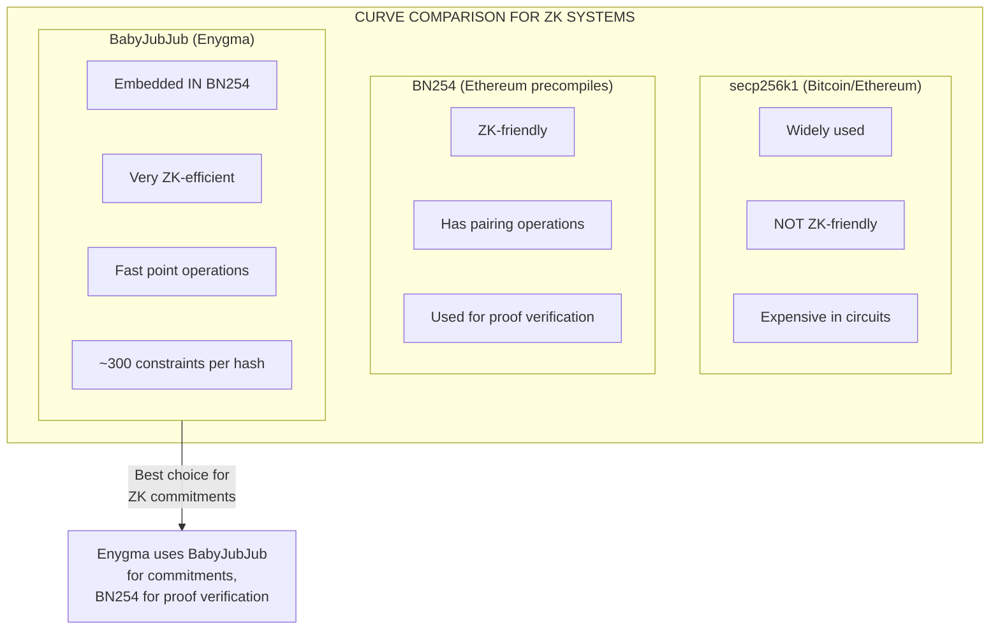
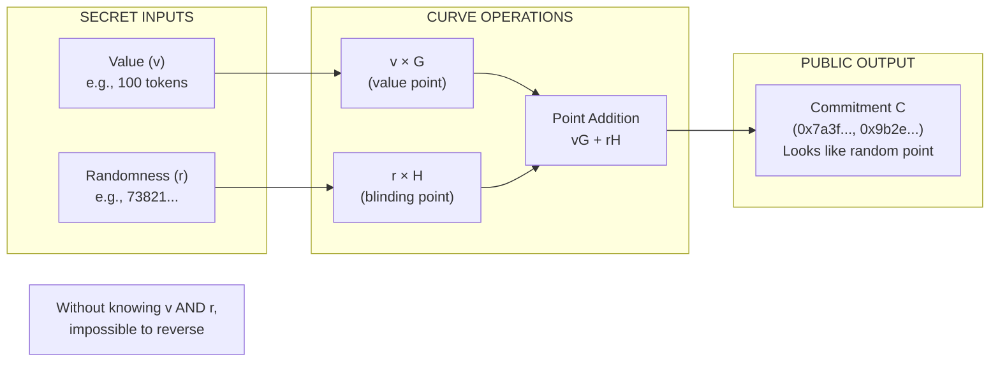
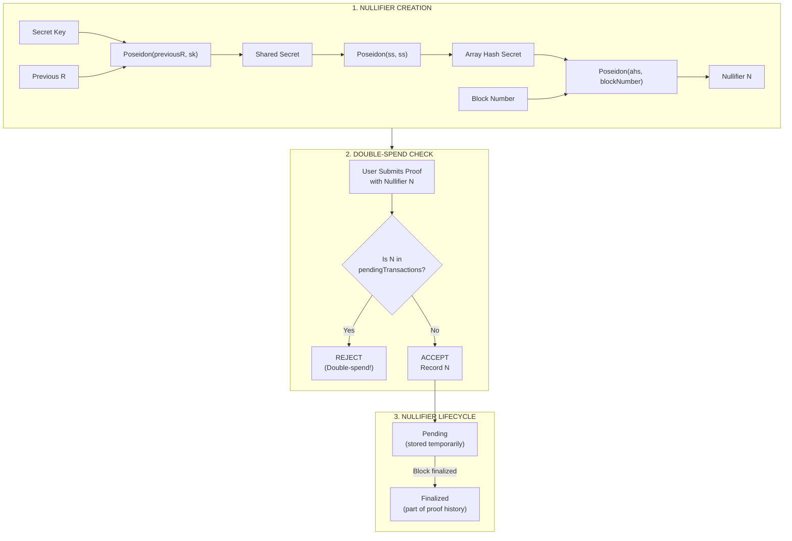

# Cryptographic Foundations

The mathematical primitives that enable Enygma's privacy guarantees.

## Overview

Enygma's privacy relies on three cryptographic building blocks:

1. **BabyJubJub Curve** - The mathematical space where operations happen
2. **Pedersen Commitments** - How values are hidden but remain verifiable
3. **Groth16 Proofs** - How validity is proven without revealing values

## The BabyJubJub Curve

### What is an Elliptic Curve?

An elliptic curve is a mathematical structure where:
- Points can be added together
- A point can be multiplied by a number (scalar)
- These operations have useful cryptographic properties

### Why BabyJubJub?

Enygma uses the BabyJubJub curve, defined by the equation:

```
168700x² + y² = 1 + 168696x²y²
```

This specific curve was chosen because:

| Property | Benefit |
|----------|---------|
| **ZK-friendly** | Efficient to verify inside zero-knowledge circuits |
| **Embedded in BN254** | Works with Ethereum's precompiled contracts |
| **Twisted Edwards form** | Fast point addition operations |
| **Large prime order** | Secure against known attacks |

### Key Parameters

```
Field size (Q): 21888242871839275222246405745257275088548364400416034343698204186575808495617

Generator point G: Used for value commitments
  Gx = 16540640123574156134436876038791482806971768689494387082833631921987005038935
  Gy = 20819045374670962167435360035096875258406992893633759881276124905556507972311

Generator point H: Used for randomness (blinding factor), derived via NUMS (Nothing Up My Sleeve)
  Hx = 10100005861917718053548237064487763771145251762383025193119768015180892676690
  Hy = 7512830269827713629724023825249861327768672768516116945507944076335453576011
```

### Point Operations

**Point Addition:** Given two points P1 and P2, their sum P3 = P1 + P2 is another point on the curve.

**Scalar Multiplication:** Given a point P and a number n, we can compute n×P by adding P to itself n times (efficiently using double-and-add algorithm).

```
Example:
  5 × G = G + G + G + G + G

  This produces a new point on the curve.
  Knowing the result, it's computationally infeasible to find "5"
  (the discrete logarithm problem).
```

### Why BabyJubJub Over Other Curves?



**The Key Insight:** BabyJubJub is "embedded" inside BN254, meaning operations on BabyJubJub can be verified efficiently using Ethereum's BN254 precompiles. This gives us the best of both worlds:
- Fast commitment operations (BabyJubJub)
- Efficient on-chain verification (BN254 precompiles)

### Security Foundations

Enygma's cryptographic security relies on these mathematical assumptions:

| Assumption | What It Means | Current Status |
|------------|---------------|----------------|
| **Discrete Logarithm Problem (DLP)** | Given v×G, cannot find v | No efficient algorithm known |
| **Collision Resistance** | Cannot find two inputs with same hash | SHA256/Poseidon resistant |
| **BN254 Security** | Pairing-based assumptions hold | ~100-bit security level |

**What Would Break Enygma:**

- **Quantum computers** - Could solve DLP, breaking commitments (not yet practical)
- **DLP breakthrough** - Mathematical advance solving discrete log (considered unlikely)
- **Weak randomness** - If r values are predictable, commitments can be reversed

## Pedersen Commitments

### The Core Concept

A Pedersen commitment hides a value while allowing mathematical operations on it:

```
Commitment = value × G + randomness × H
```

Or written as:
```
C = v·G + r·H
```

Where:
- `v` is the value being committed (e.g., 100 tokens)
- `r` is a random blinding factor
- `G` and `H` are generator points on the curve
- `C` is the resulting commitment point

### Visual: How Commitments Work



### Properties

**Hiding:** Given only C, an observer cannot determine v or r. The commitment looks like a random point on the curve.

**Binding:** Once created, the committer cannot find different values (v', r') that produce the same commitment C.

```
If C = v·G + r·H

Then finding v', r' where v'·G + r'·H = C
would require solving the discrete logarithm problem.
```

### Homomorphic Property (Key for Enygma)

Pedersen commitments can be added:

```
C1 = v1·G + r1·H
C2 = v2·G + r2·H

C1 + C2 = (v1 + v2)·G + (r1 + r2)·H
```

This means:
- Adding two commitments gives a commitment to the sum of values
- No one learns what v1, v2, or v1+v2 are
- But the relationship is mathematically preserved

### Example: Balance Transfer

```
Alice's balance commitment: C_alice = 1000·G + r1·H
Bob's balance commitment:   C_bob   = 500·G + r2·H

Alice sends 100 to Bob:

New Alice commitment: C_alice' = 900·G + r3·H
New Bob commitment:   C_bob'   = 600·G + r4·H

Verification (done in zero-knowledge):
  C_alice - C_alice' = 100·G + (r1 - r3)·H  ← Amount sent
  C_bob' - C_bob     = 100·G + (r4 - r2)·H  ← Amount received

These must be equal (after accounting for randomness), proving conservation.
```

## The Conservation Law

Enygma enforces that the sum of all balances equals the total supply:

```
Σ(all balance commitments) = totalSupply·G + totalRandomness·H
```

### How It Works

1. **At creation:** Total supply commitment is recorded
2. **On transfer:** Balances change but sum remains constant
3. **On mint:** Total supply commitment increases
4. **On burn:** Total supply commitment decreases

```
Before transfer:
  Alice: 1000·G + r1·H
  Bob:   500·G + r2·H
  Total: 1500·G + (r1+r2)·H

After transfer (Alice → Bob: 100):
  Alice: 900·G + r3·H
  Bob:   600·G + r4·H
  Total: 1500·G + (r3+r4)·H

The "1500" is preserved, just with different randomness.
```

## Groth16 Zero-Knowledge Proofs

### What is a Zero-Knowledge Proof?

A proof that convinces a verifier that a statement is true, without revealing why it's true.

```
Statement: "I know a value v such that C = v·G + r·H and v >= 100"

Zero-knowledge proof:
  - Proves the statement is true
  - Does NOT reveal v or r
  - Verifier is convinced without learning the secret
```

### Groth16 Specifically

Enygma uses Groth16 proofs because they are:

| Property | Benefit |
|----------|---------|
| **Succinct** | Proof is small (~200 bytes) regardless of computation |
| **Non-interactive** | Single message from prover to verifier |
| **Efficient verification** | Fast on-chain verification |

### Proof Structure

A Groth16 proof consists of:

```
struct TransferProof {
    pi_a: [uint256; 2]      // Point A in G1
    pi_b: [[uint256; 2]; 2] // Point B in G2 (2x2)
    pi_c: [uint256; 2]      // Point C in G1
    public_signal: uint256[] // Public inputs
}
```

### What Enygma Proofs Prove

For a transfer, the proof demonstrates:

1. **Ownership:** Prover knows the secret key for the sender's commitment
2. **Sufficient balance:** Sender's balance >= transfer amount
3. **Correct computation:** New commitments are correctly formed
4. **Conservation:** Total value is preserved
5. **Nullifier validity:** The nullifier is correctly derived (prevents double-spend)

All of this is proven without revealing:
- The actual balance amounts
- The transfer amount
- The randomness values

### Public Signals

The proof includes public inputs that the verifier checks:

```
For k participants:
  - Array hash secrets (k values)
  - Public keys (k values)
  - Previous balance commitments (2k values)
  - Output commitments (2k values)
  - Nullifier (1 value)
  - Block number (1 value)
  - K-index values (k values)
  - Message tags (k values)

Total: 8k + 2 values
```

## Nullifiers: Preventing Double-Spend

### The Problem

Without additional protection, a user could submit the same proof multiple times.

### The Solution

Each transfer includes a **nullifier** — a unique value derived through a multi-step Poseidon hash chain:

```
1. shared_secret    = Poseidon(previousR, secret_key)
2. arrayHashSecret  = Poseidon(shared_secret, shared_secret)
3. nullifier        = Poseidon(arrayHashSecret, blockNumber)
```

Where `previousR` is the sender's previous random blinding factor and `secret_key` is the sender's Payment Spend secret key. The `arrayHashSecret` is also a public signal, acting as a privacy-preserving identifier that does not reveal the underlying secret key.

Properties:
- **Unique per transfer:** Same secret key + different block = different nullifier
- **Verifiable:** The ZK proof constrains that the nullifier is correctly derived from the sender's secrets
- **Unlinkable:** Observers cannot link the nullifier to the sender's identity

### How It Works



**Why This Prevents Double-Spending:**

| Scenario | What Happens |
|----------|--------------|
| First submission | N not found → Transfer accepted, N recorded |
| Same proof resubmitted | N found → Transfer rejected |
| New transfer, same user | Different block number → Different N → Accepted |
| Attacker guesses N | Can't create valid proof without secret key |

## Summary

| Component | Purpose |
|-----------|---------|
| BabyJubJub curve | Mathematical foundation for point operations |
| Pedersen commitments | Hide values while preserving arithmetic |
| Conservation law | Guarantee total supply integrity |
| Groth16 proofs | Prove validity without revealing values |
| Nullifiers | Prevent double-spending |

These primitives combine to create a system where:
- Balances are hidden
- Transfers are private
- Validity is mathematically guaranteed
- No trust in any party is required

---

**Next:** [Architecture](architecture.md) - How these cryptographic primitives are implemented in Enygma's smart contracts and services.
