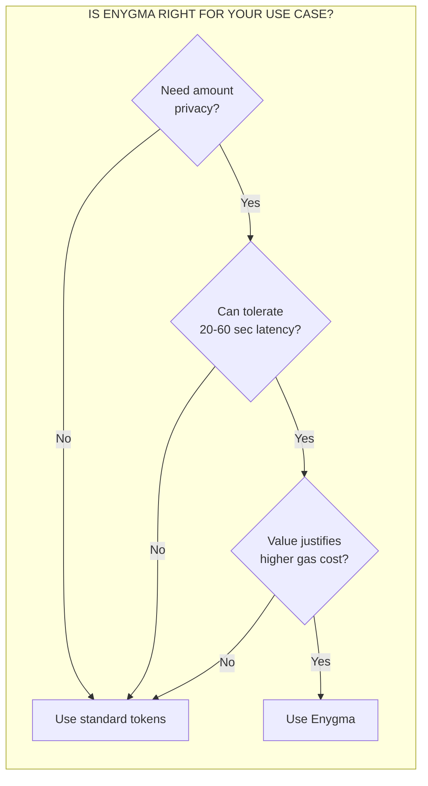
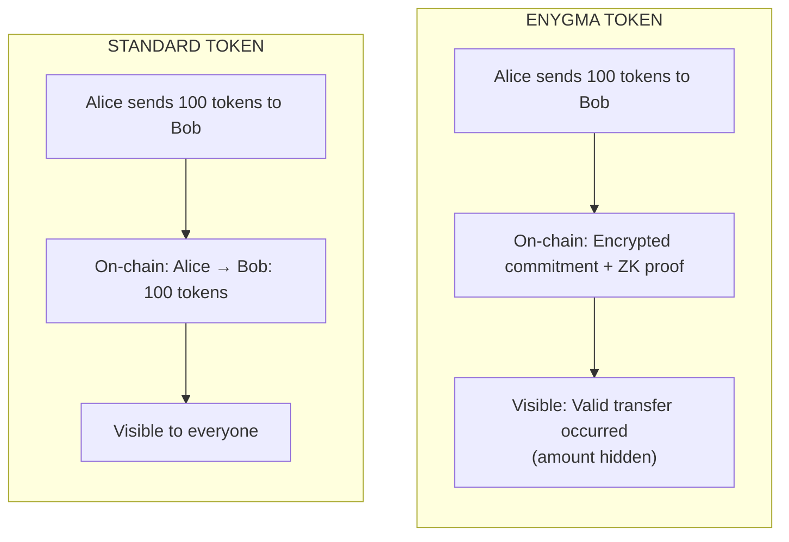

# Enygma Protocol

Enygma is Rayls' privacy-preserving token protocol that enables confidential transfers where transaction amounts remain hidden while the system mathematically proves all balances are valid.

## What is Enygma?

Enygma allows you to transfer tokens between Privacy Node Ledgers without revealing the transfer amounts to anyone except the sender and recipient. The protocol uses zero-knowledge cryptography to prove that:

- The sender has sufficient balance
- The total supply is conserved (no tokens created or destroyed)
- The transfer is authorized by the sender

All of this is proven without revealing the actual amounts involved.

## Key Properties

| Property | Description |
|----------|-------------|
| **Confidentiality** | Transfer amounts are hidden from observers |
| **k-Anonymity** | Transfers are grouped with other participants (k=2 to 6) to obscure sender/receiver |
| **Conservation** | Mathematical guarantee that total supply always balances |
| **Programmability** | Up to 5 callable actions can execute on transfer completion |
| **Freeze Protection** | Transfers are blocked on chains where the token is [frozen](../../governance/tokens.md#token-freezing) |

## Performance Characteristics

Understanding Enygma's trade-offs helps determine when to use it:

| Metric | Value | Notes |
|--------|-------|-------|
| **Latency** | 20-60 seconds | Includes batching, proof generation, finalization |
| **Gas per batch** | ~250-300k | Shared across all transfers in batch |
| **Max transfers per batch** | 1000 | Configurable |
| **Minimum anonymity set** | k=2 | Two participants in each batch |
| **Maximum anonymity set** | k=6 | Six participants in each batch |
| **Proof generation** | 2-10 seconds | Depends on k and system load |

## When to Use Enygma

**Best suited for:**
- High-value transfers where privacy justifies costs
- Regulatory-compliant confidential transactions
- Inter-institutional settlements
- Treasury operations

**Not recommended for:**
- High-frequency, low-value transfers
- Use cases requiring sub-second confirmation
- Public transparency requirements

## What You'll Learn

After reading this section, you will understand:

- [ ] Why blockchain privacy matters and what problems Enygma solves
- [ ] How Pedersen commitments hide values while enabling verification
- [ ] The 3-layer architecture (Handler → Coordinator → Proof System)
- [ ] How batching and k-anonymity work (and current limitations)
- [ ] The complete lifecycle of a cross-chain private transfer
- [ ] How balances are tracked and finalized without revealing amounts

## Prerequisites

Before diving into Enygma, you should understand:

- Basic Rayls architecture (Privacy Node Ledgers, Private Network Hub)
- How standard token transfers work in Rayls
- The role of the Relayer in cross-chain communication

## Documentation Structure

| Page | Description |
|------|-------------|
| [Problem & Solution](problem-and-solution.md) | Why privacy matters and what Enygma provides |
| [Cryptographic Foundations](cryptographic-foundations.md) | BabyJubJub curve, Pedersen commitments, proofs |
| [Architecture](architecture.md) | Contracts, components, data structures |
| [The Proof System](the-proof-system.md) | Batching, k-anonymity, verification |
| [Cross-Chain Transfers](cross-chain-transfers.md) | Complete transfer lifecycle |
| [State Management](state-management.md) | Balances, finalization, nullifiers |

## Quick Concept Overview

The key insight: Enygma proves validity without revealing values.

---

**Start here:** [Problem & Solution](problem-and-solution.md) - Why privacy matters for blockchain.

**Need term definitions?** See the [Glossary](glossary.md).
