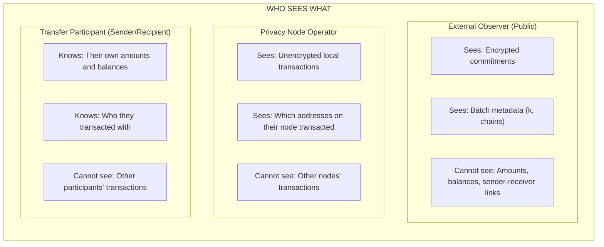

# Problem & Solution

Understanding why Enygma exists and what problems it solves.

## The Transparency Problem

Blockchain transactions are inherently transparent. Every transfer is recorded on a public ledger where anyone can see:

- **Who** sent the transaction (sender address)
- **Who** received it (recipient address)
- **How much** was transferred (amount)
- **When** it happened (timestamp)

This transparency is a feature for some use cases, but a critical problem for others.

## Business Impact of Transparency

### Competitive Intelligence

```
Scenario: Company A pays Supplier B
On-chain: 0xCompanyA → 0xSupplierB: 500,000 USDC

Competitors can see:
- Who your suppliers are
- How much you're paying them
- Payment frequency and patterns
- Your supply chain relationships
```

### Salary Exposure

```
Scenario: Payroll for 100 employees
On-chain: 0xCompany → 0xEmployee1: 8,500 USDC
          0xCompany → 0xEmployee2: 12,000 USDC
          0xCompany → 0xEmployee3: 15,500 USDC

Anyone can see:
- Individual salary amounts
- Pay disparities
- Bonus payments
- Compensation structure
```

### Trading Strategy Leakage

```
Scenario: Fund executes large trade
On-chain: 0xFund → 0xExchange: 10,000,000 USDC

Front-runners can:
- See large orders before execution
- Trade ahead of the order
- Profit from price movement
- Cause worse execution for the fund
```

### Regulatory Compliance Conflicts

Many jurisdictions require financial privacy for:

- Customer data protection (GDPR, etc.)
- Banking secrecy regulations
- Anti-front-running requirements
- Confidential business transactions

## What Enygma Provides

Enygma solves these problems while maintaining the integrity guarantees of blockchain:

| Problem | Enygma Solution |
|---------|-----------------|
| Amount visibility | Amounts encrypted in Pedersen commitments |
| Sender/receiver linkage | k-anonymity groups obscure participants |
| Balance tracking | Cryptographic proofs verify correctness |
| Regulatory compliance | Selective disclosure possible |

## The Core Insight

**Traditional approach:** Trust the ledger because you can verify all values.

**Enygma approach:** Trust the ledger because mathematical proofs guarantee correctness—without revealing the values.

```
Traditional Token:
  Balance[Alice] = 1000
  Balance[Bob] = 500

  Transfer: Alice → Bob: 100

  After:
  Balance[Alice] = 900   ← Visible
  Balance[Bob] = 600     ← Visible

Enygma Token:
  Balance[Alice] = Commitment(1000, random1)  ← Looks like: 0x7a3f...
  Balance[Bob] = Commitment(500, random2)     ← Looks like: 0x9b2e...

  Transfer: Proof that "Alice has enough" + "Bob receives correct amount"

  After:
  Balance[Alice] = Commitment(900, random3)   ← Still hidden
  Balance[Bob] = Commitment(600, random4)     ← Still hidden

  Proof guarantees: Old balances - transfer + new balances = 0
```

## Comparison: Standard vs Enygma Tokens

| Aspect | Standard Token | Enygma Token |
|--------|---------------|--------------|
| Balance visibility | Public | Hidden (commitment) |
| Transfer amount | Public | Hidden (encrypted) |
| Sender identity | Public address | Obscured by k-anonymity |
| Receiver identity | Public address | Obscured by k-anonymity |
| Balance verification | Direct inspection | Zero-knowledge proof |
| Total supply | Sum of balances | Conservation law proof |
| Gas cost | Lower | Higher (proof verification) |
| Throughput | Higher | Lower (batching helps) |

## Privacy Model

Understanding exactly what Enygma hides and what remains visible is crucial for evaluating whether it meets your privacy requirements.

### What IS Hidden

| Data | How It's Hidden |
|------|-----------------|
| **Transfer amounts** | Encrypted in Pedersen commitments; only sender and recipient know the value |
| **Individual balances** | Stored as cryptographic commitments, not plain numbers |
| **Sender-receiver relationship** | Obscured by k-anonymity; observers can't determine who sent to whom within the anonymity set |
| **Transaction purpose** | No metadata about why a transfer occurred |

### What IS NOT Hidden

| Data | Why It's Visible |
|------|------------------|
| **Wallet addresses** | Addresses on Privacy Node Ledgers are visible to that node's operator |
| **Transfer existence** | The fact that a transfer occurred is recorded on-chain |
| **Timing** | When transfers happen is visible in block timestamps |
| **Total supply** | Tracked publicly to ensure conservation (no tokens created from nothing) |
| **Number of participants in batch** | The k value (2 to 6) reveals anonymity set size |
| **Which chains participated** | Chain IDs in a batch are visible |

### Trust Assumptions



**Key Trust Points:**

| Entity | What You Trust Them With |
|--------|--------------------------|
| **Your Privacy Node operator** | They see your local transactions (addresses, timing) but not amounts |
| **Other participants in k-anonymity set** | They don't learn anything about your transaction |
| **Hub validators** | They process encrypted data; cannot decrypt without keys |
| **Relayer** | Processes batches but uses encrypted messages |

### Privacy Limitations

**What Enygma Does NOT Protect Against:**

1. **Sender or recipient disclosure** - If you send tokens to someone, they know you sent them
2. **Node operator observation** - Your node operator sees your local activity
3. **Pattern analysis** - Sophisticated analysis of timing and amounts may reveal information over time
4. **k=2 limitation** - With only 2 participants, there's 50% chance an observer guesses correctly
5. **Legal compulsion** - Authorized parties (auditors) can be granted decryption access

### Comparison to Other Privacy Approaches

| Approach | Privacy Level | Trade-offs |
|----------|---------------|------------|
| **Standard tokens** | None | Full transparency |
| **Enygma (k=2)** | Moderate | 2-party anonymity set, batch delays |
| **Enygma (k=6)** | Higher | 6-party anonymity set, requires more participants |
| **Mixers (Tornado Cash style)** | High | Fixed denominations, regulatory concerns |
| **Zcash shielded** | Very high | Complex, slower, separate network |

Enygma is designed for **institutional use cases** where moderate privacy with regulatory compliance is preferred over maximum anonymity.

## Use Cases

### Financial Institutions

- **Interbank settlements**: Transfer large sums without revealing positions
- **OTC trading**: Execute block trades without market impact
- **Payroll**: Process salaries without exposing compensation

### Corporations

- **Supplier payments**: Hide vendor relationships and pricing
- **Treasury management**: Move funds without broadcasting strategy
- **M&A activity**: Confidential transaction preparation

### Compliance-Sensitive Operations

- **Regulated entities**: Meet privacy requirements while on-chain
- **Cross-border transfers**: Comply with data protection laws
- **Audit trails**: Selective disclosure for authorized parties

## Key Takeaway

Enygma enables the benefits of blockchain (immutability, programmability, interoperability) without sacrificing the privacy that businesses and regulations require.

The next section explains the cryptographic foundations that make this possible.

---

**Next:** [Cryptographic Foundations](cryptographic-foundations.md) - How Pedersen commitments and zero-knowledge proofs enable private transfers.
