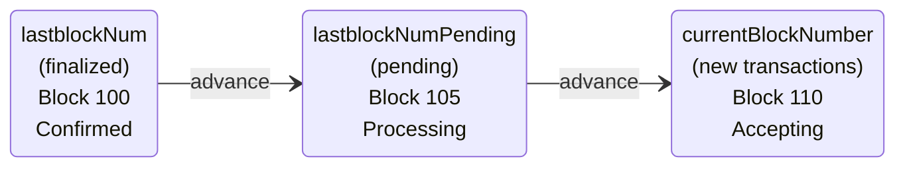

# State Management

How Enygma tracks balances, manages finalization, and prevents double-spending.

## Reference Balance Model

Unlike standard tokens where balances are plain numbers, Enygma stores balances as **Pedersen commitment points**.

### Standard Token Balance

```solidity
mapping(address => uint256) public balances;
// balances[alice] = 1000
// Anyone can see Alice has 1000 tokens
```

### Enygma Balance

```solidity
mapping(uint256 => mapping(uint256 => EnygmaPointWithChainId)) public referenceBalance;
// referenceBalance[blockNumber][chainId] = Point(c1, c2, chainId)
// Observers see: Point(0x7a3f..., 0x9b2e..., 1001)
// Meaning: Unknown balance with some randomness, for chain 1001
```

### Why Points Instead of Numbers?

The commitment point represents:
```
Point = balance × G + randomness × H
```

- **Privacy:** The actual balance cannot be extracted from the point
- **Verifiability:** ZK proofs can verify operations on commitments
- **Homomorphic:** Points can be added/subtracted while preserving the relationship

## Two-Level Balance Storage

Balances are tracked at two levels:

```solidity
referenceBalance[blockNumber][chainId] = Point

// This creates a history:
referenceBalance[100][1001] = Point(a, b)  // Finalized at block 100
referenceBalance[105][1001] = Point(c, d)  // Finalized at block 105
referenceBalance[110][1001] = Point(e, f)  // Current pending
```

### Why Block Numbers?

1. **Deterministic finalization:** All participants agree on state at each block
2. **Rollback capability:** Can reference historical states
3. **Proof verification:** Proofs reference specific block states

## Block State Machine

Enygma uses a three-phase state machine for block progression:



### State Variables

```solidity
uint256 public lastblockNum;        // Last finalized block
uint256 public lastblockNumPending; // Currently being processed
mapping(uint256 => uint256) public nextBlockNumber;  // Block chain linkage
```

### State Transitions

```
1. New transfer arrives at block 110
   - currentBlockNumber = 110
   - Add to pendingTransactions

2. Next transfer arrives
   - Check if state should advance
   - If conditions met:
     * lastblockNum becomes lastblockNumPending
     * lastblockNumPending becomes currentBlockNumber
     * processPendingActions() called

3. Finalization (empty batch)
   - All pending actions applied
   - Balances finalized
   - Events emitted
```

## Concrete Example: Block Progression

Let's trace through a complete block progression cycle with actual values.

### Initial State

```
Hub State (Start):
┌─────────────────────────────────────────────────┐
│ lastblockNum         = 100  (finalized)         │
│ lastblockNumPending  = 100  (no pending)        │
│ currentBlockNumber   = ?    (waiting)           │
│ nextBlockNumber[100] = ?    (not linked yet)    │
│ pendingTransactions  = []   (empty)             │
│                                                 │
│ Balance Commitments:                            │
│   referenceBalance[100][1001] = (0x7a3f..., 0x9b2e...)  │
│   referenceBalance[100][1002] = (0x5c8a..., 0x1f4e...)  │
└─────────────────────────────────────────────────┘
```

### Step 1: First Transfer Arrives (Block 105)

Alice sends 100 tokens to Bob (Bank A → Bank B).

```
After transferBatch() at Hub block 105:
┌─────────────────────────────────────────────────┐
│ lastblockNum         = 100  (still finalized)   │
│ lastblockNumPending  = 100  (unchanged)         │
│ currentBlockNumber   = 105  (NEW!)              │
│ pendingTransactions  = [T1] (Alice→Bob proof)   │
│                                                 │
│ T1: {                                           │
│   nullifier: 0x4d9e...,                         │
│   commitments: [C_alice', C_bankB'],            │
│   type: Transfer                                │
│ }                                               │
└─────────────────────────────────────────────────┘
```

### Step 2: Second Transfer Arrives (Block 108)

Carol sends 50 tokens to Dave (Bank B → Bank A).

```
After transferBatch() at Hub block 108:
┌─────────────────────────────────────────────────┐
│ lastblockNum         = 100  (still finalized)   │
│ lastblockNumPending  = 100  (unchanged)         │
│ currentBlockNumber   = 108  (moved forward)     │
│ pendingTransactions  = [T1, T2]                 │
│                                                 │
│ T2: {                                           │
│   nullifier: 0x7b2c...,                         │
│   commitments: [C_bankB'', C_alice''],          │
│   type: Transfer                                │
│ }                                               │
└─────────────────────────────────────────────────┘
```

### Step 3: Empty Batch Triggers Finalization (Block 110)

Relayer submits empty batch to finalize.

```mermaid
flowchart TB
    subgraph before["BEFORE FINALIZATION (Block 110)"]
        B1["lastblockNum = 100"]
        B2["lastblockNumPending = 100"]
        B3["currentBlockNumber = 110"]
        B4["pendingTransactions = [T1, T2]"]
    end

    subgraph check["FINALIZATION CHECK"]
        C1["currentBlockNumber (110) > lastblockNum (100)? ✓"]
        C2["pendingTransactions.length > 0? ✓"]
        C3["currentBlockNumber (110) > lastblockNumPending (100)? ✓"]
        C4["lastblockNumPending (100) >= lastblockNum (100)? ✓"]
        C5["ALL CONDITIONS MET → FINALIZE"]
    end

    subgraph process["PROCESS PENDING"]
        P1["1. processPendingActions(100)"]
        P2["2. Apply pending mints/burns"]
        P3["3. Clear pendingTransactions"]
    end

    subgraph update["UPDATE BLOCK CHAIN"]
        U1["nextBlockNumber[100] = 105"]
        U2["lastblockNum = 105"]
        U3["nextBlockNumber[105] = 110"]
        U4["lastblockNumPending = 110"]
    end

    subgraph after["AFTER FINALIZATION"]
        A1["lastblockNum = 105 (NEW)"]
        A2["lastblockNumPending = 110 (NEW)"]
        A3["currentBlockNumber = 110"]
        A4["pendingTransactions = []"]
        A5["Events emitted: BalancesFinalized"]
    end

    before --> check --> process --> update --> after
```



### Step 4: Final State

```
Hub State (After finalization):
┌─────────────────────────────────────────────────┐
│ lastblockNum         = 105  (ADVANCED)          │
│ lastblockNumPending  = 110  (ADVANCED)          │
│ currentBlockNumber   = 110                      │
│ nextBlockNumber[100] = 105  (linked)            │
│ nextBlockNumber[105] = 110  (linked)            │
│ pendingTransactions  = []   (cleared)           │
│                                                 │
│ Balance Commitments (now finalized):            │
│   referenceBalance[105][1001] = (0x8f2c..., 0x3a9b...)  │
│   referenceBalance[105][1002] = (0x2e7f..., 0x5d1c...)  │
│                                                 │
│ Historical (still available):                   │
│   referenceBalance[100][1001] = (0x7a3f..., 0x9b2e...)  │
│   referenceBalance[100][1002] = (0x5c8a..., 0x1f4e...)  │
└─────────────────────────────────────────────────┘
```

### Block Chain Visualization

```
Block 100 ──────> Block 105 ──────> Block 110
(finalized)       (finalized)       (pending/current)
│                 │                 │
└─ Historical     └─ Historical     └─ Current state
   balances          balances          accepts new txs
```

### Key Observations

| Phase | State | Transfers Accepted? | Balances Finalized? |
|-------|-------|---------------------|---------------------|
| Before any transfers | Block 100 finalized | Yes | Yes (at 100) |
| After T1 | Block 105 current | Yes | No (still at 100) |
| After T2 | Block 108 current | Yes | No (still at 100) |
| After empty batch | Block 110 current | Yes | Yes (at 105) |

### Why This Design?

1. **Batching window:** Multiple transfers can accumulate before finalization
2. **Deterministic finalization:** All relayers agree on state at each finalized block
3. **Historical proofs:** Old proofs remain valid against historical roots
4. **Recovery:** Can always reconstruct state from block chain

## Finalization Process

### When Finalization Happens

Finalization is triggered by:
1. An empty batch after all transfers for a resource ID
2. Sufficient block progression

### What Happens During Finalization

```solidity
function finalisePendingTransactions(uint256 currentBlockNumber) internal {
    // 1. Check if we should advance
    if (currentBlockNumber > lastblockNum &&
        pendingTransactions.length > 0 &&
        currentBlockNumber > lastblockNumPending &&
        lastblockNumPending >= lastblockNum) {

        // 2. Process pending mints/burns
        processPendingActions(lastblockNumPending);

        // 3. Update block chain
        nextBlockNumber[lastblockNum] = lastblockNumPending;
        lastblockNum = lastblockNumPending;
        nextBlockNumber[lastblockNumPending] = currentBlockNumber;

        // 4. Get finalized balances
        balances = getPublicValuesByBlockNumber(lastblockNum);

        // 5. Signal completion
        enygmaTeleport.finalizeBalances(resourceId, lastblockNum, currentBlockNumber, balances);
    }
}
```

### processPendingActions()

Applies all pending mints and burns:

```solidity
function processPendingActions(uint256 blockNumber) internal {
    // Clear pending transactions
    delete pendingTransactions;

    // Process each pending mint/burn
    for (uint256 i = 0; i < pendingMintsAndBurns.length; i++) {
        if (pendingMintsAndBurns[i].blockNumber <= blockNumber) {
            // Add point to total supply
            (totalSupplyX, totalSupplyY) = pointAdd(
                totalSupplyX, totalSupplyY,
                pendingMintsAndBurns[i].pointToAddToBalance.c1,
                pendingMintsAndBurns[i].pointToAddToBalance.c2
            );

            // Update scalar total supply
            if (pendingMintsAndBurns[i].transactionType == TxType.Mint) {
                totalSupply += pendingMintsAndBurns[i].amount;
                emit SupplyMinted(blockNumber, amount, chainId);
            } else {
                totalSupply -= pendingMintsAndBurns[i].amount;
                emit BurnSuccessful(chainId, amount);
            }
        }
    }

    // Compact the array (remove processed items)
    compactPendingMintsAndBurns();
}
```

## Nullifier System

### The Double-Spend Problem

Without protection, a user could:
1. Submit a valid proof for transfer
2. Submit the same proof again
3. Transfer tokens twice with one balance

### How Nullifiers Prevent This

Each transfer generates a unique nullifier through a multi-step Poseidon hash chain:

```
1. shared_secret    = Poseidon(previousR, secret_key)
2. arrayHashSecret  = Poseidon(shared_secret, shared_secret)
3. nullifier        = Poseidon(arrayHashSecret, blockNumber)
```

Properties:
- **Deterministic:** Same inputs always produce same nullifier
- **Unique:** Different block numbers produce different nullifiers
- **Unlinkable:** Can't determine the sender from the nullifier (the intermediate `arrayHashSecret` is a public signal but does not reveal the secret key)

### Nullifier Checking

```solidity
function isNullifierUnique(uint256 nullifier) public view returns (bool) {
    for (uint256 i = 0; i < pendingTransactions.length; i++) {
        if (pendingTransactions[i].nullifier == nullifier) {
            return false;  // Already used
        }
    }
    return true;
}

// In transferBatch():
require(isNullifierUnique(nullifier), 'Nullifier already used in pending transaction.');
```

### Nullifier Lifecycle

```
1. User creates transfer with nullifier N
2. Contract checks: N not in pendingTransactions
3. If unique, transfer added with nullifier N
4. On finalization, pendingTransactions cleared
5. Historical nullifiers verified in ZK proof itself
```

## Supply Updates (Mint/Burn)

### Mint Flow

```solidity
function updateSupply(
    uint256 chainId,
    uint256 blockNumber,
    SupplyUpdateTx calldata update
) external onlyIssuer {
    // 1. Finalize pending transactions first
    finalisePendingTransactions(blockNumber);

    // 2. Derive commitment from amount
    (uint256 gX, uint256 gY) = derivePk(update.amount);  // amount × G

    // 3. Add to pending
    pendingMintsAndBurns.push(PendingMintOrBurn({
        pointToAddToBalance: EnygmaPointWithChainId(gX, gY, chainId),
        amount: update.amount,
        blockNumber: blockNumber,
        transactionType: TxType.Mint
    }));

    // 4. Update balance commitment
    updateBalances(chainId, gX, gY, blockNumber);

    // 5. Signal via teleport
    enygmaTeleport.enygmaSupplyUpdated(resourceId, blockNumber, update, chainId);
}
```

### Burn Flow

Similar to mint, but:
- Creates negation point: `Point(-amount × G)`
- Subtracts from balance commitment
- Decreases totalSupply

## Total Supply Tracking

### Scalar vs Point

Enygma tracks total supply in two forms:

```solidity
uint256 public totalSupply;    // Plain number (for compatibility)
uint256 public totalSupplyX;   // Point X coordinate
uint256 public totalSupplyY;   // Point Y coordinate
```

### Conservation Verification

The system maintains:
```
Σ(all balance commitments) = totalSupply × G + totalRandomness × H
```

This is verified in the ZK proofs, ensuring no tokens can be created or destroyed except through proper mint/burn operations.

## Checkpoint Synchronization

The relayer maintains local state that must match on-chain state.

### Checkpoint Validation

```go
func (s *EnygmaSyncService) Run(ctx context.Context) error {
    // Get pending checkpoints
    checkpoints := s.enygmaCheckpointsRepository.GetValidationCandidates()

    for _, checkpoint := range checkpoints {
        // Compute expected balance from history
        newBalance, newRFactor := computeHistoryChanges(checkpointHistory)
        newFinalizedBalance, newFinalizedR := computeFinalizedValues(
            lastState.FinalizedBalance,
            lastState.FinalizedR,
            newBalance,
            newRFactor
        )

        // Validate checkpoint matches
        isValid := validateCheckpointBalance(
            checkpoint.FinalizedPublicBalanceX,
            checkpoint.FinalizedPublicBalanceY,
            newFinalizedBalance,
            newFinalizedR
        )

        if !isValid {
            // Trigger resync
            s.checkRetryAndResync(checkpoint)
        } else {
            // Mark as finalized
            s.finalizeCheckpoint(checkpoint)
        }
    }
}
```

### Validation Logic

The checkpoint is valid if:
```
computedCommitment = Pedersen(computedBalance, computedRFactor)
                   = checkpoint.FinalizedPublicBalance
```

## State Recovery

If state becomes inconsistent:

1. **Retry mechanism:** Up to 10 retries before resync
2. **Force resync:** Re-fetch state from smart contract
3. **History replay:** Recompute from historical events

## Summary

| Component | Purpose |
|-----------|---------|
| Reference balances | Store balances as commitment points |
| Block state machine | Manage finalization progression |
| Pending transactions | Buffer for unfinalized transfers |
| Nullifiers | Prevent double-spending |
| Supply tracking | Maintain total supply (scalar + point) |
| Checkpoint sync | Keep relayer state consistent |

The state management system ensures:
- Balances remain private (stored as commitments)
- Finalization is deterministic (all participants agree)
- Double-spending is impossible (nullifier system)
- Supply integrity is maintained (conservation law)

---

**Continue learning:** [DVP Protocol](../dvp/index.md) - How Enygma integrates with atomic swaps.
