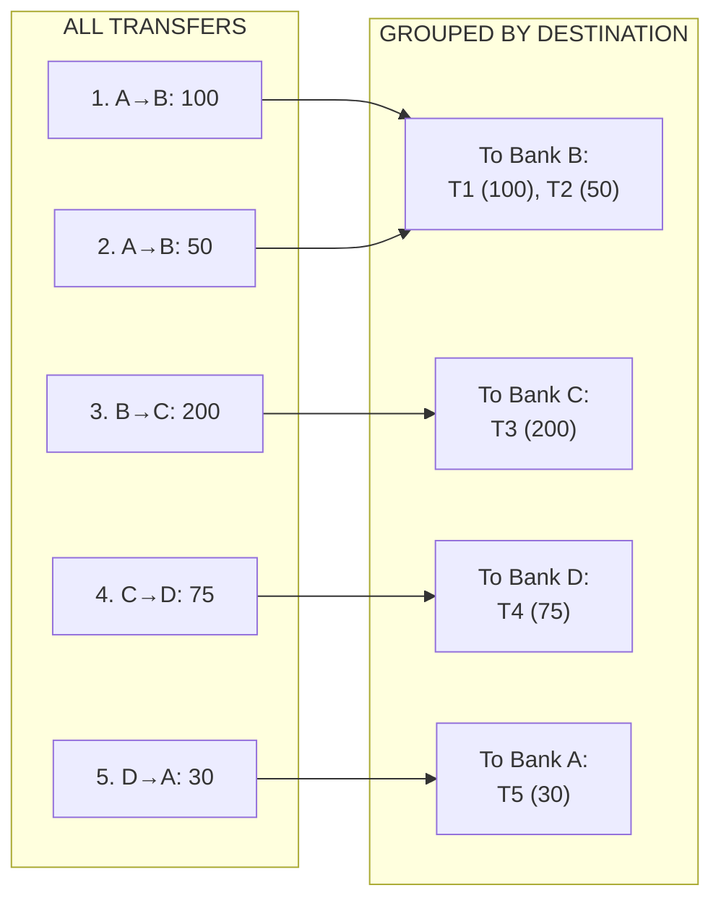
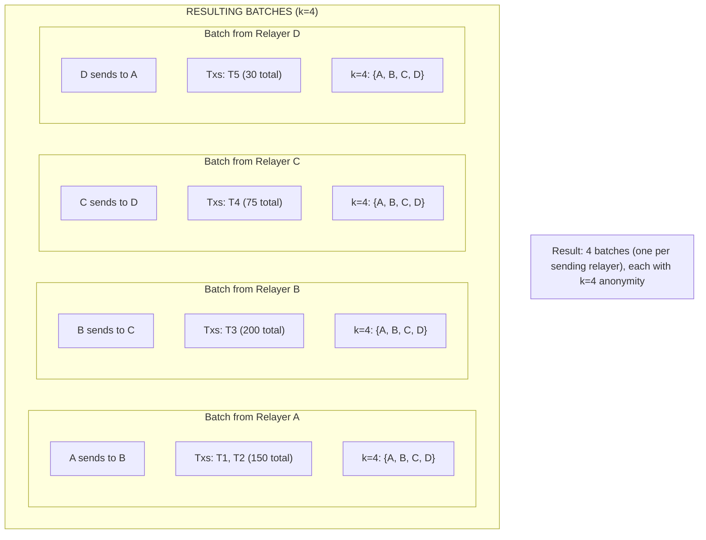

# The Proof System

How Enygma batches transactions and generates zero-knowledge proofs.

## Why Batching?

Generating a zero-knowledge proof is computationally expensive. If every transfer required its own proof:

- High gas costs per transfer
- Network congestion from many proof verifications
- Poor user experience (slow confirmations)

**Solution:** Batch multiple transfers into a single proof.

```
Without batching:
  Transfer 1 → Proof 1 → Verify → Gas cost
  Transfer 2 → Proof 2 → Verify → Gas cost
  Transfer 3 → Proof 3 → Verify → Gas cost
  Total: 3× proof generation, 3× verification gas

With batching:
  Transfer 1 ─┐
  Transfer 2 ─┼→ Single Proof → Verify → Gas cost
  Transfer 3 ─┘
  Total: 1× proof generation, 1× verification gas
```

## k-Anonymity

### What is k-Anonymity?

k-Anonymity means each transfer is grouped with k-1 other participants. An observer cannot determine which participant initiated the transfer.

```
k = 2:  Transfer from A, grouped with B
        Observer sees: "Someone from {A, B} transferred"

k = 6:  Transfer from A, grouped with B, C, D, E, F
        Observer sees: "Someone from {A, B, C, D, E, F} transferred"
```

### Supported k Values

The gnark-api supports all integer values of k from 2 to 6. The appropriate circuit is selected based on the number of registered Privacy Nodes:

| Registered PNs | k Value Used | Notes |
|----------------|--------------|-------|
| 2 PNs | k=2 | Minimum configuration |
| 3 PNs | k=3 | 3-participant batches |
| 4 PNs | k=4 | 4-participant batches |
| 5 PNs | k=5 | 5-participant batches |
| 6+ PNs | k=6 | Maximum anonymity set |

Higher k values provide stronger anonymity but produce larger proofs. The system always uses the k value matching the number of registered Privacy Nodes (capped at 6).

## Concrete Example: Batching in Action

Let's trace through a real scenario to understand how batching works in practice.

### Scenario Setup

A network has **4 Privacy Node Ledgers** (Bank A, Bank B, Bank C, Bank D) sharing an Enygma USDC token.

```
Transfers queued in this block:
  1. Alice (Bank A) → Bob (Bank B): 100 USDC
  2. Carol (Bank A) → Dave (Bank B): 50 USDC
  3. Eve (Bank B) → Frank (Bank C): 200 USDC
  4. Grace (Bank C) → Henry (Bank D): 75 USDC
  5. Ivan (Bank D) → Jane (Bank A): 30 USDC
```

### Step 1: Group by Destination Chain



### Step 2: Determine k Value

With 4 registered PLs, the system uses **k=4**. Each batch includes all 4 banks in its anonymity set.

### Step 3: Create Batches

Each relayer creates one batch per resource ID per destination chain. Since k=4, every batch includes all 4 participants (adding empty batches for chains not involved in the transfer).



### Step 4: What an Observer Sees

| Batch | Observer Sees | Reality | Observer's Certainty |
|-------|--------------|---------|---------------------|
| Batch 1 | "Transfer among {A, B, C, D}" | A sent to B | 25% guess |
| Batch 2 | "Transfer among {A, B, C, D}" | B sent to C | 25% guess |
| Batch 3 | "Transfer among {A, B, C, D}" | C sent to D | 25% guess |
| Batch 4 | "Transfer among {A, B, C, D}" | D sent to A | 25% guess |

With k=4, all batches look identical from the outside — the observer cannot determine which of the 4 participants initiated the transfer, its direction, or the amount.

### Step 5: Timing Breakdown

```
Batch 1 (A sends):
├── State fetch:      ~1 second
├── Proof generation: ~5 seconds (k=4)
├── Encryption:       <1 second
├── Hub submission:   ~10 seconds (block time)
└── Subtotal:         ~17 seconds

Batch 2, 3, 4: (run in parallel by different relayers)
└── Similar timing:   ~17 seconds each

Total time (parallel): ~20-30 seconds
```

### Step 6: Gas Costs

```
Per batch verification: ~250,000 gas
Number of batches: 4

Total gas: 4 × 250,000 = 1,000,000 gas
```

### Key Takeaways from Example

| Observation | Implication |
|-------------|-------------|
| 4 PLs → k=4 | All 4 participants in every anonymity set |
| Each batch hides sender among 4 | 25% chance of guessing correctly |
| Relayers generate proofs in parallel | Efficient even with multiple batches |
| Observer sees identical batch structure | Direction, amounts, and sender all hidden |

## Batch Rules

The batching system follows strict rules:

| Rule | Description |
|------|-------------|
| 1 batch per chain ID | All transfers to the same destination chain go in one batch |
| 1 batch per resource ID | Each Enygma token is batched separately |
| Many txs per batch | Multiple transfers can share one batch (up to limit) |
| R value per batch | Randomness is generated per batch, not per transaction |
| Max transactions | Default limit: 1000 transfers per batch |

### R Value (Randomness)

Each batch has a single R value (random factor) that applies to all transfers in that batch:

```
Batch to Chain B:
  Transfer 1: Alice → Bob: 100 tokens
  Transfer 2: Carol → Dave: 50 tokens

  Both use the same R value for this batch.
  R = Poseidon(blockNumber, sharedSecret_B) mod JubJubPrimeGroup
```

This is more efficient than per-transaction randomness while maintaining security.

## The Batching Flow

```mermaid
flowchart TB
    step1["1. SORT BY RESOURCE ID<br/>Enygma token 0xABC: [transfer1, transfer2, transfer3]<br/>Enygma token 0xDEF: [transfer4, transfer5]"]
    step2["2. SORT BY CHAIN ID (within each resource)<br/>0xABC → Chain B: [transfer1, transfer2]<br/>0xABC → Chain C: [transfer3]"]
    step3["3. CONSTRUCT BATCH STRUCTURE<br/>Batch 1: {resourceId: 0xABC, toChainId: B, txs: [t1, t2]}<br/>Batch 2: {resourceId: 0xABC, toChainId: C, txs: [t3]}<br/><i>Note: Split if >1000 txs or chain IDs > k</i>"]
    step4["4. FULFILL ANONYMITY SET<br/>If batch has fewer than k participants, add empty batches<br/>Example: Chain B (has transfers), Chain C (empty - just for anonymity)<br/><i>Observer can't tell which chain is real</i>"]
    step5["5. GET HUB STATE<br/>• Current block number<br/>• Balance commitments for each participant<br/>• Public keys from participant storage"]
    step6["6. WAIT FOR BLOCK<br/>Ensure Hub block is mined before generating proof<br/>(Proof references specific block number)"]
    step7["7. GENERATE PROOF<br/>Call gnark-api: /gen-proof-k (k=2 to 6)<br/>Inputs: sender key, balances, commitments, nullifier<br/>Output: Groth16 proof"]
    step8["8. ENCRYPT BATCHES<br/>Each participant receives encrypted data<br/>Only they can decrypt their batch"]
    step9["9. SUBMIT TO HUB<br/>transferBatch(k, commitments, proof, chainIds, encryptedBatches)"]
    step10["10. EMIT TELEPORT EVENT<br/>EnygmaTeleport broadcasts to all relayers<br/>Each relayer decrypts their batch and processes"]

    step1 --> step2 --> step3 --> step4 --> step5
    step5 --> step6 --> step7 --> step8 --> step9 --> step10
```



## Proof Generation Details

### Inputs to gnark-api

The relayer prepares these inputs for proof generation:

```
Proof Request:
├── SenderChainId       // Which chain initiated
├── SenderAmount        // Total amount being sent
├── SenderSecretKey     // Payment Spend secret key (from KMM)
├── SenderBalance       // Previous balance
├── SenderRandomFactor  // Previous R value (used in nullifier derivation)
├── BlockNumber         // Hub block number (used in nullifier derivation)
├── DestinationPublicKeys[]     // Public keys for k participants
├── DestinationPreviousCommits[]// Previous balance commitments
├── DestinationNewCommits[]     // New balance commitments
├── DestinationAmounts[]        // Amounts per destination
├── DestinationRandomFactors[]  // R values per destination
├── DestinationSharedSecrets[]  // Shared secrets for k participants
└── DestinationChainIDs[]       // Chain IDs (sorted ascending)

Note: The nullifier is computed inside the circuit from
SenderSecretKey, SenderRandomFactor, and BlockNumber
and output as a public signal.
```

### Output from gnark-api

```
Proof Response:
├── pi_a[2]           // Proof point A
├── pi_b[2][2]        // Proof point B
├── pi_c[2]           // Proof point C
└── public_signal[]   // Public inputs (verified on-chain)
```

### Public Signal Structure

The public_signal array varies by k:

```
For k participants:
  Positions 0 to k-1:      Array hash secrets (k values)
  Positions k to 2k-1:     Public keys (k values)
  Positions 2k to 4k-1:    Previous balance commitments (x,y pairs)
  Positions 4k to 6k-1:    Output commitments (x,y pairs)
  Position 6k:             Nullifier
  Position 6k+1:           Block number
  Positions 6k+2 to 7k+1:  K-index values (k values)
  Positions 7k+2 to 8k+1:  Message tags (k values)

Total: 8k + 2 elements
k=2: 18 elements
k=6: 50 elements
```

## On-Chain Verification

When `transferBatch()` is called, the contract:

1. **Validates inputs:**
   - Nullifier is unique (not in pendingTransactions)
   - Block number is within valid range
   - Commitment count matches k

2. **Verifies proof:**
   - Routes to appropriate verifier (k=2 through k=6)
   - Checks pi_a, pi_b, pi_c against public_signal
   - Verification is O(1) regardless of batch size

3. **Updates state:**
   - Adds to pendingTransactions
   - Updates balance commitments

```solidity
function verifyTransferProof(uint8 k, TransferProof memory proof) internal view {
    // Routes to the appropriate verifier for k=2 through k=6
    // Each verifier expects a fixed-size public_signal array (8k + 2 elements)
    require(
        IEnygmaVerifier(transferVerifiers[k]).verifyProof(
            proof.pi_a,
            proof.pi_b,
            proof.pi_c,
            proof.public_signal
        ),
        'Invalid proof'
    );
}
```

## Finalization

After all batches for a resource ID are submitted, an **empty batch** triggers finalization:

```
Regular batches: Submit transfers, update pending state
Final empty batch: No transfers, but triggers:
  1. processPendingActions() - Apply mints/burns
  2. Update block state machine
  3. Emit BalancesFinalized event
```

This ensures all participants receive finalized balance commitments.

## Performance Considerations

| Factor | Impact |
|--------|--------|
| Batch size | Larger batches = fewer proofs = lower total gas |
| k value | Higher k = larger proofs but stronger anonymity |
| Number of PNs | k matches PN count (capped at 6) |
| Proof generation time | ~2-10 seconds depending on k |
| Verification gas | ~200-300k gas per batch regardless of size |

## Summary

The proof system:

1. **Batches** multiple transfers to reduce proof count
2. **Enforces k-anonymity** (k=2 through k=6)
3. **Generates Groth16 proofs** via gnark-api
4. **Verifies on-chain** with constant-time verification
5. **Finalizes** with empty batch after all transfers

---

**Next:** [Cross-Chain Transfers](cross-chain-transfers.md) - The complete lifecycle of a private transfer across chains.
